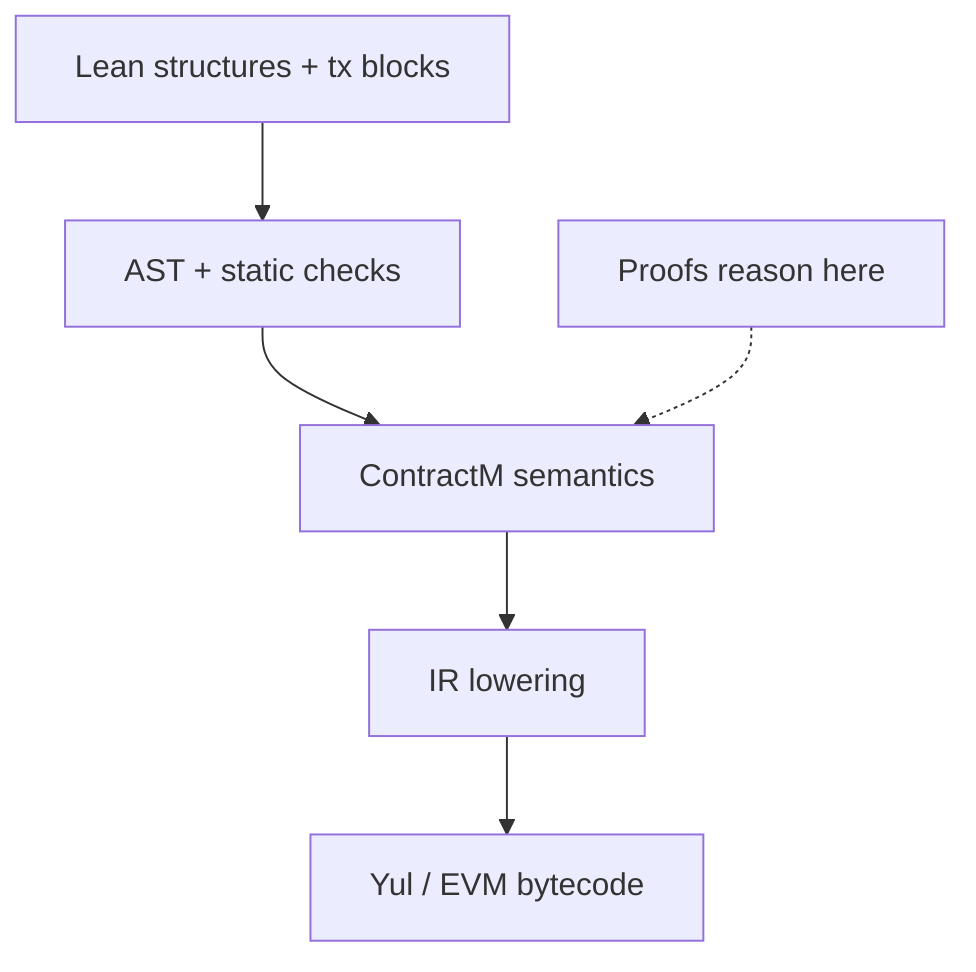

# LSC — Lean Smart Contracts

Formal verification for DeFi smart contracts. Write the contract and its safety proofs in Lean 4; compile to deployable EVM bytecode.

Most on-chain security still depends on audits, testing, and post-hoc verification tools. LSC takes a different approach: you state the properties your contract must satisfy and prove them in the same codebase, checked by the Lean proof assistant. The compiler then emits real Yul and EVM bytecode from that source.

- **One language for code and proofs** — no separate spec language or external prover toolchain
- **Machine-checked safety** — access control, value conservation, overflow handling, and reentrancy proved against the contract semantics, not just tested
- **Real deployable output** — compiles to bytecode you can put on-chain

LSC is **DeFi-focused and proof-first** — not a Solidity replacement or a gas-optimization toolchain. See [docs/DESIGN.md](docs/DESIGN.md) §1 for goals and non-goals.

## Contract + proof

Write the contract in a small `tx { ... }` DSL. Prove safety properties as ordinary Lean theorems against the same semantics the compiler uses.

**Contract** ([`examples/counter/src/Counter.lean`](examples/counter/src/Counter.lean)):

```lean
tx increment {
  require(!σ.paused) else revert Paused();
  let n = σ.number +? 1;
  σ.number = n;
  emit Incremented(n);
}
```

**Proof** ([`examples/counter/test/CounterTheorem.lean`](examples/counter/test/CounterTheorem.lean)):

```lean
theorem increment_errors_when_paused
    (s : ContractState CounterStorage)
    (hp : s.storage.paused) :
    runS (increment : CounterM Unit) s = .error CounterError.Paused := by
  simp [runS, increment, TxM.toContractM, TxM.run, show s.storage.paused = true from hp]
```

The Lean kernel checks this theorem — if the proof breaks, the build fails. No separate test suite or external prover required.

## How it works



You write plain Lean structures and inductives, function bodies in `tx { ... }`, and a trailing `derive_contract` call. Macros and `deriving` handlers assemble an AST; static checks run before lowering. Proofs reason about `ContractM` semantics via `runS`. The compiler emits Yul (via [EvmYulLean](https://github.com/NethermindEth/EVMYulLean)) or direct EVM bytecode.

**Trust boundary:** safety theorems are kernel-checked against `ContractM`; what you deploy trusts the Yul/bytecode pipeline — see [docs/DESIGN.md](docs/DESIGN.md) §2 and §11.

## Examples

| Example | Path | What it shows |
|---------|------|---------------|
| Counter | [examples/counter/](examples/counter/) | Minimal contract with fully proved safety theorems (CI-gated) |
| Interest | [examples/interest/](examples/interest/) | Fixed-point interest accrual with proved invariants |
| Escrow + Token | [examples/escrow/](examples/escrow/) | Multi-contract escrow with token transfer proofs |

Per-contract specs and required-theorem checklists live in [docs/reference/](docs/reference/).

## Quick start

**Prerequisites:** Lean 4.30, Lake, and a C toolchain (`cc`) for the `evmyul` FFI dependency.

```bash
./scripts/ci.sh          # library tests + counter example
```

Or build manually:

```bash
lake build
cd examples/counter && lake build
```

See [`scripts/ci.sh`](scripts/ci.sh) for what the CI gate covers.

## Project status

**Early-stage research project** — not audited for production use. Do not deploy real value with this toolchain yet.

**Working today:**

- `tx` / `view` DSL, `deriving` handlers, and `derive_contract`
- Static validation (DAG, selectors, UInt256 misuse, arith-error coverage)
- `ContractM` semantics and end-to-end proofs in counter, interest, and escrow
- Yul emission and direct bytecode encoding
- `@nonreentrant`, cross-contract `exec`/`read`, and `IERC20` interface support

**In progress / planned:**

- Linear types (`TokenAmount`, `Capability`, `ReentrancyLock`) — stubs exist, enforcement not wired
- Full AMM reference contract
- End-to-end compilation correctness proof
- Real keccak256 function selectors (currently a hash stub)

See [docs/todo/backlog.md](docs/todo/backlog.md) for the full backlog.

## Docs and contributing

Start with the [docs README](docs/README.md) for the full reading order. Key entry points:

- **Design and guarantees:** [docs/DESIGN.md](docs/DESIGN.md)
- **Learn by example:** [docs/reference/](docs/reference/)
- **Implementation map:** [docs/framework/IMPLEMENTATION.md](docs/framework/IMPLEMENTATION.md)
- **Architecture decisions:** [docs/decisions/](docs/decisions/)
- **What's not built yet:** [docs/todo/](docs/todo/)
