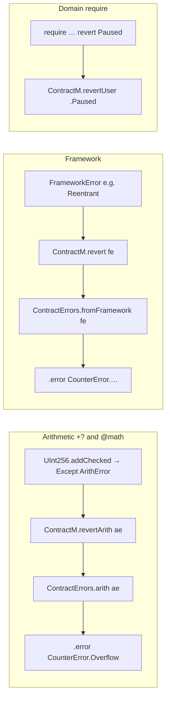

# Formally Verified EVM Smart Contract Language — Design Document

> **Purpose**: This document is the single authoritative reference for all design decisions. It is intended for developers implementing the system and reviewers evaluating the design. Every significant decision is stated explicitly with its rationale. No prior knowledge of formal verification is assumed, but familiarity with Lean 4 and EVM internals is expected.
>
> **Documentation set**: See [README.md](README.md) for reading order. Extensions live in `extensions/` (linear types, type constraints, math, optional contract spec). Canonical examples are in `reference/`.

---

## 1. Goals and Non-Goals

### Goals

- Allow DeFi developers to write smart contracts with **machine-checked formal proofs** of safety properties (no reentrancy, no value loss, access control, conservation invariants).
- Produce **EVM-deployable bytecode** from those contracts via an auditable, explicit compilation path.
- Make proofs **tractable**: a typical safety theorem should be provable with `simp` + `omega` or a short LLM-assisted proof. If a straightforward property requires more than ~10 lines of proof, the definitions are wrong.
- Replace or significantly reduce the need for manual security audits by providing a stronger, foundational guarantee.

### Non-Goals

- General-purpose smart contract language. This is a **restricted, DeFi-oriented language**. Features that cannot be proved about are excluded.
- Gas optimality. Gas inefficiency is acceptable in exchange for provability.
- Verifying existing Solidity/Vyper contracts. This is a new language, not a verifier for existing ones.
- Full compiler correctness proof in v1. The compilation path is **auditable and tested**, not fully proved end-to-end initially.

### The Guarantee

> *Your contract logic is proved correct at the semantic level. The compilation to EVM bytecode is faithful by construction, with an explicit and auditable trusted layer. Proofs are tractable: you state what your contract should do as Lean propositions, and the proof follows structurally from the contract definition.*

---

## 2. Architecture Overview

```
┌─────────────────────────────────────────────────────┐
│  Source  (Lean macros / syntax extension)           │  ← user writes this
├─────────────────────────────────────────────────────┤
│  AST     (inductive Lean types)                     │  ← macro output
│  + Linearity check pass                             │
│  + DAG check pass (no recursion)                    │
│  + Selector collision check                         │
├─────────────────────────────────────────────────────┤
│  ContractM semantics  (state monad)                 │  ← proofs live here
│  auto-derived from AST via Stmt.eval                │
├─────────────────────────────────────────────────────┤
│  IR  (flat, explicit, no sugar)                     │
├─────────────────────────────────────────────────────┤
│  Yul  (EvmYulLean's Yul.Program type)               │  ← trusted boundary
├─────────────────────────────────────────────────────┤
│  EVM bytecode  (via EvmYulLean)                     │  ← trusted
└─────────────────────────────────────────────────────┘
```

### Trust Boundary

Everything above the Yul layer is **formally proved in Lean**. The Yul emitter is **trusted but tested** against EvmYulLean's conformance suite. EvmYulLean itself is treated as ground truth (validated against 99.99% of Ethereum tests). Users can audit the Yul output directly — it is human-readable and generated deterministically.

The trust surface is:
1. The Yul emitter (tested, not proved in v1)
2. The `storageKey` injectivity axioms (see §9)
3. EvmYulLean's EVM model

---

## 3. The Source Layer — Lean Macros

### Design

The user writes contracts using **Lean 4 syntax extensions** (`declare_syntax_cat` + `macro_rules`). There is no separate compilation step, no external toolchain. Everything is Lean.

```lean
contract Counter where
  storage:
    number : UInt256 := 0
    paused : Bool    := false
    owner  : Address

  errors:
    | Paused
    | NotOwner
    | Overflow

  events:
    | Incremented (newValue : UInt256)

  def increment : Tx := do
    require (!$.paused) else revert Paused;
    let n ← $.number +? 1;
    $.number := n;
    emit Incremented(n);
```

**Storage access** uses a single prefix: `$.field` for reads, `$.field := val` for writes. Proofs use `s.storage.field` on `ContractState` snapshots — `$.` is author-facing DSL only.

Surface syntax (`require … else revert`, `msg.sender`, `+?`, bracket-pair rounding) is defined in [IMPLEMENTATION.md](IMPLEMENTATION.md). The macro lowers to `Stmt` nodes shown below.

### What the Macro Generates

The macro is **syntax-to-AST only**. It never validates, never errors on domain rules, never runs logic. It produces pure data:

```lean
-- 1. Storage struct
structure CounterStorage where
  number : UInt256 := 0
  paused : Bool    := false
  owner  : Address

-- 2. Error inductive + generated ContractErrors instance (strict 1:1 arith map)
inductive CounterError | Paused | NotOwner | Overflow

instance : ContractErrors CounterError where
  arith := fun
    | .Overflow => .Overflow
    | .Underflow | .DivisionByZero => ContractErrors.unreachableArith
    -- unreachableArith panics; validator proves these arms dead for +?-only bodies
  fromFramework := fun
    | .Reentrant     => .NotOwner
    | .Unauthorized => .NotOwner

-- 3. Event inductive
inductive CounterEvent | Incremented (newValue : UInt256)

-- 4. AST value
def Counter.increment.ast : Stmt := 
  Stmt.seq
    (Stmt.require (Expr.not (Expr.storageGet "paused")) (Expr.err .Paused))
    (Stmt.seq
      (Stmt.letBind "n" (Expr.addChecked (Expr.storageGet "number") (Expr.lit 1)))
      (Stmt.seq
        (Stmt.storageSet "number" (Expr.var "n"))
        (Stmt.emit (Expr.event .Incremented [Expr.var "n"]))))

-- 5. ContractM semantics (auto-derived, not macro-generated)
def Counter.increment : ContractM CounterStorage CounterEvent CounterError Unit :=
  Stmt.eval Counter.increment.ast
```

Counter declares only `Overflow` because `increment` uses `+?` only. Elaboration **rejects** `-?` / `/?` unless matching `Underflow` / `DivByZero` variants exist in `errors:`. An AMM using `+?`, `-?`, and `⌊/⌋?` declares all three:

```lean
errors:
  | Overflow
  | Underflow
  | DivByZero

instance : ContractErrors AMMError where
  arith := fun
    | .Overflow       => .Overflow
    | .Underflow      => .Underflow
    | .DivisionByZero => .DivByZero
  fromFramework := ...
```

The user writes proofs against `Counter.increment` (the ContractM version). The AST version exists for the compiler. The connection is definitional: `Counter.increment = Stmt.eval Counter.increment.ast` holds by `rfl`.

### Error Reporting

Domain-specific validation (selector clashes, linearity violations, DAG violations) runs in an `elab_rules` elaboration step, not in `macro_rules`. This gives access to `Lean.logErrorAt : Syntax → String → CommandElabM Unit`, which attaches errors to exact source positions and displays them in the IDE at the relevant line.

```lean
elab_rules : command
  | `(contract $name where $body) => do
    let def ← parseContractDef body
    match validateContract def with
    | .error (pos, msg) => Lean.logErrorAt pos msg; return
    | .ok validated     => generateDefinitions validated
```

Type errors in generated Lean code surface as normal Lean type errors, which are generally readable.

### User Workflow

```lean
-- Write the contract (macro expands automatically)
-- Write proofs in the same file or a separate file
-- #check Counter.increment.ast     -- inspect the AST
-- #eval  Counter.increment.ast.toYul  -- generate Yul
-- #eval  Counter.increment.ast.toABI  -- generate ABI JSON
-- The Lean kernel validates all proofs on file load
```

No build system, no CLI, no external compiler. Everything is a Lean command.

---

## 4. The AST Layer

### Core Types

```lean
inductive Ty
  | uint256 | bool | address
  | wad | ray                    -- fixed-point numeric types
  | tokenAmount                  -- linear type (see §7)
  | mapping (k v : Ty)           -- opaque, no user iteration
  | struct (fields : List (Ident × Ty))

inductive Expr : Ty → Type
  | lit      : UInt256 → Expr .uint256
  | litBool  : Bool → Expr .bool
  | var      : Ident → Expr t
  | storageGet : Ident → Expr t
  -- UInt256 checked (+? -? *? /?) — failures map ArithError → Err via ContractErrors.arith
  | addChecked  : Expr .uint256 → Expr .uint256 → Expr .uint256
  | subChecked  : Expr .uint256 → Expr .uint256 → Expr .uint256
  | mulChecked  : Expr .uint256 → Expr .uint256 → Expr .uint256
  | divFloor    : Expr .uint256 → Expr .uint256 → Expr .uint256
  -- UInt256 wrapping (+↻ -↻ *↻) — pure, intentional mod-2²⁵⁶
  | addWrapping : Expr .uint256 → Expr .uint256 → Expr .uint256
  | subWrapping : Expr .uint256 → Expr .uint256 → Expr .uint256
  | mulWrapping : Expr .uint256 → Expr .uint256 → Expr .uint256
  | mulDiv      : Expr .uint256 → Expr .uint256 → Expr .uint256 → Expr .uint256
  -- Wad fixed-point (⌊*⌋? ⸢*⸣? ⌊/⌋? … — no default wadMul)
  | wadMulDown | wadMulUp | wadMulHalfUp
  | wadDivDown | wadDivUp | wadDivHalfUp
  -- Ray fixed-point (same rounding variants)
  | rayMulDown | rayMulUp | rayMulHalfUp
  | rayDivDown | rayDivUp | rayDivHalfUp
  -- logic
  | not  : Expr .bool → Expr .bool
  | and  : Expr .bool → Expr .bool → Expr .bool
  | eq   : Expr t → Expr t → Expr .bool
  | lt   : Expr .uint256 → Expr .uint256 → Expr .bool
  -- context (implicit tx context, read-only)
  | caller    : Expr .address
  | callvalue : Expr .uint256
  | timestamp : Expr .uint256
  -- linear type operations (see §7)
  | tokenMint   : Expr .uint256 → Expr .tokenAmount  -- restricted
  | tokenBurn   : Expr .tokenAmount → Expr .uint256  -- restricted
  | tokenSplit  : Expr .tokenAmount → Expr .uint256 → Expr (.tokenAmount × .tokenAmount)
  | tokenMerge  : Expr .tokenAmount → Expr .tokenAmount → Expr .tokenAmount
  -- mapping (no iteration exposed)
  | mappingGet  : Expr (.mapping k v) → Expr k → Expr v
  | mappingSet  : Expr (.mapping k v) → Expr k → Expr v → Expr (.mapping k v)

inductive Stmt
  | skip
  | seq         : Stmt → Stmt → Stmt
  | letBind     : Ident → Expr t → Stmt
  | storageSet  : Ident → Expr t → Stmt
  | require     : Expr .bool → Expr t → Stmt   -- second arg is error value
  | ifThenElse  : Expr .bool → Stmt → Stmt → Stmt
  | call        : Ident → List (Sigma Expr) → Stmt  -- internal call by name
  | externalCall: Ident → Ident → List (Sigma Expr) → Stmt  -- interface, method, args
  | emit        : Expr t → Stmt
  | revert      : Expr t → Stmt
```

### What Is Excluded

No raw memory access, no inline assembly, no `delegatecall`, no `selfdestruct`, no recursion, no dynamic dispatch, no raw `keccak256` calls, no direct storage slot access, no loops without termination measures (v1: no loops at all; add bounded loops in v2).

---

## 5. The ContractM Semantics Layer

### Definition

```lean
def ContractM (S E Err : Type) (A : Type) : Type :=
  ContractState S → Except Err (A × ContractState S × List E)
```

`S` is the contract-specific storage struct. `E` is the contract-specific event type. `Err` is the contract-specific error type. `A` is the return value. `List E` is the list of events emitted during execution — implicit in source syntax, explicit in Lean.

### ContractState

```lean
structure TxContext where
  caller    : Address
  callvalue : UInt256
  timestamp : UInt256
  origin    : Address  -- tx.origin, available but use discouraged

structure ContractState (S : Type) where
  storage  : S
  context  : TxContext
  locked   : Bool      -- reentrancy guard, framework-managed
```

`locked` is never directly accessible to user code. It is managed exclusively by the framework's external call primitives.

### ContractBase

Rather than a typeclass, every contract state is a concrete instantiation of `ContractBase`:

```lean
abbrev ContractBase (S E Err : Type) := ContractState S
-- E and Err appear in ContractM's type, not in state
```

Framework lemmas are stated over `ContractM S E Err` with explicit type variables. User theorems are stated over their concrete types (e.g., `CounterStorage`, `CounterEvent`, `CounterError`).

### Monad Operations with `@[simp]` Lemmas

Every primitive monad operation must have a corresponding `@[simp]` lemma so that `simp [runS, myFunction, ...]` reduces proof goals automatically:

```lean
@[simp] theorem runS_pure   ...
@[simp] theorem runS_bind   ...
@[simp] theorem runS_get    ...
@[simp] theorem runS_set    ...
@[simp] theorem runS_emit   ...
@[simp] theorem runS_require_true  ...
@[simp] theorem runS_require_false ...
@[simp] theorem runS_revert ...
```

If a proof of a straightforward property cannot be closed by `simp [runS, theFunction, ...]` followed by `omega`, the simp lemma set is incomplete — add lemmas until it can.

### Deriving ContractM from AST

```lean
-- Framework provides this once
def Stmt.eval (s : Stmt) : ContractM S E Err Unit := ...

-- Macro generates AST, framework derives semantics
def Counter.increment : ContractM CounterStorage CounterEvent CounterError Unit :=
  Stmt.eval Counter.increment.ast

-- Connection is definitional
theorem Counter.increment.eval_correct :
    Counter.increment = Stmt.eval Counter.increment.ast := rfl
```

---

## 6. Execution Model

### Functions and Dispatch

Each contract declares a list of `FunctionDef`s. Entry points (`kind = .external`) are callable from outside. The ABI dispatcher is **generated by the framework** — users never write it. Users only write function bodies.

```lean
inductive FunctionKind
  | external    -- ABI entry point
  | internal    -- only callable within contract
  | view        -- no storage mutation allowed (enforced by type)
  | constructor -- runs at deployment, not callable after

structure FunctionDef where
  name       : Ident
  kind       : FunctionKind
  params     : List (Ident × Ty)
  body       : Stmt
  permits    : Finset LinearPermission  -- declared capabilities

inductive LinearPermission
  | canMint (tokenType : Ident)
  | canBurn (tokenType : Ident)
  | canFlashBorrow
```

The framework generates a Yul dispatcher that routes calls by 4-byte selector. Selector collision is checked at elaboration time and reported as a positioned error.

### No Recursion — DAG Enforcement

Recursive function calls are **banned in v1**. The call graph (built from `Stmt.call` nodes) must be a DAG. This is checked at elaboration time. Every function call terminates by structural argument. This eliminates the need for termination proofs and prevents a large class of reentrancy patterns.

Bounded loops may be added in v2 with explicit loop invariants as a language-level construct (the programmer supplies the invariant in source syntax).

### Transaction Context

`msg.sender`, `msg.value`, and `block.timestamp` are available as read-only framework primitives within `ContractM`. They are stored in `TxContext` which is populated at the start of each transaction by the dispatcher. Users never construct `TxContext` directly.

### Reverts and Error Handling

```lean
-- Framework errors (reentrancy, auth, … — not arithmetic)
inductive FrameworkError
  | Reentrant
  | Unauthorized

-- Core arithmetic failures (shared with @math Except layer)
inductive ArithError
  | Overflow
  | Underflow
  | DivisionByZero

/-- Generated per contract from the errors: block. -/
class ContractErrors (Err : Type) where
  arith         : ArithError → Err
  fromFramework : FrameworkError → Err
```

Checked arithmetic (`+?`, `-?`, `*?`, `/?`, bracket-pair ops) lives in **`ContractM`**. On failure, eval calls `ContractM.revertArith ae`, which produces `.error (ContractErrors.arith ae)` — no error name in the AST, no `.orRevert` at each call site.

Elaboration generates `ContractErrors.arith` as a **strict 1:1 map** from each `ArithError` case to a same-named variant in `errors:` (`Overflow`, `Underflow`, `DivByZero`). No collapsing — `.Underflow` never maps to `.Overflow`. The validator only requires variants for `ArithError` cases **reachable** from ops used in the contract body (e.g. `+?` alone needs `Overflow`; adding `-?` requires `Underflow`). Unmapped reachable cases and unmapped `FrameworkError` cases are **compile errors**.

```lean
-- User code:
let n ← $.number +? 1
-- On overflow: .error CounterError.Overflow  (= ContractErrors.arith .Overflow)
-- require … revert Paused: .error CounterError.Paused  (= revertUser, direct)
```

Pure `@math` functions return `Except ArithError`; lift once with `|>.orRevert` (uses `ContractErrors.arith`, same channel as `+?`). See [extensions/MATH.md](extensions/MATH.md).

On revert, all storage changes and emitted events are discarded. This matches EVM semantics.

**Wiring summary** (two channels, no name-guessing at eval time):



Both maps are **generated once** from the `errors:` block at elaboration time.

### Events

Events are declared per contract as an inductive type. In source syntax, `emit` looks like a statement. In the ContractM type, events are implicit in the `List E` return component. Users only interact with events in proof statements:

```lean
theorem increment_emits_incremented
    (s s' : CounterState) (log : List CounterEvent)
    (h : runS increment s = .ok ((), s', log)) :
    log = [CounterEvent.Incremented s'.storage.number] := ...
```

Events compile to raw EVM logs. The event inductive type is erased at the IR level; the compiler generates the ABI event signature and topic encoding. This is part of the trusted compilation layer.

### Constructors and Deployment

Each contract may declare one `constructor` function. Default field values in the storage struct are used if no constructor is declared. The constructor is not callable post-deployment. The ABI includes constructor parameter encoding. Storage layout is initialized at deployment by the generated dispatcher.

---

## 7. Linear Types

### Purpose

Linear types enforce that certain values representing **permissions, obligations, or custody** are used exactly once per execution path. They eliminate entire categories of theorems that would otherwise need to be proved manually.

### Enforcement Mechanism

Linearity is enforced at the **AST level by a linearity check pass**, not by Lean's type system (which does not support linear types natively). The pass runs after macro expansion, before IR generation.

At the IR level and below, linear types are **completely erased**. See [extensions/linear-types/README.md](extensions/linear-types/README.md) for the full algorithm, permission rules, and proof ergonomics.

### The Linear Type Library (v1)

Each type is documented in its own file under [extensions/linear-types/](extensions/linear-types/):

| Type | Eliminates (summary) | Doc |
|------|----------------------|-----|
| `TokenAmount` | Conservation, phantom minting | [TokenAmount.md](extensions/linear-types/TokenAmount.md) |
| `Allowance` | `transferFrom` over-spend | [Allowance.md](extensions/linear-types/Allowance.md) |
| `FlashLoanReceipt` | Unrepaid flash loans | [FlashLoanReceipt.md](extensions/linear-types/FlashLoanReceipt.md) |
| `ReentrancyLock` | Unlocked external calls | [ReentrancyLock.md](extensions/linear-types/ReentrancyLock.md) |
| `Capability` | `only_X_can_do_Y` theorems | [Capability.md](extensions/linear-types/Capability.md) |
| `OracleReading` | Stale oracle prices | [OracleReading.md](extensions/linear-types/OracleReading.md) |
| `WithdrawalRequest` | CEI ordering violations | [WithdrawalRequest.md](extensions/linear-types/WithdrawalRequest.md) |
| `PositionTicket` | Unresolved debt positions | [PositionTicket.md](extensions/linear-types/PositionTicket.md) |

`TwoPartyAgreement` is a v2 extension — see [TwoPartyAgreement.md](extensions/linear-types/TwoPartyAgreement.md).

Storage reserves use `Wad`, not `TokenAmount`. `TokenAmount` wraps in-flight ERC20 custody during transactions only.

## 8. The World Model

### Purpose

The `World` models the full deployment context: your contract plus external contracts it interacts with. It is used for multi-contract theorems (e.g., AMM swap correctness depends on ERC20 token behavior).

### Definition

```lean
class WorldSpec (W : Type) where
  Self    : Type                   -- your contract's storage type
  Env     : Type                   -- external contract states
  getSelf : W → ContractState Self
  getEnv  : W → Env
  setSelf : W → ContractState Self → W
  -- laws
  get_set : ∀ w s, getSelf (setSelf w s) = s
  set_get : ∀ w, setSelf w (getSelf w) = w
```

`WorldSpec` is a typeclass because the execution engine (`runWorld`, external call dispatch) must be generic over deployment topology. Contract-specific theorems are stated over concrete world types.

### Per-Deployment World Types

Each deployment scenario defines its own concrete world:

```lean
structure AMMWorld where
  self   : ContractState AMMStorage
  token0 : ERC20State
  token1 : ERC20State

instance : WorldSpec AMMWorld where
  Self := AMMStorage
  Env  := AMMEnv  -- bundles token0, token1
  ...

structure BridgeWorld where
  self    : ContractState BridgeStorage
  token   : ERC20State
  relayer : Unit  -- modeled abstractly
```

### Call Stack and msg.sender

Concrete world types (e.g. `AMMWorld`) carry the call stack and ETH balances needed to model nested calls. The generic shape is:

```lean
structure World (S : Type) (Env : Type) where
  self        : ContractState S
  env         : Env
  msgStack    : List TxContext
  ethBalances : Finmap Address UInt256
```

Per-deployment types like `AMMWorld` embed `self`, external env fields (`token0`, `token1`), and implement [WorldSpec](#definition) for generic execution code.

When your contract makes an external call, the framework pushes a new `TxContext` onto `msgStack` with `caller = your_contract_address`. When the call returns, it pops. User code reads `caller` from the top of the stack via the `ContractM.caller` primitive.

### External Contract Interfaces

External contracts are modeled as **typed interfaces**, not concrete implementations:

```lean
class IERC20 (T : Type) where
  balanceOf   : T → Address → UInt256
  transfer    : Address → UInt256 → T → Except ExternalError T
  transferFrom: Address → Address → UInt256 → T → Except ExternalError T
  totalSupply : T → UInt256
```

The AMM's external calls are typed against `IERC20`. Theorems about the AMM are parameterized over any `T` that implements `IERC20`, conditional on honesty hypotheses.

### Bundling Assumptions — `HonestWorld`

Instead of threading individual hypotheses through every theorem, bundle them:

```lean
class HonestWorld (W : Type) [WorldSpec W] where
  token0_conserves  : transferConserves (getEnv w).token0
  token1_conserves  : transferConserves (getEnv w).token1
  oracle_fresh      : oracleAge (getEnv w).oracle ≤ MAX_STALENESS
  no_hostile_reentry : ∀ call, externalCallSafe call

-- theorem signature uses one instance instead of many hypotheses
theorem swap_conserves_product
    [HonestWorld AMMWorld]
    (w w' : AMMWorld) (amountIn : UInt256) ... :
    w'.self.storage.reserve0 * w'.self.storage.reserve1 ≥
    w.self.storage.reserve0  * w.self.storage.reserve1 := ...
```

Weaker partial variants can be defined for theorems that only rely on a subset of assumptions.

### Reentrancy in the World Model

During an external call: your contract's `locked` field is `true`. Any reentrant call into your contract hits the `ReentrancyLock` check and reverts before modifying your state. The external contract's state (in `env`) may change during the call. When control returns, your state is unchanged and the updated `env` is available.

This must be explicitly modeled in the `runWorld` execution semantics. The theorem you get for free from `ReentrancyLock` is: if `locked = true` in `w.self`, any call to your contract reverts with `FrameworkError.Reentrant`.

---

## 9. Storage Model

### Abstract Storage

Each contract's storage is a plain Lean struct with typed fields:

```lean
structure AMMStorage where
  reserve0  : Wad
  reserve1  : Wad
  lpSupply  : Wad
  fee       : Wad
  paused    : Bool
  owner     : Address
```

Field-level invariants (`@monotonic`, `@bounded`, …) are optional decorators — see [extensions/TYPE-CONSTRAINTS.md](extensions/TYPE-CONSTRAINTS.md).

At the proof level, reading and writing fields is handled by Lean's struct update syntax (`s.storage.field`, `s'.storage.field`). In contract source, reads and writes use **`$.field`** and **`$.field := val`** exclusively. Field independence (`$.reserve0 := v` does not affect `$.reserve1`) holds by `rfl` — no proof needed. This is alias-freedom by construction.

### Mappings

Mappings are exposed as an **opaque `Mapping k v` type** backed by `Finmap`:

```lean
opaque Mapping (k v : Type) : Type
-- implemented as Finmap k v but opaque to users

namespace Mapping
  def get    : Mapping k v → k → v
  def set    : Mapping k v → k → v → Mapping k v
  def getD   : Mapping k v → k → v → v  -- with default
  -- no toList, no fold, no iteration
end Mapping
```

Iteration is deliberately excluded. Users cannot loop over a mapping. This prevents a class of gas griefing bugs and simplifies proofs (no need to reason about all keys). If a protocol genuinely needs global invariants over all mapping entries (e.g., sum of all balances), use **Option B: conservation proofs** (see §10).

### Storage Layout Compilation

The mapping from struct fields to EVM storage slots is handled by the trusted Yul emitter. The emitter assigns each field a deterministic slot index. For `Mapping k v`, the emitter uses `keccak256(abi.encode(key, slotIndex))` — standard Solidity layout.

The following axioms are admitted (tested against EvmYulLean, not proved):

```lean
-- Fields map to distinct slots
axiom storageKey_injective :
    ∀ (f1 f2 : StorageField), f1 ≠ f2 → storageKey f1 ≠ storageKey f2

-- Mapping keys map to distinct slots
axiom mappingKey_injective :
    ∀ (slot : Nat) (k1 k2 : Word), k1 ≠ k2 →
    mappingKey slot k1 ≠ mappingKey slot k2

-- Mapping slot does not collide with field slots
axiom mappingKey_ne_storageKey :
    ∀ slot k f, mappingKey slot k ≠ storageKey f
```

These three axioms are the complete statement of "storage is alias-free." All separation lemmas in user proofs derive from these axioms. Keccak is never exposed to user code or user proofs.

---

## 10. Arithmetic and Numeric Types

### Principles

- Plain `+ - * /` on `UInt256` / `Wad` / `Ray` is a **parse/type error** in contract bodies.
- Every operation picks an explicit family: checked (`?`), wrapping (`↻`), or fixed-point rounding (bracket pairs).
- Checked and bracket-pair ops live in **`ContractM`** and revert via `ContractErrors.arith`.
- Core arithmetic uses `ArithError` in `Core/Arithmetic.lean`; `@math` functions use `Except ArithError` and lift with `.orRevert` at call sites. Decorator violations use `ConstraintViolated` (see [TYPE-CONSTRAINTS.md](extensions/TYPE-CONSTRAINTS.md)).

Heavy `@math` functions, ℝ specs, and proof patterns: [extensions/MATH.md](extensions/MATH.md).

### Three operator families (contract surface)

Borrowed from [spec_idea_1/lsc-spec.md §2.5–§2.7](../spec_idea_1/lsc-spec.md).

#### Family A — Checked (`?`) — default

| Op | Syntax | Returns |
|----|--------|---------|
| Add | `a +? b` | `ContractM … UInt256` — `n +? 1` accepts `Nat` literal rhs |
| Sub | `a -? b` | `ContractM … UInt256` |
| Mul | `a *? b` | `ContractM … UInt256` |
| Div | `a /? b` | `ContractM … UInt256` — trunc toward zero; div/0 reverts |

`Wad`/`Ray` add/sub use the same `+?`/`-?` (scale-preserving checked ops).

#### Family B — Wrapping (`↻`) — intentional mod-2²⁵⁶

| Op | Syntax | Returns |
|----|--------|---------|
| Add | `a +↻ b` | `UInt256` (pure, not `ContractM`) |
| Sub | `a -↻ b` | `UInt256` |
| Mul | `a *↻ b` | `UInt256` |

Rare in DeFi; available when mod-2²⁵⁶ is deliberate (not a silent fallback).

#### Family C — Fixed-point rounding (bracket pairs + `?`)

**No default `wadMul`/`rayMul`** — rounding direction must be explicit.

| Rounding | Mul | Div |
|----------|-----|-----|
| Down | `a ⌊*⌋? b` | `a ⌊/⌋? b` |
| Up | `a ⌈*⌉? b` | `a ⌈/⌉? b` |
| Half-up | `a ⸢*⸣? b` | `a ⸢/⸣? b` |

Bracket characters: `⌊⌋` down, `⌈⌉` up, `⸢⸣` half-up (LSC convention). Scale from `open scoped Lsc.Wad` or `open scoped Lsc.Ray` — do **not** open both in one file. All bracket-pair ops return `ContractM … Wad` (or `Ray`) and revert on overflow.

```lean
open scoped Lsc.Wad
let out ← (amountIn ⸢*⸣? $.reserve1) ⌊/⌋? ($.reserve0 +? amountIn)
```

### UInt256 Operations (framework internals)

```lean
namespace UInt256
  def addChecked  : UInt256 → UInt256 → Except ArithError UInt256
  def subChecked  : UInt256 → UInt256 → Except ArithError UInt256
  def mulChecked  : UInt256 → UInt256 → Except ArithError UInt256
  def addWrapping : UInt256 → UInt256 → UInt256
  def subWrapping : UInt256 → UInt256 → UInt256
  def mulWrapping : UInt256 → UInt256 → UInt256
  def divFloor    : UInt256 → UInt256 → Except ArithError UInt256
  def mulDiv      : UInt256 → UInt256 → UInt256 → Except ArithError UInt256
end UInt256
```

Contract surface uses `+?`/`+↻`/bracket pairs; these named functions appear in proofs via `@[simp]` bridge lemmas.

### Fixed-Point Types: Wad and Ray

```lean
structure Wad where raw : UInt256
structure Ray where raw : UInt256

namespace Wad
  def WAD : UInt256 := 1_000_000_000_000_000_000

  def mulDown | mulUp | mulHalfUp : Wad → Wad → Except ArithError Wad
  def divDown | divUp | divHalfUp : Wad → Wad → Except ArithError Wad
  def toRay (w : Wad) : Ray := ⟨w.raw * 1_000_000_000⟩

  theorem mulHalfUp_comm (a b : Wad) : Wad.mulHalfUp a b = Wad.mulHalfUp b a
  theorem mulHalfUp_le_left (a b : Wad) (h : b.raw ≤ WAD) :
      ∀ r, Wad.mulHalfUp a b = .ok r → r.raw ≤ a.raw
end Wad
-- Ray namespace: same six rounding variants (scale RAY = 10²⁷)
```

Contract authors write `a ⸢*⸣? b` (half-up mul), not `a.wadMul b`. AMM invariant theorems unfold bracket ops to `Wad.mulHalfUp`, `Wad.divDown`, etc.

---

## 11. The Compilation Pipeline

### AST → IR

The IR is a flat, explicit intermediate with no syntactic sugar. One AST construct maps to one or more IR constructs. The IR does not know about linear types — they have been erased by this stage.

```lean
inductive IR
  | sload   (slot : Word)
  | sstore  (slot : Word) (value : IRExpr)
  | call    (target : Word) (selector : Word) (args : List IRExpr)
  | if_     (cond : IRExpr) (thn els : IR)
  | seq     (a b : IR)
  | revert  (data : IRExpr)
  | log     (topics : List IRExpr) (data : IRExpr)
  | checkFlag (slot : Word) (expected : Bool)  -- from linear type erasure
  | setFlag   (slot : Word) (value : Bool)
```

### IR → Yul

The Yul emitter targets **EvmYulLean's `Yul.Program` type directly**, not a string. This means the output is a structured Lean value that EvmYulLean can interpret and test. `#eval contract.toYul` produces this value. Rendering to a Yul string is a separate display function.

The emitter is trusted in v1. Correctness is validated by running EvmYulLean's test suite against the emitted programs.

### Compilation Correctness — What Is Proved in v1

One semantic preservation theorem per major AST construct:

```lean
-- For each core Stmt constructor:
theorem Stmt.eval_storageSet_correct ...
theorem Stmt.eval_require_correct ...
theorem Stmt.eval_ifThenElse_correct ...
-- etc.
```

And one per linear type primitive:

```lean
theorem FlashLoan.borrow_yul_correct ...
theorem FlashLoan.repay_yul_correct ...
theorem ReentrancyLock.acquire_yul_correct ...
-- etc.
```

These are proved once by the framework. User contracts inherit them for free.

The full end-to-end compilation correctness theorem (AST semantics match Yul execution for all inputs) is a **v2 goal**, not v1. The v1 guarantee is: per-construct correctness + conformance tests on the emitter.

### Deliverables Per Contract

When a user's Lean file compiles successfully:

1. **Lean source** — the contract definition and all proofs, checked by the Lean kernel
2. **Yul source** — human-readable, generated by `#eval contract.toYul.render`
3. **ABI JSON** — generated by `#eval contract.toABI`
4. **Proof certificate** — the Lean `.olean` file implicitly certifies that all stated theorems hold

---

## 12. Proof Ergonomics — Design Invariants

These are not features — they are **design constraints** that must be maintained as the system evolves.

### The simp + omega invariant

Any theorem of the form "on success, storage field X has value V" must be provable by:

```lean
simp [runS, theFunction, fieldName, ...]
omega  -- for arithmetic goals
```

If this fails, add missing `@[simp]` lemmas to the monad operations or storage accessors. Do not work around it by making proofs longer.

### The field independence invariant

Any theorem of the form "function F does not change field X" must be provable by `rfl` or `simp` with no arithmetic. If it requires case analysis or induction, the storage model is wrong.

### The error separation invariant

Success-case and failure-case theorems must be provable independently. Do not write theorems that simultaneously handle both outcomes. Pattern:

```lean
-- Prove these separately, never together:
theorem increment_succeeds_when_not_paused ...
theorem increment_errors_when_paused ...
```

### The hypothesis minimality invariant

A theorem should state exactly the hypotheses it needs — no more. If a theorem about `increment` doesn't need the `owner` field, `owner` should not appear in its statement. Use `HonestWorld` and similar bundles only when the theorem genuinely needs all bundled assumptions.

### Optional: auditor-facing specifications

For teams that want spec/proof separation, an optional `contract_spec` syntax produces human-readable proposition files. Not required for v1. See [extensions/CONTRACT-SPEC.md](extensions/CONTRACT-SPEC.md).

---

## 13. Reference: The Pausable Counter

Minimal acceptance-test contract exercising storage, errors, events, access control, and proof ergonomics. **Canonical source, theorem list, and proof techniques**: [reference/COUNTER.md](reference/COUNTER.md).

---

## 14. Reference: The Constant Product AMM

Target DeFi contract exercising `Wad`/`Ray` math, `TokenAmount`, IERC20, `HonestWorld`, `ReentrancyLock`, and conservation invariants. **Canonical storage model, swap flow, and required theorems**: [reference/AMM.md](reference/AMM.md).

---

## Appendix A: What Is Not in This Document

The following are covered in [IMPLEMENTATION.md](IMPLEMENTATION.md) rather than here:

- Lean module structure and file organization
- Exact `macro_rules` syntax for the source DSL
- EvmYulLean API usage details
- ABI encoding implementation
- Selector computation
- `Finmap` library choice
- Test harness structure for Yul conformance tests

## Appendix B: Relationship to Prior Work

- **lsc** (author's prior prototype): established the `ContractM` monad shape and proof workflow. Abandoned due to opaque bytecode emission via Lean reflection. This design replaces that emission path with an explicit Yul target.
- **dss2024**: the `declare_syntax_cat` + `macro_rules` pattern for building a DSL that compiles to a verified AST. Directly inspirational — the macro layer follows this pattern exactly.
- **EvmYulLean** (Nethermind): provides the Yul and EVM semantics. Treated as trusted ground truth.
- **Move Prover**: demonstrated that a restricted, DeFi-oriented language with co-designed verification is practical and adopted in production (Aptos Framework, Liquidswap). Key lessons: resource types, alias-free memory, static dispatch, minimal language surface. This design independently converges on all four.
