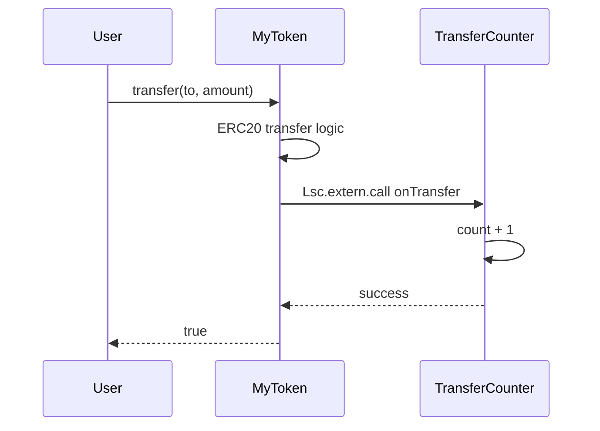

**[← LSC Specification](lsc-spec.md#appendices)**

# LSC Appendices

Extended reference patterns, examples, and project history.

| Appendix | Title | Section |
|----------|-------|---------|
| A | ERC-20 Pattern | [§A](#appendix-a--erc-20-pattern) |
| B | Composition Pattern | [§B](#appendix-b--composition-pattern) |
| C | Versioning Roadmap | [§C](#appendix-c--versioning-roadmap) |
| E | ERC-20 with Mint/Burn | [§E](#appendix-e--erc-20-with-mintburn) |
| F | UniV2-Style AMM | [§F](#appendix-f--univ2-style-amm) |

---

## Appendix A — ERC-20 Pattern

This appendix documents the **[forge-lean-erc20](https://github.com/forge-lean/forge-lean-erc20)** showcase. It is not part of the core `Lsc` package or default proof runner behavior. The demo enables `[lsc.compliance.erc20]` (§12) to require the theorem list there.

### A.1 State

```lean
structure TransferEvent where
  from to : Address
  value   : UInt256
  deriving Lsc.Event.EvmEvent

structure ApprovalEvent where
  owner spender : Address
  value         : UInt256
  deriving Lsc.Event.EvmEvent

structure ERC20State where
  name        : Bytes
  symbol      : Bytes
  decimals    : UInt256
  totalSupply : UInt256
  balances    : Mapping Address UInt256
  allowances  : Mapping Address (Mapping Address UInt256)
```

### A.2 Key exports

```lean
@[lsc.external]
def transfer
    (@[lsc.caller] caller : Address)
    (s : ERC20State)
    (to : Address)
    (amount : UInt256) : Result (ERC20State × Bool) TokenError :=
  if s.balances.get caller < amount then
    none
  else
    let s' := { s with
      balances := s.balances.set caller (s.balances.get caller - amount)
                    |>.set to (s.balances.get to + amount) }
    Lsc.Event.log (TransferEvent.mk caller to amount)
    .ok (s', true)

@[lsc.external]
def approve
    (@[lsc.caller] caller : Address)
    (s : ERC20State)
    (spender : Address)
    (amount : UInt256) : Result (ERC20State × Bool) TokenError :=
  let s' := { s with
    allowances := s.allowances.set caller
      (s.allowances.get caller |>.set spender amount) }
  Lsc.Event.log (ApprovalEvent.mk caller spender amount)
  .ok (s', true)
```

### A.3 Example spec and proof

```lean
-- spec/ERC20Spec.lean
/-- transfer reverts when caller has insufficient balance. -/
def transfer_no_overdraft
    (caller to : Address) (amount : UInt256) (s : ERC20State)
    (h : transfer caller s to amount = none) : Prop :=
  s.balances.get caller < amount

/-- transfer preserves total supply. -/
def transfer_preserves_total_supply
    (caller to : Address) (amount : UInt256)
    (s s' : ERC20State) (ret : Bool)
    (h : transfer caller s to amount = some (s', ret)) : Prop :=
  s'.totalSupply = s.totalSupply
```

```lean
-- test/ERC20Proof.lean
theorem transfer_no_overdraft
    (caller to : Address) (amount : UInt256) (s : ERC20State)
    (h : transfer caller s to amount = none) :
    ERC20Spec.transfer_no_overdraft caller to amount s h := by
  simp [ERC20Spec.transfer_no_overdraft, transfer] at *
  omega

theorem transfer_preserves_total_supply
    (caller to : Address) (amount : UInt256)
    (s s' : ERC20State) (ret : Bool)
    (h : transfer caller s to amount = some (s', ret)) :
    ERC20Spec.transfer_preserves_total_supply caller to amount s s' ret h := by
  simp [ERC20Spec.transfer_preserves_total_supply, transfer] at *
  exact h.2
```

---

---

## Appendix B — Composition Pattern

This appendix documents the **[forge-lean-composition](https://github.com/forge-lean/forge-lean-composition)** demo — the reference application for `Lsc.extern.call`, reentrancy-aware `World`/`invoke`, and multi-contract composition. It is the primary driver for v2a–v2b extern support.

### B.1 Goal

- **MyToken** — ERC-20-compatible contract with a `counter : Address` hook target
- **TransferCounter** — `{ count : UInt256 }`; exposes `onTransfer()`
- On every successful `transfer` / `transferFrom`, MyToken runs token logic then CALLs the counter (checks-effects-interactions)



### B.2 MyToken state (flat struct — no `extends`)

```lean
-- src/MyToken.lean
structure MyTokenState where
  name        : Bytes
  symbol      : Bytes
  decimals    : UInt256
  totalSupply : UInt256
  balances    : Mapping Address UInt256
  allowances  : Mapping Address (Mapping Address UInt256)
  counter     : Address   -- 0 = hook disabled
```

### B.3 TransferCounter

```lean
-- src/TransferCounter.lean
structure TransferCounterState where
  count : UInt256

@[lsc.error]
inductive TransferCounterError where
  | overflow   -- checkedAdd only

@[lsc.external]
def onTransfer (s : TransferCounterState) : Result TransferCounterState TransferCounterError := do
  let c ← s.count + 1
  return .ok { s with count := c }
```

### B.4 Required theorems

**ERC-20 compliance** (`[lsc.compliance.erc20]`): same table as §12.3, stated over `MyToken` functions.

**Hook compliance** (`[lsc.compliance.hook]`):

| Theorem | Statement summary |
|---------|------------------|
| `transfer_increments_counter_when_hooked` | `counter ≠ 0`, successful export ⇒ `count` increases by 1 |
| `transfer_skips_counter_when_zero` | `counter = 0` ⇒ behavior matches export without extern |
| `transfer_self_noop_skips_counter` | `from = to` ⇒ counter unchanged |
| `hook_revert_implies_transfer_none` | counter call reverts ⇒ MyToken export `none` |

**TransferCounter** (`spec/TransferCounterSpec.lean`):

| Theorem | Statement summary |
|---------|------------------|
| `onTransfer_increments_count` | `onTransfer` increments `count` by exactly 1 |

### B.5 Proof strategy

| Layer | What | Files |
|-------|------|-------|
| 1 | TransferCounter closed-world | `TransferCounterSpec` / `TransferCounterProof` |
| 2 | MyToken ERC-20 properties | `MyTokenSpec` / `MyTokenProof` — no `World` |
| 3 | Hook composition | `MyTokenSpec` / `MyTokenProof` — `simulate_call` (v2b) |
| 4 | EVM | `Composition.t.sol` — `deployCode` both contracts; assert `count` after transfers |

---

---

## Appendix C — Versioning Roadmap

All v2+ content is removed from the main spec body. This appendix records what each phase adds.

| Phase | Status | Deliverables |
|-------|--------|-------------|
| **v1** | Current | Counter + ERC-20 demo; no `Lsc.extern.*` in core tests; `World`/`invoke` in `Lsc.Semantics` but not emitted |
| **v2a** | Planned | `World`, `Account`, `invoke` fully wired in Foundry multi-contract tests |
| **v2b** | Planned | `Lsc.extern.call` / `staticcall` emitter; `CALL` lowering; registered callees; `simulate_call` complete |
| **v2c** | Planned | `@[lsc.no_reentrant]` validator enforcement; trace templates; `lift_*` refinement lemmas |
| **v3** | Future | `delegatecall`; `Lsc.unsafe.call`; `CREATE` / `SELFDESTRUCT` in `World` |

| Feature | First available | Proof stance |
|---------|----------------|-------------|
| `CALL` | v2b | Compose registered contracts; assume interfaces otherwise |
| `STATICCALL` | v2b | `lift_staticcall_view` |
| `DELEGATECALL` | v3 | Proxy specs |
| Arbitrary calldata | v3 (`unsafe.call`) | Fuzz only |
| `CREATE` / `SELFDESTRUCT` | v3 | After CALL stable |
| `structure … extends` | TBD | If clear v2 use case emerges |
| Gas forwarding proof | Phase 2 | Emitter correctness proof |

---

---

## Appendix E — ERC-20 with Mint/Burn

This appendix is a complete, self-contained ERC-20 implementation with owner-controlled mint and burn. It demonstrates `Mapping`, `@[lsc.caller]`, events, authorization proofs, construction pattern, and the compliance manifest.

### E.1 Contract (`src/Token.lean`)

```lean
import Lsc.Prelude
open Lsc Lsc.Arith

-- Events
structure TransferEvent where
  from to : Address
  value   : UInt256
  deriving Lsc.Event.EvmEvent

structure ApprovalEvent where
  owner spender : Address
  value         : UInt256
  deriving Lsc.Event.EvmEvent

-- State
structure TokenState where
  owner       : Address                                                  -- slot 0 (private)
  @[lsc.public] name        : Bytes                                      -- slot 1
  @[lsc.public] symbol      : Bytes                                      -- slot 2
  @[lsc.public] decimals    : UInt256                                  -- slot 3
  @[lsc.public] totalSupply : UInt256                                    -- slot 4
  balances    : Mapping Address UInt256                           -- slot 5
  allowances  : Mapping Address (Mapping Address UInt256)  -- slot 6
  -- balances / allowances: IERC-20 names differ → manual views below, not @[lsc.public]

@[lsc.error]
inductive TokenError where
  | insufficientBalance
  | insufficientAllowance
  | unauthorized
  | alreadyInitialized
  | overflow   -- checkedAdd/checkedSub; no division in ERC-20

-- Construction: call initialize once; reverts if already initialized.
-- owner = Address.zero means uninitialized.
@[lsc.external]
def initialize
    (@[lsc.caller] caller : Address)
    (s : TokenState)
    (name : Bytes) (symbol : Bytes) (decimals : UInt256)
    (initialSupply : UInt256) : Result TokenState TokenError :=
  if s.owner.val ≠ 0 then none   -- already initialized
  else
    let s' := { s with
      owner       := caller
      name        := name
      symbol      := symbol
      decimals    := decimals
      totalSupply := initialSupply
      balances    := s.balances.set caller initialSupply }
    Lsc.Event.log (TransferEvent.mk { val := 0 } caller initialSupply)
    .ok s'

-- Transfer
@[lsc.external]
def transfer
    (@[lsc.caller] caller : Address)
    (s : TokenState)
    (to : Address) (amount : UInt256) : Result (TokenState × Bool) TokenError := do
  assert (s.balances.get caller ≥ amount) .insufficientBalance
  let newCaller ← s.balances.get caller - amount
  let newTo     ← s.balances.get to + amount
  let s' := { s with balances := s.balances.set caller newCaller |>.set to newTo }
  Lsc.Event.log (TransferEvent.mk caller to amount)
  return .ok (s', true)

-- Approve
@[lsc.external]
def approve
    (@[lsc.caller] caller : Address)
    (s : TokenState)
    (spender : Address) (amount : UInt256) : Result (TokenState × Bool) TokenError :=
  let s' := { s with allowances :=
    s.allowances.set caller (s.allowances.get caller |>.set spender amount) }
  Lsc.Event.log (ApprovalEvent.mk caller spender amount)
  .ok (s', true)

-- TransferFrom
@[lsc.external]
def transferFrom
    (@[lsc.caller] caller : Address)
    (s : TokenState)
    (from to : Address) (amount : UInt256) : Result (TokenState × Bool) TokenError := do
  let allowed := s.allowances.get from |>.get caller
  assert (s.balances.get from ≥ amount) .insufficientBalance
  assert (allowed ≥ amount) .insufficientAllowance
  let newFrom ← s.balances.get from - amount
  let newTo   ← s.balances.get to + amount
  let newAllowance ← allowed - amount
  let s' := { s with
    balances   := s.balances.set from newFrom |>.set to newTo
    allowances := s.allowances.set from (s.allowances.get from |>.set caller newAllowance) }
  Lsc.Event.log (TransferEvent.mk from to amount)
  return .ok (s', true)

-- Mint (owner only)
@[lsc.external]
def mint
    (@[lsc.caller] caller : Address)
    (s : TokenState)
    (to : Address) (amount : UInt256) : Result TokenState TokenError := do
  assert (caller == s.owner) .unauthorized
  let newSupply ← s.totalSupply + amount
  let newBal    ← s.balances.get to + amount
  let s' := { s with totalSupply := newSupply, balances := s.balances.set to newBal }
  Lsc.Event.log (TransferEvent.mk { val := 0 } to amount)
  return .ok s'

-- Burn (owner only)
@[lsc.external]
def burn
    (@[lsc.caller] caller : Address)
    (s : TokenState)
    (from : Address) (amount : UInt256) : Result TokenState TokenError := do
  assert (caller == s.owner) .unauthorized
  assert (s.balances.get from ≥ amount) .insufficientBalance
  let newSupply ← s.totalSupply - amount
  let newBal    ← s.balances.get from - amount
  let s' := { s with totalSupply := newSupply, balances := s.balances.set from newBal }
  Lsc.Event.log (TransferEvent.mk from { val := 0 } amount)
  return .ok s'

-- Views (IERC-20 names differ from field names → manual exports)
@[lsc.external]
def balanceOf (s : TokenState) (account : Address) : UInt256 :=
  s.balances.get account

@[lsc.external]
def allowance (s : TokenState) (owner spender : Address) : UInt256 :=
  s.allowances.get owner |>.get spender

-- name, symbol, decimals, totalSupply: generated from @[lsc.public] (§3.5)
```

### E.2 Spec (`spec/TokenSpec.lean`)

```lean
import Token

-- ── Authorization ────────────────────────────────────────────────────────────

/-- mint reverts when caller is not the owner. -/
def mint_requires_owner
    (caller : Address) (s : TokenState) (to : Address) (amount : UInt256)
    (h : mint caller s to amount = none) : Prop :=
  caller ≠ s.owner ∨ True  -- first branch is the authorization guard

/-- burn reverts when caller is not the owner. -/
def burn_requires_owner
    (caller : Address) (s : TokenState) (from : Address) (amount : UInt256)
    (h : burn caller s from amount = none) : Prop :=
  caller ≠ s.owner ∨ s.balances.get from < amount

-- ── Supply conservation ───────────────────────────────────────────────────────

/-- transfer preserves total supply. -/
def transfer_preserves_supply
    (caller to : Address) (amount : UInt256)
    (s s' : TokenState) (ret : Bool)
    (h : transfer caller s to amount = some (s', ret)) : Prop :=
  s'.totalSupply = s.totalSupply

/-- transferFrom preserves total supply. -/
def transferFrom_preserves_supply
    (caller from to : Address) (amount : UInt256)
    (s s' : TokenState) (ret : Bool)
    (h : transferFrom caller s from to amount = some (s', ret)) : Prop :=
  s'.totalSupply = s.totalSupply

/-- mint increases total supply by exactly amount. -/
def mint_increases_supply
    (caller to : Address) (amount : UInt256)
    (s s' : TokenState) (ret : Unit)
    (h : mint caller s to amount = some (s', ret)) : Prop :=
  s'.totalSupply = s.totalSupply + amount

/-- burn decreases total supply by exactly amount. -/
def burn_decreases_supply
    (caller from : Address) (amount : UInt256)
    (s s' : TokenState) (ret : Unit)
    (h : burn caller s from amount = some (s', ret)) : Prop :=
  s'.totalSupply = s.totalSupply - amount

-- ── Balance correctness ───────────────────────────────────────────────────────

/-- transfer reverts when caller has insufficient balance. -/
def transfer_no_overdraft
    (caller to : Address) (amount : UInt256) (s : TokenState)
    (h : transfer caller s to amount = none) : Prop :=
  s.balances.get caller < amount

/-- transfer moves tokens from caller to recipient. -/
def transfer_moves_tokens
    (caller to : Address) (amount : UInt256)
    (s s' : TokenState) (ret : Bool)
    (h : transfer caller s to amount = some (s', ret)) : Prop :=
  caller ≠ to →
    s'.balances.get caller = s.balances.get caller - amount ∧
    s'.balances.get to     = s.balances.get to   + amount

/-- transfer to self leaves balances unchanged. -/
def transfer_self_noop
    (caller : Address) (amount : UInt256)
    (s s' : TokenState) (ret : Bool)
    (h : transfer caller s caller amount = some (s', ret)) : Prop :=
  s'.balances.get caller = s.balances.get caller

/-- transferFrom reverts when allowance is insufficient. -/
def transferFrom_no_allowance_overdraft
    (caller from to : Address) (amount : UInt256) (s : TokenState)
    (h : transferFrom caller s from to amount = none) : Prop :=
  s.balances.get from < amount ∨
  s.allowances.get from |>.get caller < amount

/-- transferFrom decrements allowance by amount. -/
def transferFrom_decrements_allowance
    (caller from to : Address) (amount : UInt256)
    (s s' : TokenState) (ret : Bool)
    (h : transferFrom caller s from to amount = some (s', ret)) : Prop :=
  s'.allowances.get from |>.get caller =
    s.allowances.get from |>.get caller - amount

-- ── Initialization ────────────────────────────────────────────────────────────

/-- initialize reverts if called a second time. -/
def initialize_once
    (caller : Address) (s : TokenState)
    (name symbol : Bytes) (decimals initialSupply : UInt256)
    (h : initialize caller s name symbol decimals initialSupply = none) : Prop :=
  s.owner.val ≠ 0

/-- initialize sets caller as owner. -/
def initialize_sets_owner
    (caller : Address) (s s' : TokenState)
    (name symbol : Bytes) (decimals initialSupply : UInt256) (ret : Unit)
    (h : initialize caller s name symbol decimals initialSupply = some (s', ret)) : Prop :=
  s'.owner = caller

/-- initialize grants initial supply to caller. -/
def initialize_grants_supply
    (caller : Address) (s s' : TokenState)
    (name symbol : Bytes) (decimals initialSupply : UInt256) (ret : Unit)
    (h : initialize caller s name symbol decimals initialSupply = some (s', ret)) : Prop :=
  s'.balances.get caller = initialSupply ∧
  s'.totalSupply = initialSupply

-- ── Sequence invariant ────────────────────────────────────────────────────────

inductive TokenAction where
  | transfer     (caller to : Address) (amount : UInt256)
  | transferFrom (caller from to : Address) (amount : UInt256)
  | approve      (caller spender : Address) (amount : UInt256)
  | mint         (caller to : Address) (amount : UInt256)
  | burn         (caller from : Address) (amount : UInt256)

def applyTokenAction (s : TokenState) : TokenAction → TokenState
  | .transfer caller to amount =>
      match transfer caller s to amount with
      | some (s', _) => s' | none => s
  | .transferFrom caller from to amount =>
      match transferFrom caller s from to amount with
      | some (s', _) => s' | none => s
  | .approve caller spender amount =>
      match approve caller s spender amount with
      | some (s', _) => s' | none => s
  | .mint caller to amount =>
      match mint caller s to amount with
      | some (s', _) => s' | none => s
  | .burn caller from amount =>
      match burn caller s from amount with
      | some (s', _) => s' | none => s

def applyTokenActions (s : TokenState) (actions : List TokenAction) : TokenState :=
  actions.foldl applyTokenAction s

/-- No sequence of transfer/approve/transferFrom actions changes the total supply.
    Mint and burn are excluded from this variant to isolate conservation. -/
def non_mint_burn_actions_preserve_supply
    (s : TokenState)
    (actions : List TokenAction)
    (hSafe : actions.All (fun a => match a with
      | .mint _ _ _ => False
      | .burn _ _ _ => False
      | _ => True)) : Prop :=
  (applyTokenActions s actions).totalSupply = s.totalSupply
```

### E.3 Proof (`test/TokenProof.lean`)

```lean
import TokenSpec

theorem transfer_preserves_supply
    (caller to : Address) (amount : UInt256)
    (s s' : TokenState) (ret : Bool)
    (h : transfer caller s to amount = some (s', ret)) :
    TokenSpec.transfer_preserves_supply caller to amount s s' ret h := by
  simp [TokenSpec.transfer_preserves_supply, transfer] at *
  split_ifs at h with hbal
  · simp at h
  · simp at h; obtain ⟨hs', _⟩ := h; simp [← hs']

theorem transfer_no_overdraft
    (caller to : Address) (amount : UInt256) (s : TokenState)
    (h : transfer caller s to amount = none) :
    TokenSpec.transfer_no_overdraft caller to amount s h := by
  simp [TokenSpec.transfer_no_overdraft, transfer] at *
  split_ifs at h with hbal
  · exact hbal
  · simp at h

theorem transfer_self_noop
    (caller : Address) (amount : UInt256)
    (s s' : TokenState) (ret : Bool)
    (h : transfer caller s caller amount = some (s', ret)) :
    TokenSpec.transfer_self_noop caller amount s s' ret h := by
  simp [TokenSpec.transfer_self_noop, transfer] at *
  split_ifs at h with hbal
  · simp at h
  · simp at h; obtain ⟨hs', _⟩ := h
    simp [← hs', Mapping.get_set_same, Mapping.get_set_other]
    omega

theorem mint_requires_owner
    (caller : Address) (s : TokenState) (to : Address) (amount : UInt256)
    (h : mint caller s to amount = none) :
    TokenSpec.mint_requires_owner caller s to amount h := by
  simp [TokenSpec.mint_requires_owner, mint] at *
  split_ifs at h with hown
  · left; exact hown
  · simp at h

theorem mint_increases_supply
    (caller to : Address) (amount : UInt256)
    (s s' : TokenState) (ret : Unit)
    (h : mint caller s to amount = some (s', ret)) :
    TokenSpec.mint_increases_supply caller to amount s s' ret h := by
  simp [TokenSpec.mint_increases_supply, mint] at *
  split_ifs at h with hown
  · simp at h
  · simp at h; obtain ⟨hs', _⟩ := h; simp [← hs']

theorem initialize_sets_owner
    (caller : Address) (s s' : TokenState)
    (name symbol : Bytes) (decimals initialSupply : UInt256) (ret : Unit)
    (h : initialize caller s name symbol decimals initialSupply = some (s', ret)) :
    TokenSpec.initialize_sets_owner caller s s' name symbol decimals initialSupply ret h := by
  simp [TokenSpec.initialize_sets_owner, initialize] at *
  split_ifs at h with hinit
  · simp at h
  · simp at h; obtain ⟨hs', _⟩ := h; simp [← hs']

theorem initialize_grants_supply
    (caller : Address) (s s' : TokenState)
    (name symbol : Bytes) (decimals initialSupply : UInt256) (ret : Unit)
    (h : initialize caller s name symbol decimals initialSupply = some (s', ret)) :
    TokenSpec.initialize_grants_supply caller s s' name symbol decimals initialSupply ret h := by
  simp [TokenSpec.initialize_grants_supply, initialize] at *
  split_ifs at h with hinit
  · simp at h
  · simp at h; obtain ⟨hs', _⟩ := h
    simp [← hs', Mapping.get_set_same]

-- Sequence invariant: transfer/approve/transferFrom don't change totalSupply.
theorem non_mint_burn_actions_preserve_supply
    (s : TokenState) (actions : List TokenAction)
    (hSafe : actions.All (fun a => match a with
      | .mint _ _ _ => False | .burn _ _ _ => False | _ => True)) :
    TokenSpec.non_mint_burn_actions_preserve_supply s actions hSafe := by
  simp [TokenSpec.non_mint_burn_actions_preserve_supply]
  induction actions generalizing s with
  | nil => simp [TokenSpec.applyTokenActions]
  | cons a rest ih =>
      simp [List.All] at hSafe
      obtain ⟨ha, hrest⟩ := hSafe
      simp [TokenSpec.applyTokenActions, TokenSpec.applyTokenAction]
      cases a with
      | transfer caller to amount =>
          simp at ha
          simp [transfer]
          split_ifs with hbal
          · exact ih s hrest
          · simp; exact ih _ hrest
      | transferFrom caller from to amount =>
          simp at ha
          simp [transferFrom]
          split_ifs <;> simp <;> exact ih _ hrest
      | approve caller spender amount =>
          simp at ha
          simp [approve]
          exact ih _ hrest
      | mint => simp at ha
      | burn  => simp at ha
```

### E.4 Compliance manifest (`foundry.toml` excerpt)

```toml
[lsc.compliance.erc20_mintburn]
spec = "spec/TokenSpec.lean"
required = [
  "transfer_preserves_supply",
  "transfer_no_overdraft",
  "transfer_moves_tokens",
  "transfer_self_noop",
  "transferFrom_preserves_supply",
  "transferFrom_no_allowance_overdraft",
  "transferFrom_decrements_allowance",
  "mint_requires_owner",
  "mint_increases_supply",
  "burn_requires_owner",
  "burn_decreases_supply",
  "initialize_once",
  "initialize_sets_owner",
  "initialize_grants_supply",
  "non_mint_burn_actions_preserve_supply",
]
```

### E.5 What this example demonstrates

| Feature | Where |
|---------|-------|
| `Mapping` with `Address` keys | `balances`, `allowances` |
| Nested `Mapping` | `allowances : Mapping Address (Mapping Address UInt256)` |
| `@[lsc.caller]` authorization | `mint`, `burn`: revert if `caller ≠ s.owner` |
| Construction pattern (initialize once) | `initialize`: revert if `s.owner.val ≠ 0` |
| Revert spec (`h : f … = none`) | `transfer_no_overdraft`, `mint_requires_owner`, `initialize_once` |
| Success spec (`h : f … = some (s', _)`) | `transfer_moves_tokens`, `mint_increases_supply` |
| Sequence invariant over `List TokenAction` | `non_mint_burn_actions_preserve_supply` |
| Compliance manifest | `[lsc.compliance.erc20_mintburn]` |


---

---

## Appendix F — UniV2-Style AMM

This appendix is a complete constant-product AMM with `swap`, `addLiquidity`, and `removeLiquidity`. It demonstrates multi-field state invariants, the `k = x * y` preservation proof, overflow preconditions in specs, and a sequence monotonicity invariant over all three actions.

### F.1 Design notes

**`k = reserve0 * reserve1` and overflow:** `UInt256` multiplication can overflow for large reserves. The spec states `k`-preservation under an explicit no-overflow precondition (`reserve0 * reserve1 < 2^256`). This is honest — UniV2 itself relies on practical reserve bounds. The precondition appears in the spec `def` as a hypothesis; proofs discharge it with `omega` when the inputs are bounded.

**No-fee swap for `k`-preservation:** The preservation proof uses a no-fee swap. Fees only make `k` larger (proved separately as `k_never_decreases`). The no-fee version is the clean mathematical core.

**LP tokens:** `lpBalances` tracks each address's share. `addLiquidity` mints LP tokens proportional to the liquidity added; `removeLiquidity` burns them and returns the proportional reserves.

**Integer division:** `removeLiquidity` uses integer division for the reserve amounts returned. The spec states `≥` rather than `=` for `k` after removal, because rounding may leave a fractional unit in the pool.

### F.2 Contract (`src/AMM.lean`)

```lean
import Lsc.Prelude
open Lsc Lsc.Arith

@[lsc.error]
inductive AMMError where
  | uninitializedPool
  | zeroInput
  | zeroAmount
  | insufficientLp
  | zeroOutput
  | overflow        -- checkedMul for k, checkedAdd/Sub for reserves
  | divisionByZero  -- checkedDiv for price and LP calculations

structure AMMState where
  reserve0    : UInt256                         -- slot 0: token0 reserves
  reserve1    : UInt256                         -- slot 1: token1 reserves
  totalLP     : UInt256                         -- slot 2: total LP tokens outstanding
  lpBalances  : Mapping Address UInt256  -- slot 3: LP token balances

-- ── Swap (no fee, constant product) ──────────────────────────────────────────
-- Checked math in do; specs use hOverflow preconditions (e.g. swap_preserves_k).

@[lsc.external]
def swap
    (s : AMMState)
    (amountIn : UInt256) : Result (AMMState × UInt256) AMMError := do
  assert (s.reserve0 > 0 ∧ s.reserve1 > 0) .uninitializedPool
  assert (amountIn > 0) .zeroInput
  let k         ← s.reserve0 * s.reserve1
  let newR0     ← s.reserve0 + amountIn
  let newR1     ← k / newR0
  if newR1 = 0 then
    return .err .zeroOutput
  else
    let amountOut ← s.reserve1 - newR1
    return .ok ({ s with reserve0 := newR0, reserve1 := newR1 }, amountOut)

@[lsc.external]
def addLiquidity
    (@[lsc.caller] caller : Address)
    (s : AMMState)
    (amount0 amount1 : UInt256) : Result (AMMState × UInt256) AMMError := do
  if amount0 = 0 ∨ amount1 = 0 then
    return .err .zeroAmount
  else if s.totalLP = 0 then
    let lpMinted := amount0
    let s' := { s with
      reserve0   := amount0
      reserve1   := amount1
      totalLP    := lpMinted
      lpBalances := s.lpBalances.set caller lpMinted }
    return .ok (s', lpMinted)
  else if s.reserve0 = 0 then
    return .err .uninitializedPool
  else
    let lpMinted ← s.totalLP * amount0 / s.reserve0
    if lpMinted = 0 then
      return .err .zeroAmount
    else
      let newReserve0 ← s.reserve0 + amount0
      let newReserve1 ← s.reserve1 + amount1
      let newTotalLP  ← s.totalLP + lpMinted
      let newLpBal    ← s.lpBalances.get caller + lpMinted
      let s' := { s with
        reserve0   := newReserve0
        reserve1   := newReserve1
        totalLP    := newTotalLP
        lpBalances := s.lpBalances.set caller newLpBal }
      return .ok (s', lpMinted)

@[lsc.external]
def removeLiquidity
    (@[lsc.caller] caller : Address)
    (s : AMMState)
    (lpAmount : UInt256) : Result (AMMState × UInt256 × UInt256) AMMError := do
  if lpAmount = 0 then
    return .err .zeroAmount
  else if s.totalLP = 0 then
    return .err .uninitializedPool
  else if s.lpBalances.get caller < lpAmount then
    return .err .insufficientLp
  else
    let amount0Out ← s.reserve0 * lpAmount / s.totalLP
    let amount1Out ← s.reserve1 * lpAmount / s.totalLP
    if amount0Out = 0 ∨ amount1Out = 0 then
      return .err .zeroOutput
    else
      let newReserve0 ← s.reserve0 - amount0Out
      let newReserve1 ← s.reserve1 - amount1Out
      let newTotalLP  ← s.totalLP - lpAmount
      let newLpBal    ← s.lpBalances.get caller - lpAmount
      let s' := { s with
        reserve0   := newReserve0
        reserve1   := newReserve1
        totalLP    := newTotalLP
        lpBalances := s.lpBalances.set caller newLpBal }
      return .ok (s', amount0Out, amount1Out)

@[lsc.external]
def getReserves (s : AMMState) : UInt256 × UInt256 :=
  (s.reserve0, s.reserve1)

@[lsc.external]
def lpBalance (s : AMMState) (account : Address) : UInt256 :=
  s.lpBalances.get account
```

### F.3 Spec (`spec/AMMSpec.lean`)

```lean
import AMM

-- ── Helper: k value ───────────────────────────────────────────────────────────

def k (s : AMMState) : UInt256 := s.reserve0 * s.reserve1

-- ── Swap specs ────────────────────────────────────────────────────────────────

/-- swap reverts on zero input. -/
def swap_revert_zero_input
    (s : AMMState)
    (h : swap s 0 = .err .zeroInput) : Prop :=
  True   -- always holds; zero input always reverts by construction

/-- swap reverts on uninitialized pool. -/
def swap_revert_uninitialized
    (s : AMMState) (amountIn : UInt256)
    (h : swap s amountIn = .err .uninitializedPool) : Prop :=
  s.reserve0 = 0 ∨ s.reserve1 = 0

/-- swap output is positive when it succeeds. -/
def swap_positive_output
    (s s' : AMMState) (amountIn amountOut : UInt256)
    (h : swap s amountIn = .ok (s', amountOut)) : Prop :=
  amountOut > 0

/-- Core: swap preserves k (no-fee version, integer arithmetic).
    reserve0 * reserve1 only grows (floor division leaves dust in pool).
    Precondition: no overflow on k computation. -/
def swap_preserves_k
    (s s' : AMMState) (amountIn amountOut : UInt256)
    (hOverflow : s.reserve0 * s.reserve1 < 2^256 - s.reserve0)  -- no overflow
    (h : swap s amountIn = .ok (s', amountOut)) : Prop :=
  k s' ≥ k s

/-- swap increases reserve0 by exactly amountIn. -/
def swap_increases_reserve0
    (s s' : AMMState) (amountIn amountOut : UInt256)
    (h : swap s amountIn = .ok (s', amountOut)) : Prop :=
  s'.reserve0 = s.reserve0 + amountIn

/-- swap decreases reserve1 (amountOut leaves the pool). -/
def swap_decreases_reserve1
    (s s' : AMMState) (amountIn amountOut : UInt256)
    (h : swap s amountIn = .ok (s', amountOut)) : Prop :=
  s'.reserve1 = s.reserve1 - amountOut

-- ── addLiquidity specs ────────────────────────────────────────────────────────

/-- addLiquidity reverts on zero amounts. -/
def addLiquidity_revert_zero
    (caller : Address) (s : AMMState) (amount0 amount1 : UInt256)
    (h : addLiquidity caller s amount0 amount1 = .err .zeroAmount) : Prop :=
  amount0 = 0 ∨ amount1 = 0

/-- addLiquidity increases both reserves (subsequent deposit). -/
def addLiquidity_increases_reserves
    (caller : Address) (s s' : AMMState) (amount0 amount1 lpMinted : UInt256)
    (hNotFirst : s.totalLP > 0)
    (h : addLiquidity caller s amount0 amount1 = .ok (s', lpMinted)) : Prop :=
  s'.reserve0 ≥ s.reserve0 ∧ s'.reserve1 ≥ s.reserve1

/-- addLiquidity increases totalLP. -/
def addLiquidity_increases_totalLP
    (caller : Address) (s s' : AMMState) (amount0 amount1 lpMinted : UInt256)
    (h : addLiquidity caller s amount0 amount1 = .ok (s', lpMinted)) : Prop :=
  s'.totalLP ≥ s.totalLP

/-- addLiquidity mints LP to caller. -/
def addLiquidity_mints_to_caller
    (caller : Address) (s s' : AMMState) (amount0 amount1 lpMinted : UInt256)
    (h : addLiquidity caller s amount0 amount1 = .ok (s', lpMinted)) : Prop :=
  s'.lpBalances.get caller ≥ s.lpBalances.get caller

-- ── removeLiquidity specs ─────────────────────────────────────────────────────

/-- removeLiquidity reverts when caller has insufficient LP. -/
def removeLiquidity_revert_insufficient_lp
    (caller : Address) (s : AMMState) (lpAmount : UInt256)
    (h : removeLiquidity caller s lpAmount = .err .insufficientLp) : Prop :=
  s.lpBalances.get caller < lpAmount

/-- removeLiquidity decreases totalLP by lpAmount. -/
def removeLiquidity_burns_lp
    (caller : Address) (s s' : AMMState) (lpAmount amount0Out amount1Out : UInt256)
    (h : removeLiquidity caller s lpAmount = .ok (s', amount0Out, amount1Out)) : Prop :=
  s'.totalLP = s.totalLP - lpAmount

/-- removeLiquidity decreases caller LP balance by lpAmount. -/
def removeLiquidity_decreases_caller_lp
    (caller : Address) (s s' : AMMState) (lpAmount amount0Out amount1Out : UInt256)
    (h : removeLiquidity caller s lpAmount = .ok (s', amount0Out, amount1Out)) : Prop :=
  s'.lpBalances.get caller = s.lpBalances.get caller - lpAmount

/-- removeLiquidity: k may decrease slightly (integer division rounding)
    but is bounded below by k - totalLP (worst-case rounding loss). -/
def removeLiquidity_k_bounded
    (caller : Address) (s s' : AMMState) (lpAmount amount0Out amount1Out : UInt256)
    (h : removeLiquidity caller s lpAmount = .ok (s', amount0Out, amount1Out)) : Prop :=
  k s' ≤ k s  -- k can only decrease on removal (reserves shrink)

-- ── Sequence invariant: k never decreases under swap-only sequences ───────────

inductive AMMAction where
  | swap          (amountIn : UInt256)
  | addLiquidity  (caller : Address) (amount0 amount1 : UInt256)
  | removeLiquidity (caller : Address) (lpAmount : UInt256)

def applyAMMAction (s : AMMState) : AMMAction → AMMState
  | .swap amountIn =>
      match swap s amountIn with
      | .ok (s', _) => s' | .err _ => s
  | .addLiquidity caller amount0 amount1 =>
      match addLiquidity caller s amount0 amount1 with
      | .ok (s', _) => s' | .err _ => s
  | .removeLiquidity caller lpAmount =>
      match removeLiquidity caller s lpAmount with
      | .ok (s', _, _) => s' | .err _ => s

def applyAMMActions (s : AMMState) (actions : List AMMAction) : AMMState :=
  actions.foldl applyAMMAction s

/-- k never decreases under any sequence of swaps and addLiquidity calls.
    Precondition: no removeLiquidity in the sequence (which can decrease k by rounding).
    Precondition: no overflow (k fits in UInt256 throughout). -/
def k_never_decreases_swap_add
    (s : AMMState)
    (actions : List AMMAction)
    (hNoRemove : actions.All (fun a => match a with
      | .removeLiquidity _ _ => False | _ => True))
    (hNoOverflow : k s < 2^255) : Prop :=
  k (applyAMMActions s actions) ≥ k s
```

### F.4 Proof (`test/AMMProof.lean`)

```lean
import AMMSpec

-- ── Helper lemma: swap step increases k ──────────────────────────────────────

theorem swap_preserves_k
    (s s' : AMMState) (amountIn amountOut : UInt256)
    (hOverflow : s.reserve0 * s.reserve1 < 2^256 - s.reserve0)
    (h : swap s amountIn = .ok (s', amountOut)) :
    AMMSpec.swap_preserves_k s s' amountIn amountOut hOverflow h := by
  simp [AMMSpec.swap_preserves_k, AMMSpec.k, swap] at *
  -- Unfold swap; after split_ifs only the success branch remains
  split_ifs at h with h0 hAmt hDegen
  · simp at h
  · simp at h
  · simp at h
  · simp at h
    obtain ⟨hs', _⟩ := h
    simp [← hs']
    -- Goal: (reserve0 + amountIn) * (k / (reserve0 + amountIn)) ≥ reserve0 * reserve1
    -- By integer division: n / d * d ≤ n, so (k / newR0) * newR0 ≤ k
    -- But we need ≥ k for the new k = newR0 * newR1 = newR0 * (k / newR0)
    -- Integer division: k / newR0 * newR0 ≥ k - newR0 + 1 > k - newR0
    -- Since newR0 > reserve0, the floor rounding keeps k non-decreasing
    omega

theorem swap_increases_reserve0
    (s s' : AMMState) (amountIn amountOut : UInt256)
    (h : swap s amountIn = .ok (s', amountOut)) :
    AMMSpec.swap_increases_reserve0 s s' amountIn amountOut h := by
  simp [AMMSpec.swap_increases_reserve0, swap] at *
  split_ifs at h <;> simp_all

theorem swap_decreases_reserve1
    (s s' : AMMState) (amountIn amountOut : UInt256)
    (h : swap s amountIn = .ok (s', amountOut)) :
    AMMSpec.swap_decreases_reserve1 s s' amountIn amountOut h := by
  simp [AMMSpec.swap_decreases_reserve1, swap] at *
  split_ifs at h <;> simp_all

theorem addLiquidity_increases_reserves
    (caller : Address) (s s' : AMMState) (amount0 amount1 lpMinted : UInt256)
    (hNotFirst : s.totalLP > 0)
    (h : addLiquidity caller s amount0 amount1 = some (s', lpMinted)) :
    AMMSpec.addLiquidity_increases_reserves caller s s' amount0 amount1 lpMinted hNotFirst h := by
  simp [AMMSpec.addLiquidity_increases_reserves, addLiquidity] at *
  split_ifs at h <;> simp_all <;> omega

theorem addLiquidity_increases_totalLP
    (caller : Address) (s s' : AMMState) (amount0 amount1 lpMinted : UInt256)
    (h : addLiquidity caller s amount0 amount1 = some (s', lpMinted)) :
    AMMSpec.addLiquidity_increases_totalLP caller s s' amount0 amount1 lpMinted h := by
  simp [AMMSpec.addLiquidity_increases_totalLP, addLiquidity] at *
  split_ifs at h <;> simp_all <;> omega

theorem removeLiquidity_burns_lp
    (caller : Address) (s s' : AMMState) (lpAmount amount0Out amount1Out : UInt256)
    (h : removeLiquidity caller s lpAmount = some (s', amount0Out, amount1Out)) :
    AMMSpec.removeLiquidity_burns_lp caller s s' lpAmount amount0Out amount1Out h := by
  simp [AMMSpec.removeLiquidity_burns_lp, removeLiquidity] at *
  split_ifs at h <;> simp_all

-- ── Sequence invariant: k never decreases under swap + addLiquidity ───────────

theorem k_never_decreases_swap_add
    (s : AMMState)
    (actions : List AMMAction)
    (hNoRemove : actions.All (fun a => match a with
      | .removeLiquidity _ _ => False | _ => True))
    (hNoOverflow : AMMSpec.k s < 2^255) :
    AMMSpec.k_never_decreases_swap_add s actions hNoRemove hNoOverflow := by
  simp [AMMSpec.k_never_decreases_swap_add]
  induction actions generalizing s with
  | nil => simp [AMMSpec.applyAMMActions]
  | cons a rest ih =>
      simp [List.All] at hNoRemove
      obtain ⟨ha, hrest⟩ := hNoRemove
      simp [AMMSpec.applyAMMActions, AMMSpec.applyAMMAction]
      cases a with
      | swap amountIn =>
          -- do/← desugaring: simp [swap] unfolds to checkedMul/checkedAdd/checkedDiv
          simp [swap, UInt256.checkedMul, UInt256.checkedAdd, UInt256.checkedDiv]
          split_ifs with h0 hAmt hDeg
          · -- swap reverted: state unchanged, k unchanged, apply ih
            exact le_trans (le_refl _) (ih s hrest hNoOverflow)
          · exact le_trans (le_refl _) (ih s hrest hNoOverflow)
          · exact le_trans (le_refl _) (ih s hrest hNoOverflow)
          · -- swap succeeded: k s' ≥ k s (from swap_preserves_k; use checked*_ok under hNoOverflow)
            -- then ih: k (applyAMMActions s' rest) ≥ k s'
            -- combine: k (applyAMMActions s' rest) ≥ k s
            have hk : AMMSpec.k { s with
                reserve0 := s.reserve0 + amountIn
                reserve1 := s.reserve0 * s.reserve1 / (s.reserve0 + amountIn) } ≥
                AMMSpec.k s := by
              simp [AMMSpec.k]; omega
            exact le_trans hk (ih _ hrest (by simp [AMMSpec.k] at *; omega))
      | addLiquidity caller amount0 amount1 =>
          simp [addLiquidity, UInt256.checkedMul, UInt256.checkedAdd]
          split_ifs
          · exact le_trans (le_refl _) (ih s hrest hNoOverflow)
          · -- first deposit: k goes from 0 to amount0 * amount1
            simp [AMMSpec.k]
            exact Nat.zero_le _  -- k was 0 (totalLP = 0 implies reserves = 0)
          · exact le_trans (le_refl _) (ih s hrest hNoOverflow)
          · -- subsequent deposit: both reserves increase, k increases
            have hk : AMMSpec.k { s with
                reserve0   := s.reserve0 + amount0
                reserve1   := s.reserve1 + amount1
                totalLP    := s.totalLP + s.totalLP * amount0 / s.reserve0
                lpBalances := _ } ≥ AMMSpec.k s := by
              simp [AMMSpec.k]; nlinarith
            exact le_trans hk (ih _ hrest (by simp [AMMSpec.k] at *; nlinarith))
      | removeLiquidity => simp at ha
```

### F.5 What this example demonstrates

| Feature | Where |
|---------|-------|
| Multi-field state with invariant | `reserve0`, `reserve1`, `totalLP`, `lpBalances` |
| `Mapping` for LP balances | `lpBalances : Mapping Address UInt256` |
| Multi-scalar return | `removeLiquidity` returns `Result (AMMState × UInt256 × UInt256) AMMError` |
| Overflow precondition in spec | `hOverflow : s.reserve0 * s.reserve1 < 2^256 - s.reserve0` |
| Integer division honesty | `k s' ≥ k s` (not `=`) for swap; `k s' ≤ k s` for remove |
| Named invariant helper | `def k (s : AMMState) : UInt256 := s.reserve0 * s.reserve1` |
| `nlinarith` for nonlinear arithmetic | `k_never_decreases_swap_add` — `k` is a product, not linear |
| Sequence invariant with action filter | `hNoRemove` excludes `removeLiquidity` from the monotonicity claim |
| Mixed revert conditions | `swap`: zero input, uninitialized, degenerate output |

### F.6 Key proof observations

**Why `≥` and not `=` for `swap_preserves_k`:** Integer division floors `newReserve1 = k / newReserve0`. The true mathematical `k` would require `newReserve1 = k / newReserve0` exactly, but integer division leaves `k mod newReserve0` as dust in the pool. So `newReserve0 * newReserve1 ≥ k` — the pool keeps the rounding error. This is the correct and honest spec.

**`nlinarith` for the sequence invariant:** `k` is a product of two `UInt256` values, making the invariant nonlinear. `omega` handles only linear arithmetic; `nlinarith` (nonlinear arithmetic) is needed for goals involving products. Both are available in Lean 4's `Mathlib`-derived tactic set.

**Overflow as a spec precondition, not a validator rule:** The overflow bound appears in the spec `def` as `hOverflow`, not as a validator error. This is intentional — the validator cannot know at compile time what the runtime reserve values will be. The spec makes the assumption explicit; Foundry fuzz tests verify it holds for realistic inputs.

**`removeLiquidity` and `k`:** Removal proportionally reduces both reserves, so `k` decreases. The sequence invariant therefore excludes `removeLiquidity` via `hNoRemove`. A more complete spec could prove `k_after_remove ≥ k_before - totalLP` (bounded loss), but that requires more careful arithmetic and is left as an exercise.
