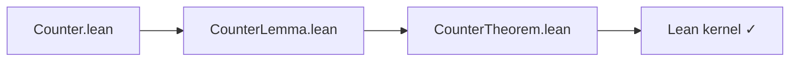

# LSC — Lean Smart Contracts Language Specification

**Language version:** LSC 1.0
**Lean baseline:** `leanprover/lean4:stable` (pinned per project)
**Execution target:** EVM (bytecode via formally-verified lowering; standard JSON ABI)
**Companion document:** [lsc-toolchain.md](lsc-toolchain.md) — reference compiler, Foundry integration, artifacts, demos

---

## §1 Overview

### §1.1 What LSC is

**LSC (Lean Smart Contracts)** is a strict subset of Lean 4 for writing smart contracts whose correctness properties are machine-checked by the Lean kernel before deployment.

Authors write **pure state-transition functions** in Lean. The compiler generates everything the EVM needs — ABI wrappers, storage load/store, LOG opcodes, CALL lowering. Authors never touch `sload`, `sstore`, ABI encoding, or log assembly directly.

This restriction is intentional. Lean's kernel checks proofs about pure functions automatically. The moment authors write storage IO or ABI ceremony, proofs become hard. LSC restricts the *language* rather than what you can deploy — the same tradeoff Vyper makes for security, applied here for provability.

**What you can deploy:** persistent storage and mappings, events/logs, standard ABIs (ERC-20 `bool` returns, etc.), ETH transfers, cross-contract calls, revert semantics, full EVM bytecode.

**What is restricted in author code:** stateful monads (`StateM`, `IO`), higher-order functions, closures, unbounded collections in state, `Nat`/`Int`/`String`, `structure … extends`, unbounded recursion, manual storage IO. `do`-notation over `Except E` is allowed for fallible exports. See §12 for the full validator error table.

### §1.2 What the compiler generates vs what authors write

Authors write pure functions. The compiler generates everything else at `@[Lsc.external]` boundaries:

| Author writes | Compiler generates |
|---------------|--------------------|
| `@[Lsc.external] def increment (s : CounterState) : Except ArithError CounterState` | ABI dispatcher, `sload` all fields, call `increment`, on `.ok s'` → `sstore`, on `.error e` → `revert(abi.encode(e))` |
| `@[Lsc.public]` on a State field (e.g. `number`) | `@[Lsc.external]` view + lazy slot read (§3.5) |
| `emit! TransferEvent from to amount` in function body | `LOG2` opcode after store, with correct topic0 and ABI-encoded data |
| `callvalue : CallValue` parameter | bound to `msg.value`; marks function payable; validator error if missing on ETH-receiving path (§5.4) |

Proofs target the author-written functions directly — the same signatures that get deployed. The lowering pipeline is formally verified in Lean (§13.3).

### §1.3 The three modules

Every LSC project produces three module kinds per contract. There is no `spec/` directory.

| File | Role | Kernel-checked |
|------|------|---------------|
| `src/Counter.lean` | Contract — `State` struct + `@[Lsc.external]` functions | Yes (types) |
| `test/CounterLemma.lean` | Lemma — action model scaffolding + `lemma` proofs | Yes (full proof check) |
| `test/CounterTheorem.lean` | Theorem — high-level requirements, one-line lemma delegations | Yes (full proof check) |

The **contract** is what deploys. The **theorem** file is the requirements document — written and reviewed by humans. Each `theorem` states a readable business property inline and delegates to a homonymous `lemma` in exactly one line. The **lemma** file is AI-generated and holds scaffolding (`CounterAction`, `applyAction`, `applyActions`) plus all tactic proofs; humans do not review it. The Lean kernel checks both files.

**End-to-end Counter example:**

`src/Counter.lean`:
```lean
import Lsc.Prelude
open Lsc

structure CounterState where
  @[Lsc.public]
  number : UInt256

@[Lsc.external]
def increment (s : CounterState) : Except ArithError CounterState := do
  let n ← s.number +? 1
  return .ok { s with number := n }
```

`test/CounterTheorem.lean`:
```lean
import Counter
import CounterLemma

/-- On success, increment increases number by exactly 1. -/
theorem increment_increases_number (s s' : CounterState) (h : increment s = .ok s') :
    s'.number = s.number + 1 :=
  CounterLemma.increment_increases_number s s' h

/-- increment errors iff number is at UInt256 max. -/
theorem increment_overflows_iff (s : CounterState) (h : increment s = .error .overflow) :
    s.number = UInt256.max :=
  CounterLemma.increment_overflows_iff s h

/-- No sequence of actions can decrease the number. -/
theorem number_never_decreases (s : CounterState) (actions : List CounterLemma.CounterAction) :
    (CounterLemma.applyActions s actions).number ≥ s.number :=
  CounterLemma.number_never_decreases s actions
```



`test/CounterLemma.lean`:
```lean
import Counter

inductive CounterAction where
  | increment

def applyAction (s : CounterState) : CounterAction → CounterState
  | .increment =>
      match increment s with
      | .ok s'   => s'
      | .error _ => s

def applyActions (s : CounterState) (actions : List CounterAction) : CounterState :=
  actions.foldl applyAction s

lemma increment_increases_number (s s' : CounterState) (h : increment s = .ok s') :
    s'.number = s.number + 1 := by
  simp [increment] at h ⊢; omega

lemma increment_overflows_iff (s : CounterState) (h : increment s = .error .overflow) :
    s.number = UInt256.max := by
  simp [increment, UInt256.addChecked_error (by omega)] at h; omega

lemma number_never_decreases (s : CounterState) (actions : List CounterAction) :
    (applyActions s actions).number ≥ s.number := by
  simp only [applyActions]
  apply Lsc.Invariant applyAction (fun s' => s'.number ≥ s.number)
  · intro s' a hP; cases a <;> simp [applyAction, increment] at hP ⊢ <;> omega
  · simp
```

### §1.4 Non-goals (v1)

- Upgradeability / proxies
- `structure … extends` storage inheritance (see §3.3)
- Gas optimization in the proof model
- Mandatory application compliance packs in the language definition

For `lakefile.lean` layout, see [lsc-toolchain.md §2](lsc-toolchain.md#2-project-layout-and-lake).

---

## PART I — THE CONTRACT LANGUAGE

---

## §2 Types

### §2.1 Primitive types

| LSC type | Lean definition | EVM/ABI type | Notes |
|----------|----------------|--------------|-------|
| `UInt256` | `Fin (2^256)` | `uint256` | Modular arithmetic everywhere |
| `Address` | `structure Address where val : UInt256` | `address` | Not coercible to `UInt256` without `.val` |
| `Bool` | Lean built-in | `bool` | |
| `Bytes32` | `Fin (2^256)` newtype | `bytes32` | Raw 32-byte value |
| `Bytes[N]` | `{ b : ByteArray // b.size ≤ N }` | `bytes` / `string` | Bounded; see §2.2 |

#### Arithmetic semantics

`UInt256 = Fin (2^256)` throughout. `+ - * /` mean modular arithmetic in **all contexts** — contract, lemma, and theorem files.

Two modes:

| Mode | Syntax | Returns | Use when |
|------|--------|---------|----------|
| Wrapping | `a + b` | `UInt256` | overflow is impossible or irrelevant |
| Checked | `a +? b` | `Except E UInt256` | overflow must revert |

Checked arithmetic returns `Except E _` via the in-scope `LscError E` instance. Compose with `←` in a `do`-block over `Except E`. See §2.5.

### §2.2 Bytes[N]

`Bytes[N]` is a Vyper-style bounded byte array. Both spellings are valid; `Bytes[N]` is the canonical form in LSC.

```lean
-- Lsc.Prelude
abbrev Bytes (n : Nat) := { b : ByteArray // b.size ≤ n }
notation "Bytes[" n "]" => Bytes n
-- Both Bytes[64] and Bytes 64 are accepted; Bytes[N] is preferred.
```

**Storage layout** (identical to Vyper/Solidity):
- `b.size ≤ 31`: left-aligned in slot, `b.size * 2` in LSB.
- `b.size > 31`: slot `p` holds `b.size * 2 + 1`; payload at `keccak256(p)` in 32-byte chunks.

**Validator rules:** `N` must be a numeric literal. `N = 0` is a warning.

### §2.3 Mapping

`Mapping K V` is a plain Lean 4 function, matching Vyper's `HashMap` model:

```lean
-- Lsc.Prelude
abbrev Mapping (K V : Type) := K → V

namespace Mapping
def load  (m : Mapping K V) (k : K) : V := m k
def store [DecidableEq K] (m : Mapping K V) (k : K) (v : V) : Mapping K V :=
  Function.update m k v
def empty [Inhabited V] : Mapping K V := fun _ => default
end Mapping
```

**Storage layout:** slot `p` for a `Mapping` field; entry at key `k` lives at `keccak256(abi.encode(k, p))` using ABI-encoded (padded) key encoding — identical to Solidity. Test vector:

```
slot p = 4, key k = address(0xABCD...):
entry slot = keccak256(
  0x000000000000000000000000ABCD...   -- address, padded to 32 bytes
  0x0000000000000000000000000000000000000000000000000000000000000004  -- slot index
)
```

Nested mappings (e.g. ERC-20 allowances) are `Mapping K (Mapping K' V)`.

**Simp laws** (derived from `Function.update`; no custom axioms):

```lean
@[simp] theorem Mapping.load_store_same [DecidableEq K] (m : Mapping K V) (k : K) (v : V) :
    (m.store k v).load k = v := Function.update_same k v m

@[simp] theorem Mapping.load_store_other [DecidableEq K] (m : Mapping K V)
    (k k' : K) (v : V) (h : k ≠ k') :
    (m.store k v).load k' = m.load k' := Function.update_noteq h v m

@[simp] theorem Mapping.load_empty [Inhabited V] (k : K) :
    (Mapping.empty : Mapping K V).load k = default := rfl

@[simp] theorem Mapping.store_store_same [DecidableEq K] (m : Mapping K V) (k : K) (v v' : V) :
    (m.store k v).store k v' = m.store k v' := Function.update_idem k v v' m
```

> **Why `K → V` instead of `Finsupp`?** Contracts never enumerate or sum over keys. A plain function is the minimal model that makes `simp [Mapping.load_store_same]` work with no extra instances.

### §2.4 Except

LSC uses Lean 4's standard `Except E A` for fallible functions. No custom `Result` type is defined.

The four return shapes:

| Shape | Meaning |
|-------|---------|
| `S` | Infallible mutator |
| `V` | Infallible view |
| `Except E S` | Fallible mutator, no ABI return value |
| `Except E (S × V)` | Fallible mutator with return value |

`.ok val` — success; emitter persists state and ABI-encodes the non-state component.
`.error e` — EVM revert; emitter ABI-encodes `e` as a Solidity custom error.

### §2.5 Error types, arithmetic errors, and `LscError`

#### `@[Lsc.error]` — declaring contract error types

Registers the inductive with the emitter for ABI `errors` generation and revert encoding.

Every `@[Lsc.error]` type **must** include an `arith` constructor and a `LscError` instance. This is enforced by the validator (§12.1). It makes the arithmetic fault channel part of the error type's contract — LSC does not allow error types that silently discard arithmetic faults.

```lean
@[Lsc.error]
inductive TokenError where
  | insufficientBalance
  | insufficientAllowance
  | unauthorized
  | arith : ArithError → TokenError
  deriving DecidableEq, Repr

instance : LscError TokenError where
  arith := .arith
```

The `arith` constructor and `LscError` instance can be auto-derived by the `@[Lsc.error]` attribute — authors may omit them and the attribute will inject both:

```lean
-- Equivalent shorthand: @[Lsc.error] derives arith constructor + LscError instance automatically
@[Lsc.error]
inductive TokenError where
  | insufficientBalance
  | insufficientAllowance
  | unauthorized
  deriving DecidableEq, Repr
-- arith : ArithError → TokenError and instance LscError TokenError injected by @[Lsc.error]
```

#### `ArithError` — prelude arithmetic error type

```lean
-- Lsc.Prelude
inductive ArithError where
  | overflow
  | divisionByZero
  deriving DecidableEq, Repr
```

#### `LscError` — the arithmetic fault typeclass

```lean
-- Lsc.Prelude
class LscError (E : Type) where
  arith : ArithError → E

-- ArithError is its own LscError (identity instance, for simple contracts)
instance : LscError ArithError where
  arith := id
```

This typeclass is the mechanism by which `+?`, `-?`, `*?`, `/?` inject arithmetic faults into any error type `E` without an explicit lift at every call site. The instance is resolved at elaboration time.

#### The `+?` operator family

`+?`, `-?`, `*?`, `/?` return `Except E A` directly (not `Option`), using the `LscError E` instance in scope. Plain `+ - * /` always wrap (Fin semantics).

```lean
-- Lsc.Prelude
def UInt256.addChecked [LscError E] (a b : UInt256) : Except E UInt256 :=
  if a.val + b.val < 2^256 then .ok ⟨a.val + b.val⟩
  else .error (LscError.arith .overflow)
def UInt256.subChecked [LscError E] (a b : UInt256) : Except E UInt256 :=
  if a.val ≥ b.val then .ok ⟨a.val - b.val⟩
  else .error (LscError.arith .overflow)
def UInt256.mulChecked [LscError E] (a b : UInt256) : Except E UInt256 :=
  if a.val = 0 ∨ b.val ≤ (2^256 - 1) / a.val then .ok ⟨a.val * b.val⟩
  else .error (LscError.arith .overflow)
def UInt256.divChecked [LscError E] (a b : UInt256) : Except E UInt256 :=
  if b.val ≠ 0 then .ok ⟨a.val / b.val⟩
  else .error (LscError.arith .divisionByZero)

scoped notation a " +? " b => UInt256.addChecked a b
scoped notation a " -? " b => UInt256.subChecked a b
scoped notation a " *? " b => UInt256.mulChecked a b
scoped notation a " /? " b => UInt256.divChecked a b
```

Because `+?` etc. return `Except E _` directly, they compose naturally with `←` in a `do`-block over `Except E` — no macro, no wrapper, no lift annotation needed.

**AMM swap example:**

```lean
@[Lsc.external]
def swap (s : AMMState) (amountIn : UInt256) : Except AMMError AMMState := do
  require (s.reserve0 > 0) .uninitializedPool
  let num       ← amountIn  *? s.reserve1
  let denom     ← s.reserve0 +? amountIn
  let amountOut ← num /? denom
  return .ok { s with
    reserve0 := s.reserve0 + amountIn
    reserve1 := s.reserve1 - amountOut }
```

**Simple contracts** use `ArithError` directly as `E`; the identity `LscError ArithError` instance is in the prelude:

```lean
@[Lsc.external]
def increment (s : CounterState) : Except ArithError CounterState := do
  let n ← s.number +? 1
  return .ok { s with number := n }
```

**Solidity comparison:**

| | Solidity | LSC |
|---|---|---|
| Default `+` | reverts on overflow | wraps (Fin) |
| Opt-out | `unchecked { a + b }` | `a + b` (plain) |
| Checked | `a + b` (default) | `let x ← a +? b` in `do`-block |

#### Bridge lemmas (`@[simp]`)

```lean
@[simp] theorem UInt256.addChecked_ok [LscError E] {a b : UInt256} (h : a.val + b.val < 2^256) :
    (a +? b : Except E UInt256) = .ok ⟨a.val + b.val⟩ := by simp [UInt256.addChecked, h]
@[simp] theorem UInt256.addChecked_error [LscError E] {a b : UInt256} (h : a.val + b.val ≥ 2^256) :
    (a +? b : Except E UInt256) = .error (LscError.arith .overflow) := by
  simp [UInt256.addChecked]; omega
@[simp] theorem UInt256.subChecked_ok [LscError E] {a b : UInt256} (h : a.val ≥ b.val) :
    (a -? b : Except E UInt256) = .ok ⟨a.val - b.val⟩ := by simp [UInt256.subChecked, h]
@[simp] theorem UInt256.subChecked_error [LscError E] {a b : UInt256} (h : a.val < b.val) :
    (a -? b : Except E UInt256) = .error (LscError.arith .overflow) := by
  simp [UInt256.subChecked]; omega
@[simp] theorem UInt256.divChecked_error [LscError E] {a : UInt256} :
    (a /? 0 : Except E UInt256) = .error (LscError.arith .divisionByZero) := by
  simp [UInt256.divChecked]
```

**Proof recipe:** `simp [myFunction]` unfolds `+?`, `-?`, `*?`, `/?` and fires bridge lemmas in one step. `omega` closes arithmetic goals. Arithmetic revert theorems use `.error (LscError.arith .overflow)` or `.error (.arith .overflow)` interchangeably when the instance is in scope.

#### `Option.orError` — single-operation option lift (rare)

```lean
-- Lsc.Prelude — for non-arithmetic Option sites
def Option.orError (e : E) : Option A → Except E A
  | some a => .ok a
  | none   => .error e
```

### §2.6 Forbidden types

| Forbidden | Validator error | Use instead |
|-----------|----------------|-------------|
| `Nat`, `Int`, `Float` | `lsc: use UInt256` | `UInt256` |
| `String`, `Char` | `lsc: use Bytes[N]` | `Bytes[N]` |
| `List`, `Array` in state | `lsc: use Mapping` | `Mapping` |
| `IO`, `StateM`, `ST` | `lsc: stateful monads not allowed; use explicit state passing` | Explicit state |
| Higher-order functions | `lsc: functions cannot be passed as arguments` | Top-level helpers |
| Recursive inductives with >2 constructors | `lsc: use Struct + Mapping` | Struct + `Mapping` |
| `Option (S × Ret)` on mutator | `lsc: use Except E (S × Ret)` | `Except E (S × Ret)` |

`do`-notation over `Except E` is allowed — it only threads the error channel; `s` remains explicit.

> **Why not richer types?** `simp` + `omega` + `decide` work best on flat finite structures. Every restriction here trades expressiveness for proofs that close in one step.

---

## §3 State

### §3.1 Defining a State struct

Contract storage is a plain Lean 4 struct. Each field is a primitive type or `Mapping`. Fields receive sequential storage slots in declaration order from slot 0.

```lean
structure ERC20State where
  name        : Bytes[32]                              -- slot 0
  symbol      : Bytes[32]                              -- slot 1
  decimals    : UInt256                                -- slot 2
  totalSupply : UInt256                                -- slot 3
  balances    : Mapping Address UInt256                -- slot 4
  allowances  : Mapping Address (Mapping Address UInt256) -- slot 5
```

The **contract name** is the file stem (`Counter` from `src/Counter.lean`). The validator requires PascalCase file stems.

### §3.2 Slot layout

Fields occupy slots 0, 1, 2, … in declaration order. `Mapping` fields occupy one slot (the mapping root); individual entries live at `keccak256(abi.encode(key, slot))` with ABI-padded key encoding (see §2.3 for test vector).

`structure … extends` is **not supported in v1**. Shared field patterns are expressed by composing structs manually.

> **Why no `extends`?** Storage inheritance introduces slot-layout ambiguity with no clean answer absent significant validator complexity. Vyper takes the same position.

### §3.3 State vocabulary

| Term | Meaning | Who uses it |
|------|---------|-------------|
| `store` | Functional update: `Mapping.store`, record `{ s with field := v }` | Contract authors |
| `State` | Full contract snapshot threaded through `@[Lsc.external]` functions | Authors and theorem files |
| `sstore` | Persist snapshot to chain via EVM `SSTORE` | **Emitter only** |

Authors never call `sstore`. Theorems quantify over complete `s` and `s'`.

> **Why whole-state load/store?** Theorems on complete snapshots make `s'.field = s.field` trivially provable by `simp` when `field` doesn't appear in the function body.

### §3.4 The `@[Lsc.public]` annotation

Mark a State field `@[Lsc.public]` to expose it as a read-only ABI getter. The compiler synthesizes a lazy `@[Lsc.external]` view that loads only the relevant slot(s) — identical performance to Solidity/Vyper public variables.

```lean
structure CounterState where
  @[Lsc.public]
  number : UInt256
-- Compiler synthesizes (lazy slot read, not full sload):
-- @[Lsc.external]
-- def number (s : CounterState) : UInt256 := s.number
```

Fields without `@[Lsc.public]` are storage-only. Only `@[Lsc.external]` functions and `@[Lsc.public]`-generated getters appear in the deployed ABI.

**Generation rules:**

| Field type | Generated signature |
|------------|---------------------|
| Scalar | `def fieldName (s : State) : T` |
| `Mapping K V` | `def fieldName (s : State) (k : K) : V` |
| Nested `Mapping` | one key parameter per mapping level |

When the standard ABI name differs from the field name (e.g. IERC-20 `balanceOf` vs field `balances`), omit `@[Lsc.public]` and write a manual `@[Lsc.external]` export instead.

### §3.5 `@[Lsc.initialize]`

At most one initialization function per contract, called at deployment (constructor).

```lean
@[Lsc.initialize]
def initialize (name symbol : Bytes[32]) (decimals : UInt256)
    (initialSupply : UInt256) (owner : Caller)
    : Except TokenError TokenState :=
  return .ok {
    name        := name
    symbol      := symbol
    decimals    := decimals
    totalSupply := initialSupply
    balances    := Mapping.empty |>.store owner initialSupply
    allowances  := Mapping.empty }
```

- Return type must be `Except E S` or bare `S`.
- The emitter generates an ABI constructor (not a named function).
- `Caller` parameters are bound to `msg.sender` at deploy time (§5.1).

---

## §4 Functions (Exports)

### §4.1 The `@[Lsc.external]` annotation

Public ABI functions are declared with `@[Lsc.external]`. The Lean `def` name **is** the ABI function name. The compiler computes the 4-byte selector via `keccak256(canonicalSignature)`.

All `@[Lsc.external]` functions are **non-reentrant by default** — the emitter generates a reentrancy guard. Use `@[Lsc.allow_reentrant]` to opt out (validator warning issued).

```lean
@[Lsc.external]
def increment (s : CounterState) : Except ArithError CounterState := do
  let n ← s.number +? 1
  return .ok { s with number := n }
```

### §4.2 Mutators

| Return shape | Meaning |
|---|---|
| `S` | Infallible mutator |
| `Except E S` | Fallible mutator, no ABI return value |
| `Except E (S × V)` | Fallible mutator with return value |

**`require` — inline precondition guard:**

```lean
require (condition) .ErrorVariant
-- desugars to:
if ¬condition then return .error .ErrorVariant
```

`require` on an infallible function (return type `S` or `V`) is a validator error.

```lean
-- Fallible mutator with return value
@[Lsc.external]
def transfer (caller : Caller) (s : ERC20State)
    (to : Address) (amount : UInt256) : Except TokenError (ERC20State × Bool) := do
  require (s.balances.load caller ≥ amount) .insufficientBalance
  let newCaller ← s.balances.load caller -? amount
  let newTo     ← s.balances.load to +? amount
  let s' := { s with balances := s.balances.store caller newCaller |>.store to newTo }
  emit! TransferEvent caller to amount
  return .ok (s', true)

-- Infallible mutator
@[Lsc.external]
def activate (s : FlagState) : FlagState := { s with active := true }
```

### §4.3 Views

```lean
-- Fallible view (rare)
@[Lsc.external]
def price (s : AMMState) : Except AMMError UInt256 := do
  require (s.reserve1 > 0) .uninitializedPool
  let p ← s.reserve0 /? s.reserve1
  return .ok p
```

The emitter generates a read-only wrapper; no `sstore` is emitted. For `@[Lsc.public]`-generated views, only the relevant slot is read (lazy load).

### §4.4 ABI inference rules

| Author return shape | Mutability | ABI return | ABI errors |
|--------------------|-----------|------------|------------|
| `S` | nonpayable | none | none |
| `V` (not State) | view | ABI type of `V` | none |
| `Except E S` | nonpayable | none | `E` variants |
| `Except E (S × Bool)` | nonpayable | `bool` | `E` variants |
| `Except E (S × UInt256)` | nonpayable | `uint256` | `E` variants |
| `Except E (S × Address)` | nonpayable | `address` | `E` variants |
| `Except E (S × Bytes32)` | nonpayable | `bytes32` | `E` variants |
| `Except E V` (V not State) | view | ABI type of `V` | `E` variants |
| `Option _` on mutator | **validator error** | — | use `Except` |

When a `CallValue` parameter is present (§5.4), the function is marked `payable` in the ABI.

**EVM behavior summary:**

| Lean return | EVM behavior |
|-------------|-------------|
| `.error e` | `REVERT` with `abi.encode(e)`; no storage commit; no events |
| `.ok s'` (mutator) | persist `s'`; emit events; ABI-encode non-state component |
| `val` (infallible view) | read-only; ABI-encode `val`; no store |
| `.ok v` (fallible view) | read-only; ABI-encode `v`; no store |

### §4.5 Parameter filtering

| Parameter kind | ABI | Rule |
|---------------|-----|------|
| `s : SomeState` | excluded | Loaded from storage by compiler |
| `caller : Caller` | excluded | Bound to `msg.sender` (§5.1) |
| `callvalue : CallValue` | excluded | Bound to `msg.value` (§5.4) |
| All other primitive types | included | In declaration order after excluded params |

---

## §5 Caller Identity and ETH Handling

### §5.1 The `Caller` type

```lean
-- Lsc.Prelude
@[reducible] def Caller := Address
```

Any parameter of type `Caller` is excluded from ABI calldata and bound to `msg.sender` by the emitter. The type itself is the signal — no annotation required.

```lean
@[Lsc.external]
def transfer (caller : Caller) (s : ERC20State)
    (to : Address) (amount : UInt256)
    : Except TokenError (ERC20State × Bool) := ...
```

**Validator rules:**
- At most one `Caller` parameter per function.
- `Address` parameter named `caller`, `sender`, `from`, or `owner` → warning: use `Caller` type.

**In proofs:** theorems quantify over `caller : Caller` directly. No `EvmContext`.

> **Why `abbrev` not `structure`?** A `structure` forces `.val` projections throughout proofs. `abbrev Caller := Address` is proof-transparent — `funext` and `simp` work uniformly with no unwrapping.

### §5.2 Block context

When a function needs block context values, they are passed as typed parameters bound by the emitter:

| Type | Bound to | ABI | Notes |
|------|----------|-----|-------|
| `Caller` | `msg.sender` | excluded | §5.1 |
| `CallValue` | `msg.value` | excluded | marks function payable; §5.4 |
| `BlockTimestamp` | `block.timestamp` | excluded | future: v2 |
| `BlockNumber` | `block.number` | excluded | future: v2 |

Each is an `@[reducible] def` alias for `UInt256`. Each is excluded from ABI calldata by type. Each is a clean proof variable — no `EvmContext` struct needed.

### §5.3 ETH handling and `CallValue`

LSC has explicit, cohesive ETH handling. There is no implicit `msg.value`.

```lean
-- Lsc.Prelude
@[reducible] def CallValue := UInt256
```

#### Payable functions

A function that accepts ETH **must** declare a `callvalue : CallValue` parameter. The emitter binds it to `msg.value` and marks the function `payable` in the ABI.

```lean
@[Lsc.external]
def deposit (caller : Caller) (callvalue : CallValue) (s : VaultState)
    : Except VaultError VaultState := do
  require (callvalue > 0) .zeroDeposit
  let newBal ← s.balances.load caller +? callvalue
  return .ok { s with balances := s.balances.store caller newBal }
```

#### Non-payable protection (default)

If a function does **not** declare `CallValue`, the emitter generates a guard that reverts if `msg.value > 0`. This prevents ETH from being locked in a contract that has no way to withdraw it. This is the default for all functions.

#### ETH transfers out

To send ETH from the contract, use `Lsc.Eth.transfer`:

```lean
-- Lsc.Prelude
-- Returns Except EthError Unit; .error .transferFailed on failure
def Lsc.Eth.transfer (to : Address) (amount : CallValue) : Except EthError Unit
```

```lean
@[Lsc.external]
def withdraw (caller : Caller) (s : VaultState) (amount : UInt256)
    : Except VaultError VaultState := do
  require (s.balances.load caller ≥ amount) .insufficientBalance
  let newBal ← s.balances.load caller -? amount
  let s' := { s with balances := s.balances.store caller newBal }
  let _ ← Lsc.Eth.transfer caller amount |>.mapError .ethTransfer
  return .ok s'
```

#### Receive and fallback

```lean
-- Optional: accept plain ETH transfers (no calldata)
@[Lsc.receive]
def receive (callvalue : CallValue) (s : VaultState) : Except VaultError VaultState := do
  require (callvalue > 0) .zeroDeposit
  let newBal ← s.totalDeposited +? callvalue
  return .ok { s with totalDeposited := newBal }

-- Optional: called when no selector matches
@[Lsc.fallback]
def fallback (s : VaultState) : Except VaultError VaultState :=
  return .error .unknownSelector
```

- `@[Lsc.receive]` must take `CallValue` (validator error otherwise).
- `@[Lsc.fallback]` must **not** take `CallValue` unless also marked payable via an additional `@[Lsc.allow_value]` attribute.
- If neither is defined and plain ETH is sent, the transaction reverts (safe default).

#### In proofs

`callvalue : CallValue` is a plain `UInt256` alias — theorems quantify over it directly:

```lean
theorem deposit_increases_balance
    (caller : Caller) (callvalue : CallValue) (s s' : VaultState)
    (h : deposit caller callvalue s = .ok s') :
    s'.balances.load caller = s.balances.load caller + callvalue :=
  VaultLemma.deposit_increases_balance caller callvalue s s' h
```

---

## §6 Events

### §6.1 Declaring events

```lean
structure TransferEvent where
  from to : Address
  value   : UInt256
  deriving Lsc.Event.EvmEvent
```

The `EvmEvent` instance supplies the canonical ABI signature and which fields are indexed (topics) vs non-indexed (data).

### §6.2 Emitting: `emit!`

```lean
emit! TransferEvent caller to amount
-- desugars to:
Lsc.Event.log (TransferEvent.mk caller to amount)
```

The first argument is the event structure (must have `deriving Lsc.Event.EvmEvent`). Positional arguments match the structure fields in declaration order.

**Multiple events on one path:**
```lean
emit! TransferEvent caller to amount
if fee > 0 then emit! FeeEvent caller fee
return .ok (s', true)
```

Each call on a path to `.ok _` is collected independently. No logs fire on `.error _` paths.

Emit ordering: **load → call author function → on `.ok` → sstore → LOG(s) in source order → ABI return.**

### §6.3 Proof erasure

`emit!` desugars to `Lsc.Event.log`, which is proof-erased: it is definitionally equal to the identity in the Lean kernel. Theorems quantify only over `Except` returns — log calls do not appear in proofs.

Log correctness (correct `topic0`, encoding, ordering) is covered by the formally-verified lowering pipeline (§13.3).

> **Why proof erasure?** Returning log lists from functions would pollute every theorem with list destructions the spec doesn't care about. Log *correctness* belongs in the verified emitter, not in Lean proofs.


---

## §7 Revert

Covered by §4.4 (EVM behavior table) and §9.4 (requirements checklist). In brief:

- `.error e` → `REVERT` with `abi.encode(e)`; no storage commit; no events.
- Error specs use `(h : f ... = .error .Variant)` as the hypothesis and prove the condition under which that error fires.

---

## §8 External Calls

> **v1 status:** `World`, `invoke`, and `Lsc.extern.*` are specified for completeness and to support the composition demo ([Appendix B](lsc-appendices.md#appendix-b--composition-pattern)), but full emitter support lands in v2b. See [Appendix C](lsc-appendices.md#appendix-c--versioning-roadmap).

### §8.1 World and accounts

Single-contract `State → Except E S` is insufficient when bytecode calls other contracts. Multi-contract storage lives in `World`:

```lean
structure World where
  accounts : Mapping Address Account
```

Author contract functions remain `State → Except E S` — they never take `World`. `World` threading happens only in compiler-generated export bodies.

### §8.2 `Lsc.extern.call` / `staticcall`

```lean
-- Read-only: callee must not modify storage
Lsc.extern.staticcall IERC20.balanceOf tokenAddr w who : UInt256

-- Mutating: may update World; returns new world
Lsc.extern.call IERC20.transferFrom tokenAddr w from to amount
  : Except ExternError (World × Bool)
```

Interface typeclasses live in `Lsc.Interfaces` or project `interfaces/*.lean`.

### §8.3 Registered vs assumed callees

| Callee kind | Resolution | Proof strength |
|-------------|-----------|----------------|
| **Registered** | Same repo `src/*.lean` + address table | Compose callee theorems via `simulate_call` (§10.3) |
| **Assumed** | `@[extern_assume "IERC20"]` + axioms in `test/*Lemma.lean` | Trust interface axioms (human-reviewed) |

### §8.4 Reentrancy

`@[Lsc.external]` functions are non-reentrant by default (§4.1). `@[Lsc.allow_reentrant]` opts out. Proofs of re-entrant exports must use Layer 2 helpers (§10).

---

## PART II — THE PROOF SYSTEM

---

## §9 Proof Files

Each contract has two proof modules in `test/`: `*Lemma.lean` (AI-generated) and `*Theorem.lean` (human-reviewed requirements).

### §9.1 Lemma files (`test/*Lemma.lean`)

Lemma files are **AI-generated**. Humans do not review them. They import the contract module and contain:

- **Action model scaffolding** for sequence invariants (`inductive Action`, `applyAction`, `applyActions`)
- **Helper `def`s** used by proofs
- **`lemma` proofs** with full tactic bodies

No `sorry`. Kernel-checked.

```lean
import Counter

inductive CounterAction where | increment

def applyAction (s : CounterState) : CounterAction → CounterState
  | .increment => match increment s with | .ok s' => s' | .error _ => s

def applyActions (s : CounterState) (actions : List CounterAction) : CounterState :=
  actions.foldl applyAction s

lemma increment_increases_number (s s' : CounterState) (h : increment s = .ok s') :
    s'.number = s.number + 1 := by
  simp [increment] at h ⊢; omega

lemma number_never_decreases (s : CounterState) (actions : List CounterAction) :
    (applyActions s actions).number ≥ s.number := by
  simp only [applyActions]
  apply Lsc.Invariant applyAction (fun s' => s'.number ≥ s.number)
  · intro s' a hP; cases a <;> simp [applyAction, increment] at hP ⊢ <;> omega
  · simp
```

#### Sequence invariants and `Lsc.Invariant`

For properties that must hold across any sequence of actions, define in `*Lemma.lean`:
1. `inductive Action` — one variant per exported mutator.
2. `def applyAction (s : S) : Action → S` — run one action; on `.error`, return `s` unchanged.
3. `def applyActions := actions.foldl applyAction`.

Then prove the corresponding `lemma` using `Lsc.Invariant`:

```lean
-- Lsc.Prelude
theorem Lsc.Invariant
    {S A : Type} (step : S → A → S) (P : S → Prop)
    (hstep : ∀ (s : S) (a : A), P s → P (step s a))
    (s : S) (actions : List A) (h0 : P s)
    : P (List.foldl step s actions)
```

`Lsc.Invariant` eliminates manual list induction. The proof obligation reduces to one case per action type.

**When to use direct `induction` instead:** when the property relates initial to final state in a way that depends on the full history (e.g. "total tokens transferred equals sum of individual transfers").

`axiom` is allowed in `*Lemma.lean` for `@[extern_assume]` interface assumptions (§8.3).

### §9.2 Theorem files (`test/*Theorem.lean`)

Theorem files are the **requirements document** — written and reviewed by humans. Each `theorem`:

- States a readable business property **inline** in its type (not via a separate spec module)
- Carries a docstring describing the requirement
- Delegates to a homonymous `lemma` in **exactly one line**

No `sorry`. This is the CI `PASS`/`FAIL` enumeration surface.

```lean
import Counter
import CounterLemma

/-- On success, increment increases number by exactly 1. -/
theorem increment_increases_number (s s' : CounterState) (h : increment s = .ok s') :
    s'.number = s.number + 1 :=
  CounterLemma.increment_increases_number s s' h

/-- No sequence of actions can decrease the number. -/
theorem number_never_decreases (s : CounterState) (actions : List CounterLemma.CounterAction) :
    (CounterLemma.applyActions s actions).number ≥ s.number :=
  CounterLemma.number_never_decreases s actions
```

### §9.3 Naming convention

- `{function}_{property}` for single-call properties: `increment_increases_number`, `transfer_no_overdraft`
- `{subject}_{invariant}` for sequence invariants: `number_never_decreases`, `constant_product_nondecreasing`

Each name appears as a homonymous `lemma` / `theorem` pair.

### §9.4 Requirements checklist

Every mutating export should have at minimum in `*Theorem.lean`:
1. A **success theorem** — `(h : f … s = .ok s')` — what holds after the call
2. A **revert theorem** — `(h : f … = .error e)` — what inputs cause each revert

Contracts with global invariants additionally need an action model in `*Lemma.lean` (`Action`, `applyAction`, `applyActions`) plus an invariant theorem in `*Theorem.lean`.

### §9.5 Proof authorship

AI writes `*Lemma.lean` (scaffolding + tactic proofs). Humans craft `*Theorem.lean` (theorem statements + one-line delegations). The Lean kernel is the arbiter for both.

### §9.6 Enforcement rules

| Condition | Result |
|-----------|--------|
| `sorry` in lemma or theorem file | FAIL |
| Lean type error in lemma or theorem file | FAIL |
| Required theorem missing from `*Theorem.lean` | FAIL |
| Theorem body is not a single lemma delegation | error |
| `theorem` with no homonymous `lemma` | FAIL (typecheck) |
| `lemma` with no matching `theorem` | warning (helper lemma) |

---

## §10 Proof Helpers

### §10.1 Layer 1 — Pure (default)

Lemmas proved directly over `@[Lsc.external]` functions using `simp`, `omega`, and `Mapping` lemmas. This is the default layer. Most contracts never leave Layer 1.

#### `Except` discriminators

```lean
@[simp] theorem Except.ok_ne_error {E A : Type} (a : A) (e : E) :
    (Except.ok a : Except E A) ≠ Except.error e := by simp
@[simp] theorem Except.error_ne_ok {E A : Type} (a : A) (e : E) :
    (Except.error e : Except E A) ≠ Except.ok a := by simp
```

#### `bind_ok` — intermediate state extraction

```lean
@[simp] theorem Except.bind_ok {E A B : Type} {ma : Except E A} {f : A → Except E B}
    {b : B} (h : ma >>= f = .ok b) : ∃ a, ma = .ok a ∧ f a = .ok b := by
  cases ma with | error e => simp at h | ok a => exact ⟨a, rfl, h⟩
```

**Proof recipe for multi-step functions:**

```lean
-- simp [f] to unfold; obtain ⟨mid, hmid, hrest⟩ := Except.bind_ok h to extract intermediate
-- state; simp [Mapping.load_store_same] + omega to close
lemma transferFrom_decrements_allowance ... := by
  simp [transferFrom] at h ⊢
  obtain ⟨bal, hbal, hrest⟩ := Except.bind_ok h
  obtain ⟨alw, halw, hfinal⟩ := Except.bind_ok hrest
  simp [Mapping.load_store_same, Mapping.load_store_other,
        UInt256.subChecked_ok (by omega)] at *
  omega
```

**Proof recipe for revert conditions with `split_ifs`:**

```lean
lemma transfer_no_overdraft ... := by
  simp [transfer] at h
  -- require desugars to if; split_ifs names the branches
  split_ifs at h with hguard
  · omega   -- hguard : ¬(balance ≥ amount) gives balance < amount directly
  · simp [UInt256.subChecked_ok (by omega)] at h  -- contradiction: this branch can't error here
```

### §10.2 Layer 2 — Wrapped (export bridge)

Used when a lemma must reason about compiler-generated export wrappers or ABI `Bool` returns. Most contracts do not need this layer.

```lean
-- Strip event log lists from compiler-generated export
theorem Lsc.lift_logs {S α E : Type} ...

-- Export with no extern sites equals internal fn then load/store
theorem Lsc.lift_no_extern ...
```

### §10.3 Layer 3 — Composed (cross-contract, v2b)

> **TODO v2b:** `simulate_call` threads `World` through callees and composes callee theorems with caller theorems.

### §10.4 Tactics

**`export_cases`** — destructs `Except E (Ret × List LogEntry)` for Layer 2 goals.
**`erc_cases`** — destructs `Except E (S × Bool)`.

---

## §11 Compliance Manifests

### §11.1 Opt-in theorem requirements

```toml
[lsc.compliance.erc20]
theorems = "test/ERC20Theorem.lean"
required = [
  "transfer_preserves_total_supply",
  "transfer_no_overdraft",
  "transfer_no_creation",
  "transfer_self_noop",
  "approve_sets_allowance",
  "transferFrom_respects_allowance",
  "transferFrom_decrements_allowance",
  "transferFrom_respects_balance",
  "constructor_mints_initial_supply",
  "constructor_sets_metadata",
]
```

Compliance is always opt-in. The default proof runner imposes no application requirements.

### §11.2 Proof runner verification

For each listed name the runner checks:
1. A `theorem <name>` exists in the corresponding `*Theorem.lean`.
2. The theorem body is a one-line `*Lemma.<name>` delegation.
3. A homonymous `lemma <name>` typechecks in `*Lemma.lean` (implicit).

CI reports `PASS`/`FAIL` per **theorem** name only.

### §11.3 ERC-20 required theorems

| Group | Theorem | Statement summary |
|-------|---------|------------------|
| Transfer | `transfer_preserves_total_supply` | `totalSupply` unchanged on success |
| Transfer | `transfer_no_overdraft` | insufficient balance → error |
| Transfer | `transfer_no_creation` | tokens conserved between distinct parties |
| Transfer | `transfer_self_noop` | `from = to` → state unchanged |
| Approve | `approve_sets_allowance` | allowance equals requested amount |
| Approve | `increaseAllowance_additive` | allowance increases by delta |
| Approve | `decreaseAllowance_subtractive` | allowance decreases by delta |
| TransferFrom | `transferFrom_respects_allowance` | insufficient allowance → error |
| TransferFrom | `transferFrom_decrements_allowance` | allowance reduced by amount |
| TransferFrom | `transferFrom_respects_balance` | insufficient balance → error |
| Constructor | `constructor_mints_initial_supply` | deployer balance = `initialSupply` |
| Constructor | `constructor_sets_metadata` | `name`, `symbol`, `decimals` stored correctly |

---

## PART III — TOOLCHAIN BOUNDARY

---

## §12 Validator

Runs as a post-elaboration pass over contract, lemma, and theorem modules. All messages use prefix `lsc:` with file, line, and column. **Hard errors** abort compilation. **Warnings** are reported but do not abort.

### §12.1 Contract module errors

| Construct | Severity | Error message |
|-----------|----------|--------------|
| `Nat`, `Int`, `Float` | error | `lsc: use UInt256` |
| `String`, `Char` | error | `lsc: use Bytes[N]` |
| Closures / lambda capturing outer variable | error | `lsc: use a top-level function` |
| Partial application | error | `lsc: partial application not supported` |
| `IO`, `StateM`, `ST` | error | `lsc: stateful monads not allowed; do-notation over Except E is permitted` |
| Higher-order functions | error | `lsc: functions cannot be passed as arguments` |
| Unbounded recursion | error | `lsc: recursive function must be structurally terminating` |
| `List` or `Array` in author code | error | `lsc: use Mapping` |
| `structure … extends` | error | `lsc: storage inheritance not supported in v1` |
| Hand-written export wrapper | error | `lsc: use @[Lsc.external] on contract functions` |
| `EvmContext` in author code | error | `lsc: use Caller for msg.sender` |
| Error type without `@[Lsc.error]` | error | `lsc: error type must be declared with @[Lsc.error]` |
| `@[Lsc.error]` on non-inductive | error | `lsc: @[Lsc.error] may only annotate inductive types` |
| `@[Lsc.error]` type missing `arith` constructor | error | `lsc: error type must include arith : ArithError → E` |
| `@[Lsc.error]` type missing `LscError` instance | error | `lsc: error type must have a LscError instance` |
| Bare `Option State` on mutator | error | `lsc: use Except E S` |
| Invalid `@[Lsc.external]` return shape | error | `lsc: must return Except E S, Except E (S × V), S, or V` |
| Unresolved polymorphism | error | `lsc: polymorphic function cannot be compiled` |
| `Bytes[N]` literal longer than `N` | error | `lsc: Bytes literal exceeds declared bound` |
| More than one `@[Lsc.initialize]` | error | `lsc: at most one @[Lsc.initialize] per contract module` |
| `sload` / `sstore` in author code | error | `lsc: storage IO is emitter-only` |
| `World` in contract functions | error | `lsc: World not allowed in contract functions` |
| Malformed event signature | error | `lsc: invalid event signature; expected "Name(type,type)"` |
| Event arg count / type mismatch | error | `lsc: event argument mismatch` |
| Multiple `Caller` parameters | error | `lsc: at most one Caller parameter per export` |
| `require` on infallible function | error | `lsc: require requires Except return type` |
| `assert` in contract function | error | `lsc: use require; assert! is a runtime panic` |
| `@[Lsc.public]` not on State field | error | `lsc: @[Lsc.public] may only annotate State struct fields` |
| `@[Lsc.public]` field name collides with existing `@[Lsc.external]` | error | `lsc: field is @[Lsc.public] but @[Lsc.external] def already exists` |
| `@[Lsc.receive]` without `CallValue` parameter | error | `lsc: @[Lsc.receive] must take CallValue` |
| `@[Lsc.allow_reentrant]` on export | warning | `lsc: REENTRANT function; ensure reentrancy safety manually` |
| `Address` named caller/sender/from/owner without `Caller` type | warning | `lsc: use Caller type to exclude from ABI and bind to msg.sender` |
| `Bytes[0]` field | warning | `lsc: field can never hold data` |

### §12.2 Lemma module errors (`test/*Lemma.lean`)

| Construct | Severity | Error message |
|-----------|----------|--------------|
| `theorem` (non-helper) | error | `lsc: use lemma in *Lemma.lean; put requirements in *Theorem.lean` |
| `+?`, `-?`, `*?`, `/?` in lemma file | error | `lsc: checked arithmetic (+?) is contract-only; lemmas use Fin +` |
| `sorry` | error | `lsc: sorry not allowed in lemma modules` |

### §12.3 Theorem module errors (`test/*Theorem.lean`)

| Construct | Severity | Error message |
|-----------|----------|--------------|
| `sorry` | error | `lsc: sorry not allowed in theorem modules` |
| Theorem body is not a single lemma delegation | error | `lsc: theorem body must be a one-line *Lemma delegation` |
| Missing required theorem | error | `lsc: compliance requires "f" but no theorem in *Theorem.lean` |
| `lemma` | error | `lsc: put proofs in *Lemma.lean` |

---

## §13 Compiler-Generated Code

### §13.1 What the emitter produces

At each `@[Lsc.external]` boundary, the emitter generates:

1. **ABI dispatcher** — 4-byte selector from `keccak256(canonicalSignature)`; Yul dispatch
2. **Calldata decode** — ABI-decode included parameters (§4.5) from calldata
3. **`msg.value` guard** — revert if `CALLVALUE > 0` and no `CallValue` parameter present
4. **Reentrancy guard** — unless `@[Lsc.allow_reentrant]`; standard mutex pattern
5. **`Caller` binding** — `caller := msg.sender`
6. **`CallValue` binding** — `callvalue := msg.value` if present
7. **State load** — `sload` all struct fields (full load for mutators; lazy slot read for views and `@[Lsc.public]` getters)
8. **Author function call** — invoke the `@[Lsc.external]` function
9. **On `.error e`** — `revert(abi.encode(e))`; no storage writes; no events
10. **On `.ok val`** — `sstore` all modified fields; collect and emit `emit!` / `Lsc.Event.log` sites in source order via `LOG` opcodes; ABI-encode non-state component as returndata

For `@[Lsc.public]`-generated getters and all view exports: step 7 performs a lazy load of only the accessed slot(s); step 10 is skipped.

### §13.2 Auto load/store invariant

Any emitter optimization (lazy view loads, diff stores) must produce observable behavior identical to:

```
load all fields → call author function → store all fields (on `.ok`)
```

This invariant bridges Lean proofs (pure functions on `State` snapshots) and EVM bytecode (individual slot reads/writes).

### §13.3 Formal verification of the lowering pipeline

The Lean IR → Yul emitter is implemented in Lean 4 and **formally verified**: the emitter is proved correct with respect to the auto load/store invariant (§13.2). This includes:

| Component | Verification status |
|-----------|-------------------|
| Lean IR → Yul emitter | Formally verified in Lean |
| ABI encoding/decoding fidelity | Formally verified in Lean |
| `LOG` opcode encoding from `emit!` / `Lsc.Event.log` | Formally verified in Lean |
| `keccak256` selector computation | Formally verified in Lean |
| `Mapping` slot layout match (Lean model ↔ Yul output) | Formally verified in Lean |

Foundry fuzz tests (`deployCode` + property assertions) serve as an additional independent check. The emitter correctness proof and test suite are part of the LSC distribution.

### §13.4 Gas (non-goal in v1)

Gas estimation, optimization, and EIP-150 gas forwarding rules for `CALL` are outside the v1 proof scope. Gas is fully delegated to the emitter and testable via Foundry.