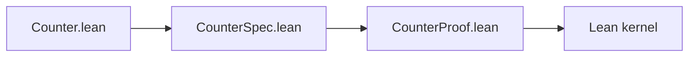
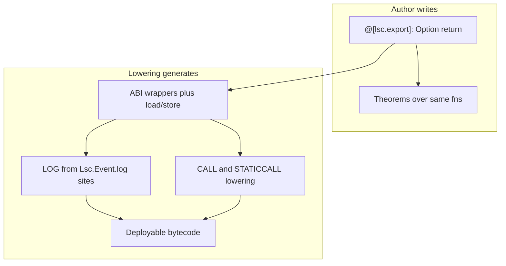
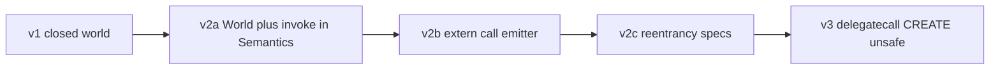
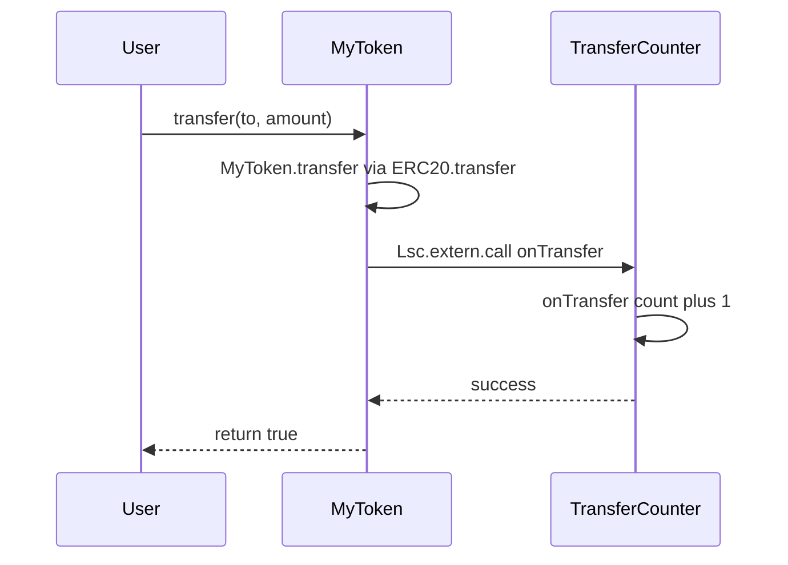

# LSC — Lean Smart Contracts Language Specification

**Language version:** LSC 1.0 (migrated from forge-lean-spec v1.6)  
**Lean baseline:** `leanprover/lean4:stable` (pinned per project; see [lsc-toolchain.md](lsc-toolchain.md))  
**Execution target:** EVM (bytecode via lowering; standard JSON ABI)  
**Companion document:** [lsc-toolchain.md](lsc-toolchain.md) — reference compiler, Foundry integration, artifacts, demos  

**Status:** v1 closed-world contracts; v2 `World` / `Lsc.extern`; v3 `delegatecall`, `Lsc.unsafe.call`.

---

## 1. Introduction

**LSC (Lean Smart Contracts)** is a strict subset of Lean 4 for **provable smart contracts**: pure state-transition functions that lower to EVM bytecode.

### 1.0 Three artifacts

1. **Contract modules** — `State` + `@[lsc.export]` functions (deployable).
2. **Spec modules** — human-reviewed `def` declarations of type `Prop` (requirements, no proofs).
3. **Proof modules** — `theorem` proofs of spec propositions (kernel-checked; no `sorry`).

Proofs establish properties of the **functional model** (`@[lsc.export]` functions). Bytecode fidelity depends on the conforming toolchain ([lsc-toolchain.md §7](lsc-toolchain.md#7-trust-boundaries)).

### 1.1 End-to-end example: Counter

The reference v1 contract is a counter: one `UInt256` in storage, three ABI entry points. The **contract name** is the module stem (`Counter` from `Counter.lean`). Authors write pure transitions; lowering loads storage before each call and persists on `some` (§3–§5).



**Contract module** (`Counter.lean`):

```lean
import Lsc.Prelude

open Lsc Lsc.Event

structure CounterState where
  number : UInt256

@[lsc.export]
def increment (s : CounterState) : Option (CounterState × Unit) :=
  some ({ s with number := s.number + 1 }, ())

@[lsc.export]
def setNumber (s : CounterState) (n : UInt256) : Option (CounterState × Unit) :=
  some ({ s with number := n }, ())

@[lsc.export]
def number (s : CounterState) : Option UInt256 :=
  some s.number
```

**Spec module** (`CounterSpec.lean`) — human-reviewed requirements as `Prop` definitions (no `theorem`, no `sorry`):

```lean
import Counter

def increment_increases_number
    (s s' : CounterState) (ret : Unit)
    (h : increment s = some (s', ret)) : Prop :=
  s'.number = s.number + 1
```

**Proof module** (`CounterProof.lean`) — proves each spec `Prop` with a matching `theorem`; no `sorry`:

```lean
import CounterSpec

theorem increment_increases_number
    (s s' : CounterState) (ret : Unit)
    (h : increment s = some (s', ret)) :
    CounterSpec.increment_increases_number s s' ret h := by
  simp [CounterSpec.increment_increases_number, increment] at h
  exact h
```

Each proof theorem has the **same name** as the spec `def` and concludes that def applied to the arguments. Compliance manifests and the proof runner key off these shared names (§7). Deployment and bytecode fuzz tests are in [lsc-toolchain.md §9](lsc-toolchain.md#9-minimal-counter-foundry-testdata).

Every major design choice in this spec follows the template below.

### 1.2 Specification propositions (`def`, not `theorem`)

**Decision:** Specification artifacts are Lean 4 `def` declarations with return type **`Prop`** — the requirement body is the definition RHS. No `theorem`, no `sorry`, and no `by` in spec modules. The matching **proof module** contains `theorem` declarations that prove each spec `def`.

**Rationale:** Separating propositions from proofs keeps human review on declarative requirements only; proof terms (including LLM-generated ones) never appear in spec files. A single language for code, requirements, and proofs stays machine-checkable and diffable. Accessibility comes from templates, naming conventions, doc comments, and `Lsc.ProofHelpers` — not from a parallel DSL.

**Alternatives rejected:** YAML/Markdown spec DSL (extra compilation step, drift risk); `theorem … := by sorry` in spec files (mixes requirements with proof obligations); interactive wizard-only specs (not version-control friendly as source of truth).

### 1.3 Provability over gas and Lean expressiveness

**Decision:** Contract functions model **whole-state** pure transitions returning **`Option`** (§1.9). The lowering generates EVM export wrappers (ABI encode/decode, load/store) from parameterless `@[lsc.export]` metadata and **infers** the ABI from each function's name and types; events use **`Lsc.Event.log`** in author bodies (§3.5). Authors do not hand-write ABI signature strings or `List LogEntry` lists.

**Rationale:** Authors and provers never reason about `sload`/`sstore`, ABI encoding, or log emission. Proofs stay on functional state. The **Lean dialect** restricts expressiveness (no monads, no unbounded collections) while **on-chain capability** remains full (storage, events, standard ABIs, cross-contract calls). Gas is solved by the toolchain; proving is hard and must stay easy.

**Invariant:** Emitter optimizations must not change observable behavior relative to whole-state load → call → store semantics.

**Alternatives rejected:** Author-written load/store in exports (more control, worse proof burden); implicit globals for `msg.sender` (harder to quantify in theorems); hand-written export wrappers with ABI ceremony (duplicate proof surfaces).

### 1.4 Three-file separation

**Decision:** `src/*.lean` (contract), `spec/*Spec.lean` (human spec), `test/*Proof.lean` (LLM proofs, e.g. `CounterProof.lean` — no dots in the filename; Lake module paths require it).

**Rationale:** Human review focuses on `Prop` definitions in spec modules, not proof terms in proof modules. Proof authorship can be automated without touching the spec. The Counter layout is illustrated in §1.1.

### 1.5 Trusted compiler in v1; full-stack verification later

**Decision:** v1 ships a tested but unproven Lean IR → Yul emitter. Dual runtime assurance via Solidity fuzz/invariant tests on deployed bytecode (`deployCode`). Phase 2 may prove emitter correctness; scope is intentionally undefined until v1 lessons are learned.

**Rationale:** Shipping provable *models* first delivers value; compiler proofs are a large independent project.

### 1.6 Provability-first contract dialect

**Decision:** Contract code in `src/*.lean` follows a validated **LSC** — a restricted subset of Lean 4 chosen so theorems are inherently easy to state and prove, analogous to how Vyper restricts source features (e.g. no unbounded arrays) while still producing real EVM contracts.

**Core rule:** Authors write **pure state transitions** in Lean. The compiler produces **everything the EVM needs** (ABI wrappers, LOG opcodes, load/store, CALL lowering).



**What is restricted (Lean authoring):** monads, higher-order functions, closures, polymorphism, unbounded `List`/`Array` in persistent state, author `sload`/`sstore`, `Nat`/`Int`/`String`, unbounded recursion — see §8.

**What is NOT restricted (on-chain capability):** persistent storage and mappings, bounded dynamic `Bytes`, events/logs, standard ABIs (e.g. ERC-20 `bool` returns), cross-contract `call`/`staticcall`, multi-contract composition, revert semantics, EVM deployment (see [lsc-toolchain.md](lsc-toolchain.md)).

#### 1.6.1 On-chain features → dialect authoring

| On-chain capability | Author writes | Proofs target | Lowering / bridge |
| ------------------- | ------------- | ------------- | ----------------- |
| Persistent storage | Finite `State` struct + `StorageMapping` | Whole `s`, `s'` | Auto load/store (§3.8) |
| Dynamic metadata (`name`, `symbol`) | `Bytes` in state (bounded) | `@[lsc.export]` fns | ABI `string` encoding |
| Events / logs | `Lsc.Event.log` on success path; optional `@[lsc.event]` lint | Ignore (proof-erased) | Collect log sites → LOG after store |
| Standard ABI | Parameterless `@[lsc.export]`; types infer ABI | Same function names | Name + `Option` return shape (§3.9) |
| Authorization | `caller : Address` arg (excluded from ABI) | Explicit in theorems | `ctx.sender` bound in wrapper |
| Cross-contract calls | `Lsc.extern.*` in **lowering-generated export** only | `simulate_call` (§7.3) | CALL lowering (§6.3) |
| Multi-contract / reentrancy | Exports with externs use `World` (§6.1) | `lift_no_extern`, `lift_no_reentrant` | `invoke` (§6.2) |
| Revert | `Option` / `none` (§1.9) | `(h : f … = none) → …` | `revert(0,0)` before store |
| Deployment | contract module name (filename) | N/A | [lsc-toolchain.md](lsc-toolchain.md) artifacts |

#### 1.6.2 Proof layers (default path vs advanced)

| Layer | When | Author obligation |
| ----- | ---- | ----------------- |
| **1 — Direct (default)** | Counter (§1.1), solo ERC-20 | Theorems over `@[lsc.export]` fns; `(h : f … s = some (s', _)) → P` for mutators |
| **2 — Export refinement** | Properties of deployed entrypoints | `lift_no_extern` + compiler certificate (trusted v1) |
| **3 — Cross-contract** | Composition (Appendix B) | `simulate_call` + callee spec theorems |
| **4 — Reentrancy traces** | Vault-style callbacks | Opt-in `@[lsc.no_reentrant]` or trace specs (§6.4) |

**Rationale:** Restrict the *language*, not deployment. Vyper shows source restrictions and full EVM output coexist; LSC chooses restrictions for **Lean proof automation** (`simp`, `decide`, LLM proofs).

**Alternatives rejected:** Proof-only functional model without bytecode; hand-written ABI signature strings; implicit `msg.sender` globals.

### 1.9 `Option` models EVM revert

**Decision:** All `@[lsc.export]` functions return **`Option`** — `some` for success, `none` for EVM revert. **Views** return `Option α` where `α` is not the contract `State`. **Mutators** return **`Option (State × Ret)` only** — never bare `Option State`. Use `Ret = Unit` (written `()`) when the ABI returns no data; use `Bool`, `UInt256`, etc. when it does (e.g. ERC-20 `bool`). There is **no** typed error type and **no** branching on revert reason in the Lean model.

**Rationale:**

1. **Proof ergonomics** — `Option` is native to Lean 4. Every mutator success uses the same hypothesis shape: `(h : f … s = some (s', ret)) → P` (ignore `ret` with `_` when proving state only). Revert remains `(h : f … s = none) → …`. `cases`, `simp`, `omega`, and LLM-generated proofs target this uniformly; a custom `CallResult` or `Except` type adds constructors without new expressive power.

2. **Matches the EVM functional model** — On revert, the EVM rolls back storage and returns no ABI-decoded success payload. A single `none` captures that unified failure mode. The *reason* for revert (insufficient balance, failed guard, etc.) is a **property the spec proves from inputs**, not a tag returned by the function — e.g. `transfer … = none → balance too low`.

3. **No invalid product states** — Alternatives like `Option State × Option Ret × Option Error` allow combinations that cannot happen on-chain and force invariant lemmas in every proof. One outer `Option` keeps success and failure mutually exclusive by construction.

4. **Uniform mutator product** — `Option (State × Unit)` and `Option (State × Bool)` share one success constructor; proofs ignore `ret` with `_` when only `s'` matters. Bare `Option State` is rejected (§8.1) so spec and proof modules never fork on return shape.

5. **Provability-first dialect (§1.6)** — Restrict Lean for proofs, not on-chain capability. Custom Solidity errors and revert strings remain observable in **Solidity fuzz tests** (`deployCode`); they are intentionally outside the default Lean proof surface so theorems stay simple.

**Mapping (see also §3.7):**

| Lean | EVM |
| ---- | --- |
| `none` | `REVERT` — no storage commit, no success returndata |
| `some (s', ret)` (mutator) | success — persist `s'`, emit `Lsc.Event.log` sites, ABI-encode `ret` (`()` = empty returndata) |
| `some value` (view) | read-only — ABI-encode `value`; no store |

**Alternatives rejected:**

- **`Lsc.CallResult` / `returned`–`reverted` inductive** — isomorphic to `Option`; breaks existing `simp`/`cases` habits; no proof benefit.
- **Typed errors (`Except`, custom error inductive, Solidity `error` in Lean)** — would require branching on error kinds in author code and proofs; out of scope for v1; deferred to fuzz-only observation.
- **`Option State × Option Ret × Option Error` triple** — redundant channels; most combinations invalid; heavy invariant burden.
- **Implicit revert via partial functions** — not total; bad for Lean kernel checking and LLM proof generation.

Spec files **never** mention error enums; revert theorems use `none` only (§7).

### 1.10 Non-goals (language v1)

- Payable functions (`msg.value` > 0)
- Upgradeability / proxies in core syntax
- Formal proof of the lowering pipeline (toolchain Phase 2)
- Built-in automated prover command
- Mandatory application compliance packs in the language definition

External `CALL` is specified in §6; the Counter example (§1.1) omits externs.

---

## 2. Relation to Lean 4

LSC uses Lean 4 syntax and elaboration with a post-elaboration **validator** (§8).

### 2.1 Module roles

| Role | Purpose | Bytecode |
| ---- | ------- | -------- |
| **Contract** | One deployable contract per module | Yes |
| **Library** | Shared storage types and helpers | No |
| **Spec** | Theorem statements | No |
| **Proof** | Proof terms | No |

Paths (`src/`, `spec/`, `test/`) are defined in [lsc-toolchain.md §2](lsc-toolchain.md#2-project-layout-and-lake).

---


## 3. Defining a contract


This section defines contract authoring in LSC (§1.6): types, state, `@[lsc.export]` functions, and metadata annotations authors write. Compiler-generated export wrappers, `LogEntry` assembly, and ABI return encoding are specified in §3.8–4.10 and §5. Multi-contract `World` / `Lsc.extern.*` (§6) are **full product scope**; v1 Counter omits externs, but ERC-20, composition, and cross-contract calls remain first-class targets with phased implementation (§3.16.5).

### 3.4 Caller context

```lean
structure EvmContext where
  sender  : Address
  value   : UInt256   -- v1 Counter: always 0; reserved for future payable exports
  address : Address   -- executing contract (self); required for extern/delegatecall (§3.14.3)
  origin  : Address   -- tx.origin
```

**Decision:** `@[lsc.export]` functions take **`caller : Address`** (and other logical args) when authorization matters — not a full `EvmContext`. The compiler-generated export wrapper binds `caller := ctx.sender` from calldata/`msg.sender`.

**Compiler-generated exports** take `ctx : EvmContext` as the first parameter plus loaded state (and `w : World` when the export contains `Lsc.extern.*`; §3.7). Authors do not write these functions.

**Rationale:** Explicit `caller` in contract functions keeps theorems uniform and avoids optional/injected context fields. Full `EvmContext` exists only in generated code and advanced export-layer proofs.

**Binding (Counter example):**

| Author (contract fn) | Generated export calls |
| -------------------- | ---------------------- |
| `increment s` | `increment ctx.sender s` |
| `setNumber s n` | `setNumber ctx.sender s n` |
| `transfer caller s to amount` | `transfer ctx.sender s to amount` |

**Alternatives rejected:** Implicit `msg.sender` globals (harder to prove); optional `address`/`origin` omission with emitter injection (non-uniform contract signatures).

### 3.5 Events, `Lsc.Event.log`, and `LogEntry`

#### 3.5.1 Declaring events (typed, preferred)

Authors declare each on-chain event as a Lean structure with a **`Lsc.Event.EvmEvent`** instance that supplies the canonical ABI signature and indexed/non-indexed field layout:

```lean
structure TransferEvent where
  from to : Address
  value : UInt256
  deriving Lsc.Event.EvmEvent

-- Instance (project or Lsc.Interfaces) maps fields → "Transfer(address,address,uint256)"
-- first two addresses indexed; value non-indexed in LOG data
```

Alternatively, v1 may accept a string signature on each log call (§3.5.2) when no typed descriptor exists.

#### 3.5.2 Classic emit: `Lsc.Event.log` in the function body

**Decision:** Event **payloads are injected at the emit site**, like Solidity `emit Transfer(from, to, amount)` or Vyper `log Transfer(...)`. Authors call **`Lsc.Event.log`** with explicit field values on branches that return `some s'`:

```lean
@[lsc.export]
def transfer (caller : Address) (s : TokenState) (to : Address) (amount : UInt256)
    : Option (TokenState × Bool) :=
  if s.balances.get caller < amount then
    none
  else
    let s' := { s with
      balances := s.balances.set caller (s.balances.get caller - amount)
                    |>.set to (s.balances.get to + amount) }
    Lsc.Event.log (TransferEvent.mk caller to amount)
    some (s', true)
```

**Minimal v1 (string signature):**

```lean
Lsc.Event.log "Transfer(address,address,uint256)" caller to amount
```

The validator checks argument count and types against the event signature (indexed vs non-indexed rules).

**Conditional / multi-event paths:** Each `Lsc.Event.log` on a path to `some _` is collected independently:

```lean
| some s' =>
    Lsc.Event.log (TransferEvent.mk caller to amount)
    if fee > 0 then Lsc.Event.log (FeeEvent.mk caller fee)
    some s'
```

#### 3.5.3 Proof-erasure

**Decision:** `Lsc.Event.log` is **proof-erased** — it elaborates to `Unit` (or an equivalent no-op) in the functional proof model. Spec theorems quantify over `Option` returns only; `transfer … = some (s', _)` has the same meaning whether or not the body contains `Lsc.Event.log`. The Lean kernel never reasons about log payloads.

**Proof stance:** Specs ignore events (observability). Log correctness is a compiler obligation (trusted v1; tested via `deployCode` + log assertions in `.t.sol`).

#### 3.5.4 Compiler lowering

```lean
structure LogEntry where
  topic0 : Bytes32
  topics : List Bytes32   -- indexed args; max 3 additional topics (validator-enforced)
  data   : Bytes          -- non-indexed ABI-encoded payload
```

`LogEntry` is **compiler-internal**. The emitter:

1. Statically collects `Lsc.Event.log` sites on each control-flow path that reaches `some s'`
2. After persisting state (§3.8 step 5), encodes collected logs to `LOG` opcodes in source order
3. Never runs logs on paths that return `none` (revert before store)

**Emit ordering:** load → call author function → on `some _` → **store** → **LOG(s)** → ABI return.

#### 3.5.5 Optional `@[lsc.event]` metadata

**Decision:** `@[lsc.event "canonicalSignature"]` on a function is **optional lint only** — it declares which events may fire from that export. It does **not** supply payload data and does not replace `Lsc.Event.log`. The validator may warn if a function annotated with `@[lsc.event]` never calls `Lsc.Event.log` for that signature (or vice versa).

**Alternatives rejected:** Author-returned `List LogEntry` (pollutes proof surface); function-level auto-emit from arguments without `Lsc.Event.log` (underspecified binding); magic auto-emission from function names alone; `@[lsc.emit]` side effects without explicit values.

### 3.6 Storage State

Contract storage is a plain Lean 4 struct. Fields receive sequential slots in declaration order from slot 0. Mappings use `keccak256(abi.encode(key, slot))`.

```lean
structure CounterState where
  number : UInt256   -- slot 0
```

Larger applications define their own struct (mappings, `Bytes` fields, etc.). ERC-20 layout is documented in Appendix A.

**Storage inheritance (`extends`):** Child contracts may extend a parent storage struct defined in `lib/` (not deployed):

```lean
structure ERC20State where ...

-- src/MyToken.lean (deployed contract)
structure MyTokenState extends ERC20State where
  counter : Address   -- slot after last parent field
```

**Slot rule:** Parent fields occupy slots 0…N in declaration order; each child field continues at N+1, N+2, … (same sequential rule as §3.6). The emitter flattens `extends` when computing `storageLayout` metadata.

**Validator:** Allow `extends` only when the parent is a storage struct in `lib/` or the same project; reject `@[lsc.export]` on `lib/` modules; reject `extends` if the parent uses disallowed types.

Slot layout is recorded in artifact metadata for external tooling.

**Non-aliasing:** Sequential slot assignment makes disjoint field slots provable by `decide`.

**Single axiom** (in `Lsc.Prelude`):

```lean
axiom StorageMapping.key_injective {K V : Type} [DecidableEq K]
    (m : StorageMapping K V) (a b : K) (s : UInt256) :
    storageKey a s = storageKey b s → a = b
```

### 3.7 State Threading and `Option` Returns

State is threaded **explicitly** in contract functions. Monads (`StateM`, `IO`, etc.) are **disallowed in contract code** (see §3.11). Proof scripts may use tactics and monadic proof modes freely.

All `@[lsc.export]` functions return **`Option`** (§1.9). `none` models undifferentiated EVM revert; `some` models success.

```lean
-- Mutating — no ABI returndata (Ret = Unit)
@[lsc.export]
def increment (s : CounterState) : Option (CounterState × Unit) := ...

-- Mutating — ABI returndata (ERC-20 bool)
@[lsc.export]
def transfer (caller : Address) (s : TokenState) (to : Address) (amount : UInt256)
    : Option (TokenState × Bool) := ...

-- View
@[lsc.export]
def number (s : CounterState) : Option UInt256 := ...

-- Rejected in src/*.lean
def increment : StateM CounterState Unit := ...
```

**Lean ↔ EVM mapping:**

| Lean return | EVM behavior |
| ----------- | ------------ |
| `none` | `REVERT` — no storage commit, no success returndata |
| `some (s', ret)` (mutator) | persist `s'`, emit `Lsc.Event.log` sites, ABI-encode `ret` |
| `some value` (view) | read-only; ABI-encode `value`; no store |

For mutators, `ret : Unit` is written `()`; lowering emits no ABI returndata. Bare `Option State` is **rejected** (§8.1).

**Parameter filtering for ABI calldata** (compiler excludes from selector args):

| Lean parameter | ABI |
| -------------- | --- |
| `s : CounterState` (contract state struct) | excluded — loaded by compiler |
| `caller : Address` | excluded — `msg.sender` |
| `UInt256`, `Address`, `Bool`, `Bytes32`, `Bytes` | included in declaration order |

**Function naming:** The Lean `def` name **is** the ABI function name (`increment`, `transfer`, `number`).

All proofs are written against the same `@[lsc.export]` signatures users deploy.

**Exports with mutating external calls:** A single linear `s` threaded through an export body is **not** a complete model when `Lsc.extern.call` may re-enter or mutate other accounts. Exports that perform mutating externs take `w : World` and thread `World` at each extern site; author contract functions remain `State → Option …` without `World` (§3.14–4.16, Appendix B). Composition properties use `invoke` / `lift_no_extern` / `[lsc.compliance.hook]` (§7.3, §7.5).


### 3.12 State Vocabulary (`set` vs `State` vs `store`)

Authors and provers use three distinct terms. There is **no** second author-facing API for persistence.

| Term | Meaning | Who uses it |
| ---- | ------- | ----------- |
| **`set`** | Functional update: `StorageMapping.set`, record `{ s with field := v }` | Contract authors in `src/*.lean` |
| **`State`** | Full contract snapshot struct (e.g. `CounterState`) threaded through `@[lsc.export]` fns | Authors and spec theorems (`s`, `s'`) |
| **`store`** | Persist snapshot to chain storage (`sstore` / dynamic `Bytes` tails) | **Emitter only** at `@[lsc.export]` boundary (§3.8) |

**Decision:** Do not expose author-level `StateM`, slot indices, fractional `ΔState`, or diff-store APIs.

**Rationale:** Theorems quantify over complete `s` and `s'`. Functional `set` + `StorageMapping` lemmas give expressiveness; emitter whole-state load/store gives EVM fidelity without proof burden from partial loads or storage aliasing.

**Invariant (unchanged):** Emitter optimizations (diff stores, lazy view loads) must refine whole-state load → apply → store semantics (§2.2).

**Optional v2 syntax sugar (zero semantic change):** field modifiers desugar to `get`/`set`, e.g. `s.balances.modify who (fun b => b - amount)` (demo apps).

**Rejected for contract code:** `ΔState` types, author diff-store, monadic `Store` / `ContractM` — marginal proof benefit, heavy emitter and reentrancy cost (§3.16).

**Axioms:** Keep **`StorageMapping.key_injective`** as the sole storage axiom (§3.6). Struct field slot disjointness is provable by `decide`. Do **not** axiomatize load/store; that belongs in Phase 2 emitter refinement ([lsc-toolchain.md §7](lsc-toolchain.md#7-trust-boundaries)).


### 3.13 Worked example: Counter

The canonical end-to-end walkthrough (contract, spec, and proof modules) is **§1.1**. This section and §5.9 use Counter only to illustrate storage layout and `@[lsc.export]` ABI inference.


---

## 4. Type system and values


### 4.1 Primitive Types

The validator permits exactly the following primitive types in contract code. Any other type is a hard error.


| Lean 4 type | EVM / Yul type     | Notes                                                |
| ----------- | ------------------ | ---------------------------------------------------- |
| `UInt256`   | `uint256`          | all arithmetic is `mod 2^256`                        |
| `Address`   | `uint256`          | distinct newtype, not interchangeable with `UInt256` |
| `Bool`      | `uint256` (0 or 1) | ABI boundary and internal guards                     |
| `Bytes32`   | `uint256`          | raw 32-byte value                                    |
| `Bytes`     | dynamic bytes      | metadata, strings; see §4.2                            |


`Address` is defined in `Lsc.Prelude`:

```lean
structure Address where
  val : UInt256
  deriving DecidableEq, Repr
```

It is not coercible to `UInt256` without an explicit `.val` projection.

### 4.2 `Bytes` Storage Layout

`Bytes` uses Solidity-compatible dynamic storage (short string / bytes array):

- Slot `p` holds the length encoding: if `length ≤ 31`, data is left-aligned in the slot with `length * 2` in the LSB; if `length > 31`, slot holds `length * 2 + 1` and payload lives at `keccak256(p)`.
- Maximum length in v1: **256 bytes** (configurable via `[lean] max_bytes` in `foundry.toml`). Exceeding this is a validator error.

ABI mapping: `Bytes` ↔ `string` in the JSON ABI.

### 4.3 Composite Types

Allowed composite forms in **author-written** contract code:

- **Structs** whose fields are primitives or allowed composites → storage state
- **`Option α`** → revert (`none`) or success (`some`) — the sole mutator result form
- **`StorageMapping K V`** where `K` and `V` are allowed types → EVM mapping

**Compiler-generated only** (not written in `src/*.lean`): products `α × β` and `List LogEntry` in export wrapper return types.

Recursive types, inductive types with more than 2 constructors, and unresolved type parameters are not allowed.

### 4.3.1 Mappings vs arrays

**Mappings (v1 — use this):** `StorageMapping K V` is the primary keyed storage type. It corresponds to Solidity `mapping(K => V)` with `keccak256(abi.encode(key, slot))` layout (§4.6). Nested mappings (e.g. `allowances`) are `StorageMapping K (StorageMapping K' V)`. Counter does not need mappings; ERC-20 and most applications do.

**Dynamic bytes (v1):** `Bytes` covers short strings and byte payloads in storage (§4.2), ABI-encoded as `string` / `bytes` at the boundary.

**Storage arrays (Solidity `T[]` — not a first-class v1 type):** Contiguous on-chain arrays with `length` / `push` are **not** modeled as Lean `List` or a built-in `StorageArray` in v1. Prefer:

| Goal | v1 pattern |
| ---- | ---------- |
| Sparse index → value | `StorageMapping UInt256 V` |
| Registry id → record | `StorageMapping Bytes32 Struct` or `StorageMapping Address V` |
| Packed blob | `Bytes` (length-capped) |

A future `StorageArray α` may be added if Solidity parity for `push`/`pop`/`length` is required; scope TBD after v1.

**Lean `List`:** Allowed **only** inside compiler-generated export IR and in `LogEntry.topics` (§4.5). **Disallowed** in author `src/*.lean` — including `@[lsc.export]` functions and persistent `State` structs. Proofs use finite snapshots, not unbounded lists in storage.

**ABI calldata arrays** (e.g. `uint256[]` arguments): encoded at the export boundary; explicit calldata-array support in the validator/emitter is TBD when projects need it beyond Counter/ERC-20 shapes.


### 4.5 ABI type mapping

| LSC type | JSON ABI type |
| -------- | ------------- |
| `UInt256` | `uint256` |
| `Address` | `address` |
| `Bool` | `bool` |
| `Bytes32` | `bytes32` |
| `Bytes` | `string` |
| `Option (Bool × List LogEntry)` (lowering-internal) | `bool` |
| View `UInt256` / `Bytes` | respective view type |


---

## 5. Lowering model

Normative EVM semantics for `@[lsc.export]`. Implementation stages: [lsc-toolchain.md §3](lsc-toolchain.md#3-compiler-pipeline).


### 5.8 Storage Boundary (Auto Load/Store)

The emitter wraps every public ABI entry (compiler-generated export) around the author function annotated with `@[lsc.export]`:

1. Decode calldata → arguments + build `EvmContext` from `msg.sender` / `msg.value`
2. `s ← loadState` (all struct fields, including dynamic `Bytes` tails)
3. Invoke the author function, binding `caller := ctx.sender` when the signature includes `caller : Address`
4. On `none` → `revert(0, 0)` with **no** storage writes
5. On `some (s', ret)` → persist state, emit **`Lsc.Event.log` sites** collected on that path, encode ABI return from `Ret` (§5.9; `Unit` → empty)

Author functions receive loaded `s : CounterState` (or the contract's state type) but do not perform storage IO themselves. This keeps the proof model identical to pure function application on loaded state.

**View exports** (e.g. `number()`): read-only; return `Option α`; emitter may lazy-load only accessed fields if observable result matches whole-state read.

**Exports with `Lsc.extern.*`:** Generated export body threads `World` at each extern site (§5.14.4); author contract functions remain without `World`.


### 5.9 The `@[lsc.export]` Annotation

Public ABI functions are declared by annotating contract functions with **`@[lsc.export]`** (parameterless). Only annotated functions appear in the ABI JSON. The compiler **generates** the Yul dispatcher entry and export wrapper; authors do not hand-write separate export functions or ABI signature strings.

```lean
-- src/Counter.lean — contract name inferred from filename

import Lsc.Prelude

open Lsc EVM

structure CounterState where
  number : UInt256

@[lsc.export]
def increment (s : CounterState) : Option (CounterState × Unit) :=
  some ({ s with number := s.number + 1 }, ())

@[lsc.export]
def setNumber (s : CounterState) (n : UInt256) : Option (CounterState × Unit) :=
  some ({ s with number := n }, ())

@[lsc.export]
def number (s : CounterState) : Option UInt256 :=
  some s.number
```

**ABI inference rules:**

| Author return shape | Inferred ABI |
| ------------------- | ------------ |
| `Option (State × Unit)` | mutating; no returndata |
| `Option (State × Bool)` | mutating; `returns (bool)` |
| `Option (State × UInt256)` | mutating; `returns (uint256)` |
| `Option (State × Address)` | mutating; `returns (address)` |
| `Option (State × Bytes32)` | mutating; `returns (bytes32)` |
| `Option α` where `α` is not the contract `State` | **view**; returns ABI type of `α` |

Bare **`Option State`** is a **validator error** — use `Option (State × Unit)` instead (§8.1).

The **function name** is the Lean `def` name. The compiler computes the 4-byte selector via `keccak256(canonicalSignature)` and dispatches in Yul. Invalid return shapes fail at compile time.

**Mutating return validation:**

- `Option (State × Unit)` — persist; empty returndata
- `Option (State × scalar)` — persist + ABI scalar (`Bool`, `UInt256`, `Address`, `Bytes32`)
- `Option State` — rejected
- Other product shapes — compile error until explicitly supported


### 5.10 ABI Wrapper Convention (Compiler-Generated)

When the author returns `Option (State × Bool)` (common in standards like ERC-20), the compiler wrapper persists `State`, collects `Lsc.Event.log` sites, and ABI-encodes `Bool` on success. On `none` → EVM revert.

Counter mutators return `Option (CounterState × Unit)`; the compiler generates wrappers with no ABI return value.

**Authors must not** hand-write export functions that duplicate contract logic or return compiler-internal shapes like `Bool × List LogEntry`. The validator rejects author-defined functions whose signatures match the generated export wrapper shape (see §5.11).

**Proof stance:** Theorems target the same `@[lsc.export]` functions (§1.6). `lift_to_abi` and `lift_logs` (§7.3) bridge to export-layer goals when needed; Counter (§1.1) and default ERC-20 spec theorems do not use them.


---

## 6. EVM interoperability


### 6.1 Multi-Contract `World` and Accounts

Single-contract `State → Option (State × Ret)` is insufficient when bytecode can `CALL` other contracts (§6.2). Multi-contract storage lives in a separate **`World`** type in `Lsc.Semantics` — not in author `@[lsc.export]` signatures.

```lean
/-- Tagged union of known contract states in the build (extensible per project). -/
inductive TypedAccount where
  | counter (s : CounterState)
  | custom (tag : String) (payload : Bytes)   -- or per-project inductive extension
  -- demo repo may add: | erc20 (s : ERC20State)

structure Account where
  /-- Present when this address is a registered LSC contract (§6.1.1). -/
  typed   : Option TypedAccount
  /-- Fallback for unknown bytecode: slot → word. -/
  raw     : StorageMapping UInt256 UInt256
  balance : UInt256   -- native ETH; reserved for payable exports

structure World where
  accounts : StorageMapping Address Account
  -- future: blockNumber, timestamp, etc. for oracle contracts
```

#### 6.1.1 Contract registration (filename)

Each `src/*.lean` file is one deployable contract. The **contract name** is the file stem:

| File | Contract | `[lsc.contracts]` key |
| ---- | -------- | ---------------------- |
| `src/Counter.lean` | `Counter` | `Counter` |
| `src/MyToken.lean` | `MyToken` | `MyToken` |

There is **no** contract-name attribute. The validator requires PascalCase file stems matching the Lake module name.

**Deployment binding:** `deployment map (`[lsc.contracts]` in [lsc-toolchain.md](lsc-toolchain.md)) maps logical names to deployment addresses in tests and artifacts:

```toml
[lsc.contracts]
Counter = "0x0000000000000000000000000000000000000001"
MyToken = "0x0000000000000000000000000000000000000002"
```

The compiler resolves `Lsc.extern.*` callee addresses against this table when the callee is a **registered** project contract.

#### 6.1.2 Projections

```lean
def World.getAccount (w : World) (addr : Address) : Account :=
  w.accounts.get addr

def World.getCounter (w : World) (addr : Address) : Option CounterState :=
  match w.accounts.get addr |>.typed with
  | some (.counter s) => some s
  | _ => none

def World.setCounter (w : World) (addr : Address) (s : CounterState) : World :=
  { w with accounts := w.accounts.set addr {
      w.accounts.get addr with typed := some (.counter s) } }
```

Demo repos add `getERC20` / `setERC20` projections alongside `.erc20` in `TypedAccount`.

Unknown addresses remain `typed := none` with data in `raw` only. Proofs against unknown callees require **interface assumptions** (§6.15.3, [lsc-toolchain.md §7](lsc-toolchain.md#7-trust-boundaries)).

### 6.2 Invocation Semantics (`Lsc.Semantics`)

The operational core for external calls and reentrancy lives in **`Lsc.Semantics`** (library code, not `src/*.lean`). Author contract functions are **not** rewritten to take `World`; the emitter and `invoke` compose them at export boundaries.

#### 6.2.1 Call kinds and frames

```lean
inductive CallKind where
  | call
  | staticcall
  | delegatecall

structure CallFrame where
  kind     : CallKind
  caller   : Address
  target   : Address
  calldata : Bytes
  value    : UInt256
  -- returndata offset/size and gas are execution details; omitted from v2a proof surface
```

#### 6.2.2 Step results and `invoke`

```lean
inductive StepResult where
  | done (world : World) (ret : Bytes) (success : Bool)
  | reverted (world : World)

def invoke (w : World) (self : Address) (selector : UInt32) (args : Bytes)
    (stack : List CallFrame := []) : StepResult
```

**Dispatch:** `selector` is the first four bytes of `keccak256(canonicalSignature)`; `invoke` loads `self` from `w`, runs the matching `@[lsc.export]` on that contract's model, and returns `StepResult`.

**Reentrancy:** A nested `CALL` pushes a `CallFrame` and calls `invoke` again with the **current** `w` (after the callee's load). A reentrant call to the same `self` runs another export on the world left by the inner execution so far.

**Revert:** Export returns `none` → `StepResult.reverted w'` where `w'` is `w` with **no net storage writes** for the callee (EVM revert semantics). The caller export maps callee revert to `none` unless it catches (v3; not in v2b).

**`staticcall`:** `CallKind.staticcall`; validator rejects callee exports that would persist storage or emit logs.

**`delegatecall`:** Callee **code** runs against the **caller's** storage root (`self` in `EvmContext` remains the caller; storage reads/writes use caller's `Account`). Required for proxies (v3).

#### 6.2.3 `EvmContext` extension (v2+)

```lean
structure EvmContext where
  sender  : Address
  value   : UInt256
  address : Address   -- contract executing (self); added v2 for delegatecall
  origin  : Address   -- tx.origin; optional v2b
```

v1 Counter omits externs; the emitter always sets `ctx.address` to `address()` in generated Yul wrappers.

#### 6.2.4 Export execution with extern holes

For exports that contain `Lsc.extern.*`, the reference semantics are:

```
runExport(w, ctx, s, args) =
  let (w', s', out) := runWithExterns w ctx s (λ → exportBody ctx s args)
  match out with
  | none => none
  | some r => persist self s' to w'; some r
```

`runWithExterns` interprets each extern site as `invoke` (or `staticcall` variant) and threads `World` updates. **Proof default** remains contract functions without `World` (§6.16).

### 6.3 External Call API (`Lsc.extern`)

Higher-order functions and arbitrary calldata remain banned (§6.11). External interaction uses **typed, validator-checked** `Lsc.extern.*` primitives in **compiler-generated export bodies** only (not in author contract functions).

#### 6.3.0 Example: cross-contract ERC-20 call

The following illustrates `Lsc.extern` with a standard interface. Token logic itself lives in the [forge-lean-erc20](https://github.com/forge-lean/forge-lean-erc20) demo — not in the core `Lsc` package.

#### 6.3.1 Interface typeclasses

```lean
class IERC20 (α : Type) where
  balanceOf     : EvmContext → α → Address → UInt256
  transferFrom  : EvmContext → α → Address → Address → UInt256 → Option (Bool × List LogEntry)
  -- ... signatures mirror ABI; state type α is callee's State or World projection
```

Interfaces live in `Lsc.Interfaces` or project `interfaces/*.lean`. The validator checks that `Lsc.extern.*` references a typeclass method whose ABI selector matches the string literal.

#### 6.3.2 Call forms

```lean
-- Read-only: callee must not persist storage (staticcall)
Lsc.extern.staticcall
  IERC20.balanceOf tokenAddr ctx w who
  : UInt256

-- Mutating: may update World and reenter; returns decoded success + new world
Lsc.extern.call
  IERC20.transferFrom tokenAddr ctx w from to amount
  : Option (World × Bool)
```

**Compiler checks:**

1. Callee method exists on the interface typeclass with matching ABI types.
3. Appears only in compiler-generated export bodies (not in author contract functions).
4. `staticcall` target export must be read-only (validator).

#### 6.3.3 Registered vs assumed callees

| Callee kind | Resolution | Proof strength |
| ----------- | ---------- | -------------- |
| **Registered** | Same repo `src/*.lean` + `[lsc.contracts]` address | Compose callee spec theorems via simulation (§7.5) |
| **Assumed** | `@[extern_assume "IERC20"]` + axioms in `spec/` | Trust interface axioms (disclosed in [lsc-toolchain.md §7](lsc-toolchain.md#7-trust-boundaries)) |

```lean
@[extern_assume "IERC20"]
axiom assumed_transferFrom_preserves_supply
    (w : World) (addr : Address) ... : ...
```

Assumed axioms are **human-reviewed** in `spec/` (alongside `def` propositions); they are not machine-checked against bytecode.

#### 6.3.4 Emitter lowering (v2b+)

| Lean construct | Yul output |
| -------------- | ---------- |
| `Lsc.extern.staticcall ...` | `staticcall(gas, addr, ...)` + ABI decode returndata |
| `Lsc.extern.call ...` | `call(gas, addr, value, ...)` + revert on `success = 0` |
| `Lsc.extern.call` + reentrancy | Nested dispatcher entries via `invoke` semantics |

Export functions without externs keep §6.8 load → call → store unchanged.

#### 6.3.5 Unsafe escape hatch (v3)

```lean
Lsc.unsafe.call (addr : Address) (value : UInt256) (calldata : Bytes)
  : Option (World × Bytes)
```

No spec support in v3 default templates; Solidity fuzz only. Validator requires explicit `@[lsc.allow_unsafe_calls]` on the contract module.

### 6.4 Reentrancy, Proof Patterns, and Roadmap

#### 6.4.1 Why contract functions stay closed-world

```lean
def increment (s : CounterState) : Option (CounterState × Unit) := ...
```

Routine proofs target **only** `@[lsc.export]` function signatures. `World` and `invoke` are for export-layer composition, extern calls, and advanced specs. Application-specific theorem packs (e.g. ERC-20, Appendix A) are opt-in via `[lsc.compliance]`.

#### 6.4.2 Proof patterns

| Pattern | When to use | Mechanism |
| ------- | ----------- | --------- |
| **Contract-only** | Default; no externs | Theorems over `@[lsc.export]` functions (v1) |
| **No-extern simulation** | Export mirrors contract fn | `lift_no_extern` (§7.5): export = load + contract fn + store |
| **Staticcall-only** | Oracle / `balanceOf` reads | `lift_staticcall_view`: world unchanged at `self`; result equal to pure read |
| **Registered callee** | Compose with another `src/*.lean` contract | `simulate_call` + callee theorems |
| **Reentrancy-sensitive** | Callbacks, CEI violations | Quantify over `invoke` traces or assume `@[lsc.no_reentrant]` |
| **Assumed interface** | Unknown bytecode | Axioms in `spec/`; trust boundary ([lsc-toolchain.md §7](lsc-toolchain.md#7-trust-boundaries)) |

#### 6.4.3 `@[lsc.no_reentrant]` (v2c automation)

```lean
@[lsc.export]
@[lsc.no_reentrant]
def withdraw (caller : Address) (s : VaultState) (amount : UInt256) : Option VaultState := ...
```

**Validator:** No `Lsc.extern.call` (mutating) in the dynamic call graph of this export while a frame for `self` is on the stack. **Proof obligation:** Specs may use `lift_no_reentrant` to reduce to `State → Option (State × Ret)` without trace quantification.

**Not a security silver bullet:** It is a proof simplifier; bytecode can still be attacked if the emitter or assumption is wrong.

#### 6.4.4 Trace-based specs (v2c advanced)

```lean
/-- If no reentrant call to self occurs during invoke, total supply is preserved. -/
theorem transfer_preserves_supply_under_trace
    (w : World) (tr : List CallFrame) (h : noSelfReentry tr) ... := sorry
```

`Lsc.SpecTemplates` provides skeletons. Full trace proofs are opt-in; application compliance packs (Appendix A) use contract-function theorems by default.

#### 6.4.5 Implementation phases



| Phase | Deliverable |
| ----- | ----------- |
| **v1** | §6.6–4.12; Counter testdata; no `Lsc.extern.*` in core smoke tests |
| **v2a** | `World`, `Account`, `invoke` in `Lsc.Semantics`; Foundry tests multi-contract |
| **v2b** | `Lsc.extern.call` / `staticcall`; emitter `CALL` lowering; registered callees |
| **v2c** | `@[lsc.no_reentrant]`; trace templates; `lift_*` refinement lemmas (§7.5) |
| **v3** | `delegatecall`; `Lsc.unsafe.call`; `CREATE` / `SELFDESTRUCT` in `World` |

| Feature | Semantics | Proof stance |
| ------- | --------- | ------------ |
| `CALL` | `World` + `invoke` | Compose registered contracts; assume interfaces otherwise |
| `STATICCALL` | read-only `invoke` | Easiest `lift_staticcall_view` |
| `DELEGATECALL` | caller storage root | Proxy specs; explicit in v3 |
| Arbitrary calldata | `unsafe.call` only | Fuzz / no default spec |
| `CREATE` / `SELFDESTRUCT` | extend `World.accounts` | After CALL stable |

**Rejected default:** `ContractM World α` in author code — hides revert/reentrancy order; worse for `simp` and LLM proofs than explicit `Lsc.extern.*` at exports (§6.15).

---

---

## 7. Verification


### 7.1 The Spec File

#### 7.10 Spec Accessibility

Since specs **are** `Prop` definitions, accessibility means low friction for authors who are not proof experts:

1. **Spec templates** — `Lsc.SpecTemplates` provides generic skeletons (`success_preserves_field`, `revert_on_none`, etc.); application packs (e.g. ERC-20) ship in demo repos (Appendix A)
2. **Naming convention** — `{function}_{property}` (e.g. `increment_increases_number`); the proof module uses the **same name** for the proving `theorem`
3. **Doc comments** — one-sentence English intent above each `def`
4. **`ProofHelpers` + `export_cases`** — used in proof modules when lifting export-layer goals (Layer 2+)
5. **Spec review checklist** — every mutating export has ≥1 success-property `def` using `(h : f … s = some (s', _))` and ≥1 revert `def` using `(h : f … = none)` (§1.9; project-defined)
6. **Worked examples** — §1.1 (Counter); Appendix A (ERC-20 pattern)

```lean
/-- increment increases the stored number. -/
def increment_increases_number (s s' : CounterState) (ret : Unit) (h : increment s = some (s', ret)) : Prop := ...
```

#### 7.11 Purpose and Authorship

`spec/<Contract>Spec.lean` contains **only** `def` declarations with return type `Prop` (plus optional `axiom` for assumed extern interfaces; §6.3.3). Written and reviewed by humans. No `theorem`, no `sorry`, no `by`. This is the contract's requirements document.

#### 7.12 Format

```lean
import Counter

def increment_increases_number
    (s s' : CounterState) (ret : Unit)
    (h : increment s = some (s', ret)) : Prop :=
  s'.number = s.number + 1
```

- Imports use Lake module paths (`import Counter`, not `import src.Counter`)
- RHS must be a `Prop` (not `Bool` unless coerced intentionally — use propositions)
- `theorem`, `lemma`, `example`, `sorry`, and `by` in spec modules are rejected by `lsc check-spec` (see [lsc-toolchain.md §5](lsc-toolchain.md#5-proof-checking-in-ci))

`lsc check-spec spec/CounterSpec.lean` validates well-formedness (CI helper). The proof runner checks that every spec `def` has a matching `theorem` in the corresponding `*Proof.lean` module.

#### 7.13 Optional compliance manifests

Projects may opt into **named theorem requirements** via `foundry.toml`:

```toml
[lsc.compliance.erc20]
spec = "spec/Token.spec.lean"
required = [
  "transfer_preserves_total_supply",
  "transfer_no_overdraft",
  # ... see Appendix C for full ERC-20 list
]
```

When `[lsc.compliance.*]` is present, the proof runner ([lsc-toolchain.md §5](lsc-toolchain.md#5-proof-checking-in-ci)) fails if any listed name is missing from the spec as a `def`, or lacks a matching `theorem` in the proof module. **The default proof runner does not impose ERC-20 (or any application) requirements by default.** The [forge-lean-erc20](https://github.com/forge-lean/forge-lean-erc20) demo enables `[lsc.compliance.erc20]`.

---
### 7.2 The Proof File

#### 7.21 Purpose and Authorship

`test/<Contract>Proof.lean` (e.g. `CounterProof.lean`) contains `theorem` proofs of each spec `Prop`. Generated via **manual LLM workflow** (v1): not reviewed line-by-line by humans; correctness is guaranteed by Lean's kernel when the file compiles without `sorry`.

#### 7.22 Format

```lean
import CounterSpec

theorem increment_increases_number
    (s s' : CounterState) (ret : Unit)
    (h : increment s = some (s', ret)) :
    CounterSpec.increment_increases_number s s' ret h := by
  simp [CounterSpec.increment_increases_number, increment] at h
  exact h
```

- Each `theorem` name matches a spec `def` name
- The conclusion must be that `def` applied to the same arguments (typically `CounterSpec.<name> …`)
- No `sorry` allowed

In v1 projects, the spec is a separate Lake library; proof files import the spec module and discharge each proposition.

#### 7.23 Manual LLM Workflow (v1)

1. Author completes `spec/CounterSpec.lean` with `def … : Prop := …`
2. For each spec `def`, add a `theorem` of the same name in `test/CounterProof.lean` concluding that proposition
3. Use an external LLM (paste contract + spec + `Lsc` API) to generate proof bodies
4. Run the proof runner — reports PASS/FAIL per proposition

There is **no** `forge-lean prove` command in v1.

#### 7.24 Enforcement

- `sorry` in a proof file → FAIL
- `theorem` or `sorry` in a spec file → FAIL
- Lean type error in proof → FAIL
- Spec `def` present but no matching proof `theorem` → FAIL
- Proof `theorem` in proof file not naming a spec `def` → warning (allowed for helper lemmas)

---
#### 7.33 Proof Helper Library (`Lsc.ProofHelpers`)

Ships with `Lsc`. **Default proofs use Layer 1 only** (§2.7.2): theorems over `@[lsc.export]` functions with `StorageMapping` simp lemmas and `compose`. Bridge helpers below connect contract-function proofs to compiler-generated export wrappers and multi-contract semantics when a project needs Layers 2–4.

#### 7.31 Core Helpers (Layer 1 — default)

All mutators use `Option (S × Ret)`. Specs and proofs use `(h : f s = some (s', ret))` uniformly; ignore `ret` with `_` when only state matters.

```lean
namespace Lsc

theorem compose {S Ret : Type} (f g : S → Option (S × Ret)) (s s'' : S) (s' : S)
    {r1 r2 : Ret} (hf : f s = some (s', r1)) (hg : g s' = some (s'', r2)) :
    ∃ smid rmid, f s = some (smid, rmid) ∧ g smid = some (s'', r2) :=
  ⟨s', hf, hg⟩

theorem revert_on_none {S Ret : Type} {f : S → Option (S × Ret)} {s : S}
    (h : f s = none) : True := trivial

/-- Extract success state from a mutator hypothesis (ret ignored). -/
theorem success_state {S Ret : Type} {f : S → Option (S × Ret)} {s s' : S} {ret : Ret}
    (h : f s = some (s', ret)) : f s = some (s', ret) := h

end Lsc
```

`Lsc.SpecTemplates` skeletons (`success_preserves_field`, `revert_on_none`) assume this mutator shape.

#### 7.32 Export Bridge Helpers (Layer 2 — compiler-generated wrappers)

Used when a spec must reason about deployed entrypoints or ABI `bool` returns. Authors of Counter and default ERC-20 compliance theorems **do not need these**.

```lean
namespace Lsc

-- Strip ceremonial Bool from success branch (author returns Option (S × Bool))
theorem lift_to_abi {S : Type} {f : S → Option (S × Bool)} {g : S → Option (S × Bool × List LogEntry)}
    (hg : ∀ s r, f s = some r → ∃ logs, g s = some (r, logs))
    (s : S) (r : S × Bool) (logs : List LogEntry) (h : g s = some (r, logs)) :
    f s = some r := by ...

-- Strip LogEntry list from compiler-generated export
theorem lift_logs {α : Type} {f : S → Option (S × α)} {g : S → Option (S × α × List LogEntry)}
    (hg : ∀ s r, f s = some r → ∃ logs, g s = some (r, logs))
    (s : S) (r : S × α) (logs : List LogEntry) (h : g s = some (r, logs)) :
    f s = some r := by ...

end Lsc
```

#### 7.33 Tactics

`**export_cases**` — for Layer 2 goals over compiler-generated `Option (Return × List LogEntry)`:

```lean
macro "export_cases" h:ident : tactic => `(tactic|
  (cases $(h) with
   | none => simp_all
   | some p =>
       obtain ⟨ret, logs⟩ := p
       simp_all))
```

`**erc_cases**` — destructs `Option (S × Bool)`.

#### 7.34 `StorageMapping` API

`get`, `set`, `empty`, `get_set_same`, `get_set_other` — shipped as `@[simp]` lemmas in `Lsc.Prelude`. Primary tool for Layer 1 proofs.

#### 7.35 Export / World Refinement Helpers (Layers 3–4)

Bridges closed-world contract function proofs to compiler-generated exports with `Lsc.extern.*` and multi-contract semantics (§6.14–4.16). Used for composition (Appendix B) and reentrancy-sensitive specs — not Counter.

```lean
namespace Lsc

/-- Export with no Lsc.extern.* sites equals internal then load/store. -/
theorem lift_no_extern {S Ret : Type} {α : Type}
    (internal : S → Option (S × Ret))
    (exportFn : EvmContext → S → Option (α × List LogEntry))
    (hNone : ∀ ctx s, internal s = none → exportFn ctx s = none)
    (hSome : ∀ ctx s s' ret r logs, internal s = some (s', ret) → exportFn ctx s = some (r, logs)) :
    ∀ ctx s s' ret, internal s = some (s', ret) → ∃ r logs, exportFn ctx s = some (r, logs) := by ...

/-- staticcall view: self snapshot unchanged; result equals pure internal read. -/
theorem lift_staticcall_view {S : Type} {α : Type}
    (read : S → α)
    (exportFn : EvmContext → World → S → α)
    (h : ∀ ctx w s, exportFn ctx w s = read s) :
    ∀ ctx w s, exportFn ctx w s = read s := by ...

/-- Registered callee: if extern.call equals invoke on callee model, inherit callee theorem. -/
theorem simulate_call {S Ret : Type} {α : Type}
    (internal : S → Option (S × Ret))
    (exportWithCall : EvmContext → World → S → Option (α × List LogEntry))
    (hSim : ∀ ctx w s, exportWithCall ctx w s =
      match internal s with
      | none => none
      | some (s', _) => some (default, []) ) :
    ∀ ctx w s s' ret, internal s = some (s', ret) → exportWithCall ctx w s ≠ none := by ...

/-- @[lsc.no_reentrant]: export rewrites to internal when validator certifies no self-call frames. -/
theorem lift_no_reentrant {S Ret : Type}
    (internal : S → Option (S × Ret))
    (exportFn : EvmContext → World → S → Option (α × List LogEntry))
    (hNoReentry : True)  -- replaced by validator certificate in practice
    (h : ∀ ctx w s, exportFn ctx w s =
      match internal s with | none => none | some (s', _) => some (default, [])) :
    ∀ s s' ret, internal s = some (s', ret) → True := by ...

end Lsc
```

**Usage in proofs:**

1. **Default (Layer 1):** Prove property on `@[lsc.export]` functions using `simp` on definitions and `StorageMapping` lemmas. No `lift_*` required for Counter or standard ERC-20 compliance theorems (Appendix A).
2. **Layer 2:** If a spec quantifies over compiler-generated export wrappers, use `lift_no_extern` + `lift_logs` + `lift_to_abi`.
3. **Layer 3:** If export contains `Lsc.extern.call`, use `simulate_call` + callee theorems (Appendix B).
4. **Layer 4:** Reentrancy — prove on traces or assume `@[lsc.no_reentrant]` and use `lift_no_reentrant`.

`Lsc.SpecTemplates` includes generic Layer 1 skeletons (`success_preserves_field`, `revert_on_none`). Export and trace templates ship for Layers 2–4. ERC-20-specific templates ship in the demo repo (Appendix A).

---

---

## 8. Well-formedness and diagnostics

Messages use prefix `lsc:` with file, line, column.


### 8.1 Rejected Constructs (Contract Code Only)

These are **dialect law** (§1.6) — hard errors in contract modules:


| Construct                                  | Error message                                                                      |
| ------------------------------------------ | ---------------------------------------------------------------------------------- |
| Closures / lambda capturing outer variable | `lsc: closures are not supported; use a top-level function`                 |
| Partial application (`pap` IR node)        | `lsc: partial application is not supported`                                 |
| `Nat`, `Int`, `Float`, `String`, `Char`    | `lsc: type Nat is not allowed; use UInt256`                                 |
| `IO`, `StateM`, any monad in `src/`        | `lsc: monadic code is not allowed in contracts; use explicit state passing` |
| Higher-order functions                     | `lsc: functions cannot be passed as arguments`                              |
| Unbounded recursion                        | `lsc: recursive function X must be structurally terminating`                |
| Tuples in contract functions (non-export return) | `lsc: tuples are only allowed as Option (State × Ret) on @[lsc.export] mutators` |
| `List LogEntry` or bare `List` in author code | `lsc: List is not allowed in contract code; use StorageMapping or Lsc.Event.log for events` |
| Invalid `Lsc.Event.log` event type         | `lsc: unknown event type "X"; define Lsc.Event.EvmEvent instance or use string signature` |
| Malformed event signature in `Lsc.Event.log` | `lsc: invalid event signature "..."; expected form "Name(type,type)"`                   |
| Event arg count / type mismatch              | `lsc: event "Transfer(...)" expects N arguments of types ...; got ...`                  |
| `LogEntry` constructed in author code        | `lsc: LogEntry is compiler-internal; use Lsc.Event.log`                                 |
| Hand-written export wrapper                | `lsc: export wrappers are compiler-generated; use @[lsc.export] on contract functions` |
| `EvmContext` in author contract code         | `lsc: use caller : Address; EvmContext is export-only`         |
| Export return `Option (Bool × List LogEntry)` in author code | `lsc: ABI return types are compiler-generated`              |
| Typed error return (`Except`, custom error inductive) | `lsc: use Option for revert; error kinds are not supported in v1` |
| `Lsc.CallResult` or similar revert ADT     | `lsc: use Option; none models revert` |
| Bare `Option State` on mutator           | `lsc: mutator "f" must return Option (State × Unit) or Option (State × scalar); bare Option State is not allowed` |
| Invalid `@[lsc.export]` return shape     | `lsc: @[lsc.export] "f" must return Option (State × Unit), Option (State × scalar), or Option α (view)` |
| `@[lsc.export]` on `lib/` module       | `lsc: lib/ modules are not deployed; move contract to src/` |
| Unresolved polymorphism                    | `lsc: polymorphic function X cannot be compiled`                            |
| `Bytes` longer than `max_bytes`            | `lsc: Bytes length exceeds max_bytes (N)`                                   |
| Author `sload` / `sstore` / slot indices   | `lsc: storage IO is only performed by the emitter at @[lsc.export] boundaries` |
| `World` in contract functions           | `lsc: World is not allowed in contract functions; externs are compiler-generated only` |
| Raw `bytes4` / arbitrary `call` calldata   | `lsc: use Lsc.extern.call/staticcall with a typed interface`          |
| `Lsc.extern.*` in contract functions | `lsc: external calls are only allowed in compiler-generated exports`        |

### 8.2 Spec modules (`spec/*.lean`)

| Construct | Error message |
| --------- | ------------- |
| `theorem` / `lemma` in spec | `lsc: spec modules use def … : Prop, not theorem; put proofs in *Proof.lean` |
| `sorry` in spec | `lsc: sorry is not allowed in spec modules` |
| `by` tactic proof in spec | `lsc: spec modules must not contain proof terms` |
| `def` not returning `Prop` | `lsc: spec definition "f" must return Prop` |
| Missing proof for spec `def` (on test) | `lsc: spec/CounterSpec.lean defines "f" but CounterProof.lean has no theorem f` |

`axiom` remains allowed in spec modules for `@[lsc.extern_assume]` interfaces (§6.3.3).

---

## 9. Standard library (`Lsc.Std`)

The standard library ships with conforming toolchains (reference package name: `ForgeLean` — see [lsc-toolchain.md §1.1](lsc-toolchain.md#11-normative-name-bindings-v1)). **Not** application-specific:

| Module | Contents |
| ------ | -------- |
| `Lsc.Prelude` | `Address`, `Bytes32`, `Bytes`, `EvmContext`, `StorageMapping` |
| `Lsc.Event` | `Lsc.Event.EvmEvent` typeclass, `Lsc.Event.log`, `LogEntry` encoding (compiler) |
| `Lsc.ProofHelpers` | Layer 1: `compose`; Layers 2–4: `lift_*`, `simulate_call`, `export_cases` (§7) |
| `Lsc.SpecTemplates` | Layer 1 skeletons; Layers 3–4 export/trace templates |
| `Lsc.Semantics` | `World`, `invoke`, … (v2a+; §4.13–4.14) |
| `Lsc.Interfaces` | Optional shared interface typeclasses (v2b+; §4.15) |

Attributes: `@[lsc.export]` (parameterless ABI inference); optional `@[lsc.event]` lint; `@[lsc.extern_hook]`, `@[lsc.no_reentrant]`, `@[lsc.extern_assume]` (phased). Contract name from filename (§4.13.1).

ERC-20 state, exports, and compliance theorems live in the [[forge-lean-erc20](https://github.com/forge-lean/forge-lean-erc20)](https://github.com/forge-lean/[forge-lean-erc20](https://github.com/forge-lean/forge-lean-erc20)) demo (Appendix C) — not in core `Lsc`.

---


## Appendix A. ERC-20 contract pattern

This appendix documents the **[forge-lean-erc20](https://github.com/forge-lean/forge-lean-erc20)** showcase. It is **not** part of the core `Lsc` package or default proof runner behavior. The demo enables `[lsc.compliance.erc20]` to require the theorem list below.

### A.1 Application scope

- Full ERC-20 interface (constructor-only mint; no post-deploy mint/burn in the reference token)
- `Bytes` for `name` / `symbol`; mutators return `bool` on the ABI (compiler-generated)
- `Lsc.Event.log` for `Transfer` and `Approval` events (classic emit)

### A.2 State and prelude (demo `lib/` or `src/ERC20.lean`)

```lean
structure TransferEvent where
  from to : Address
  value : UInt256
  deriving Lsc.Event.EvmEvent

structure ERC20State where
  name        : Bytes
  symbol      : Bytes
  decimals    : UInt256
  totalSupply : UInt256
  balances    : StorageMapping Address UInt256
  allowances  : StorageMapping Address (StorageMapping Address UInt256)

@[lsc.export]
def transfer (caller : Address) (s : ERC20State) (to : Address) (amount : UInt256)
    : Option (ERC20State × Bool) :=
  if s.balances.get caller < amount then
    none
  else
    let s' := { s with
      balances := s.balances.set caller (s.balances.get caller - amount)
                    |>.set to (s.balances.get to + amount) }
    Lsc.Event.log (TransferEvent.mk caller to amount)
    some (s', true)
```

Example revert proposition (no error-kind branching; §1.9):

```lean
def transfer_no_overdraft
    (caller to : Address) (amount : UInt256) (s : ERC20State)
    (h : transfer caller s to amount = none) : Prop :=
  s.balances.get caller < amount
```

The demo defines `@[lsc.export]` functions with **`Lsc.Event.log`** on success paths (no hand-written export wrappers; no `Lsc.ERC20` in core).

### A.3 Required propositions (`[lsc.compliance.erc20]`)

Each name is a spec `def`; the demo proof module provides a matching `theorem`.

Enforced only when the demo repo (or a project) sets `[lsc.compliance.erc20]` in `foundry.toml`.


| Group        | Theorem                               | Statement (summary)                           |
| ------------ | ------------------------------------- | --------------------------------------------- |
| Transfer     | `transfer_preserves_total_supply`     | `totalSupply` unchanged on success            |
| Transfer     | `transfer_no_overdraft`               | insufficient balance → `none`                 |
| Transfer     | `transfer_no_creation`                | tokens conserved between distinct parties     |
| Transfer     | `transfer_self_noop`                  | `from = to` → state unchanged on success path |
| Approve      | `approve_sets_allowance`              | allowance equals requested amount             |
| Approve      | `increaseAllowance_additive`          | allowance increases by delta                  |
| Approve      | `decreaseAllowance_subtractive`       | allowance decreases by delta (saturating)     |
| Approve      | `decreaseAllowance_saturates_at_zero` | decrease below zero → allowance 0             |
| TransferFrom | `transferFrom_respects_allowance`     | insufficient allowance → `none`               |
| TransferFrom | `transferFrom_decrements_allowance`   | allowance reduced by transfer amount          |
| TransferFrom | `transferFrom_respects_balance`       | insufficient balance → `none`                 |
| Constructor  | `constructor_mints_initial_supply`    | deployer balance equals `initialSupply`       |
| Constructor  | `constructor_sets_metadata`           | `name`, `symbol`, `decimals` stored correctly |


---


## Appendix B. Composition pattern

This appendix documents **[[forge-lean-composition](https://github.com/forge-lean/forge-lean-composition)](https://github.com/forge-lean/[forge-lean-composition](https://github.com/forge-lean/forge-lean-composition))** — a reference application for **mutating `Lsc.extern.call`**, reentrancy-aware `World` / `invoke` (§6.14), and **`structure … extends`** for storage (§6.6). It is not part of the core toolchain; it is the primary driver for v2a–v2b extern support.

### B.1 Goal

- **MyToken** — one deployed ERC-20-compatible contract whose storage **extends** `ERC20State` with a `counter : Address` hook target.
- **TransferCounter** — `{ count : UInt256 }`; exposes `onTransfer()`.
- On every successful **`transfer`** and **`transferFrom`**, MyToken runs token logic then **CALL**s the counter (checks-effects-interactions).



### B.2 MyToken extends ERC20
 MyToken extends ERC20 (Lean model)

```lean
-- lib/ERC20.lean
structure ERC20State where
  name : Bytes
  symbol : Bytes
  decimals : UInt256
  totalSupply : UInt256
  balances : StorageMapping Address UInt256
  allowances : StorageMapping Address (StorageMapping Address UInt256)

def ERC20.transfer (s : ERC20State) (from to : Address) (amount : UInt256)
    : Option ERC20State := ...

-- src/MyToken.lean
import ERC20

structure MyTokenState extends ERC20State where
  counter : Address   -- 0 = hook disabled in tests

def MyToken.transfer (s : MyTokenState) (from to : Address) (amount : UInt256)
    : Option MyTokenState :=
  match ERC20.transfer s.toERC20 from to amount with
  | none => none
  | some erc' => some { s with toERC20 := erc' }
```

- **Field access:** `s.balances` works on `MyTokenState` (flat inheritance).
- **Appendix C proofs** target `ERC20.transfer` on `ERC20State` in `spec/ERC20Spec.lean`.
- **MyToken exports** with hooks: author annotates `transfer` / `transferFrom` with `@[lsc.export]` and `@[lsc.extern_hook]` (or equivalent metadata); **compiler-generated** export threads `World` and inserts `Lsc.extern.call` after contract-function success (§6.15.2).

### B.4 TransferCounter

```lean
structure TransferCounterState where
  count : UInt256

@[lsc.export]
def onTransfer (s : TransferCounterState) : Option TransferCounterState :=
  some { s with count := s.count + 1 }
```

- No `Lsc.extern.*` in the counter (closed-world Layer 1 proofs).
- Optional: store allowed `token : Address` and reject callers other than MyToken.

### B.5 Hooked exports (CEI)

**Checks-effects-interactions** on `transfer` / `transferFrom`. Author writes token logic in contract functions; the **compiler-generated export** (not author code):

1. Calls `MyToken.transfer` / `transferFrom` (delegates to `ERC20.transfer` on `s.toERC20`).
2. If `s.counter ≠ 0` and transfer is not a self-noop, `Lsc.extern.call` to `ITransferCounter.onTransfer`.
3. On callee revert → export returns `none`; emitter / `invoke` must not persist token storage (§6.14).

**Reference generated export shape (illustrative — not written in `src/`):**

```lean
-- Compiler-generated only
def transfer (ctx : EvmContext) (w : World) (s : MyTokenState) (to : Address) (amount : UInt256)
    : Option (World × Bool × List LogEntry) :=
  match MyToken.transfer s ctx.sender to amount with
  | none => none
  | some s' =>
      if s'.counter == Address.zero then
        some (w, true, [...])   -- LOGs from Lsc.Event.log sites on success path
      else
        match Lsc.extern.call w s'.counter ctx inferInstance s'.counter with
        | none => none
        | some (w', ()) => some (w', true, [...])
```

**Self-transfer (`from == to`):** When `ERC20.transfer` is a noop, **do not** call the counter (`transfer_self_noop`).

**Constructor:** `(name, symbol, decimals, initialSupply, counterAddress)`.

**Non-hook exports:** `approve`, `balanceOf`, etc. use standard wrappers over `ERC20` library helpers without `World` (or pass `w` through unchanged).

### B.6 Required theorems
 Required theorems

**ERC-20 (`[lsc.compliance.erc20]`):** Same table as Appendix C.3, stated over `ERC20.transfer` in `spec/ERC20Spec.lean`.

**Hook (`[lsc.compliance.hook]`):** In `spec/MyTokenSpec.lean` only.


| Theorem | Statement (summary) |
| ------- | ------------------- |
| `transfer_increments_counter_when_hooked` | `counter ≠ 0`, successful hooked export ⇒ counter `count` increases by 1 |
| `transfer_skips_counter_when_zero` | `counter = 0` ⇒ behavior matches export without extern |
| `transfer_self_noop_skips_counter` | `from = to` ⇒ counter unchanged |
| `hook_revert_implies_transfer_none` | counter call reverts ⇒ MyToken export `none` |
| `transferFrom_increments_counter_when_hooked` | same as `transfer` for `transferFrom` |


**TransferCounter (`spec/TransferCounterSpec.lean`):**


| Theorem | Statement (summary) |
| ------- | ------------------- |
| `onTransfer_increments_count` | `onTransfer` increments `count` by 1 |


### B.8 Proof strategy

| Layer | What | Where |
| ----- | ---- | ----- |
| 1 | ERC-20 contract fns | `ERC20Spec` / `ERC20Proof` — no `World` |
| 2 | Counter contract fns | `TransferCounterSpec` / `TransferCounterProof` |
| 3 | Hook / composition | `MyTokenSpec` / `MyTokenProof` — `lift_no_extern`, `simulate_call`, or `@[lsc.no_reentrant]` (§6.16, §7.5) |
| 4 | EVM | `Composition.t.sol` — `deployCode` both contracts; assert `count` after transfers |

### B.9 Out of scope
 Out of scope (first slice)

- `delegatecall` proxies
- Counter re-entering MyToken
- Payable hook / `msg.value` on CALL
- Hooking `approve` / `increaseAllowance`


---


## Appendix C. Decision Log


| Date | Topic         | Decision                                                                    |
| ---- | ------------- | --------------------------------------------------------------------------- |
| v1.1 | EVM context   | Explicit `EvmContext`; wrappers bind `msg.sender`                           |
| v1.1 | Verification  | Full-stack intent; Phase 2 scope TBD; v1 trusts emitter + solc              |
| v1.1 | Spec format   | Lean `def` propositions + proof-module theorems; templates/docs/tactics       |
| LSC 1.0 | Spec format | Spec: `def … : Prop`; proofs: matching `theorem` (replaces sorry-in-spec) |
| LSC 1.0 | Mutator returns | `Option (State × Ret)` only; `Unit` / `()` for void; bare `Option State` rejected |
| v1.1 | Foundry       | Native via fork first; distribution like Vyper                              |
| v1.1 | ERC-20 demo   | Reference app (later moved to external repo; Appendix C)                    |
| v1.1 | Proofs        | Manual LLM workflow; no `LSC prove` in v1                            |
| v1.1 | Compliance    | Proof check on `forge test`, not `forge build`                                |
| v1.1 | Storage       | Auto load/store at export boundary; whole-state proof model                 |
| v1.1 | Foundry hooks | Rejected invalid `extra_output` shell hook pattern                          |
| v1.2 | State vocabulary | `set` / `State` / `store` terminology; reject author storage IO          |
| v1.2 | Invocation     | `Lsc.Semantics.invoke`, `CallFrame`, revert/reentrancy semantics      |
| v1.2 | Externals      | `Lsc.extern.*`, interfaces, assumed callees, phased roadmap           |
| v1.2 | Proofs         | `lift_no_extern`, `lift_staticcall_view`, `simulate_call`, `@[lsc.no_reentrant]` |
| v1.2 | Rejected       | `ContractM` in contracts; `World` in contract functions; raw arbitrary `call`      |
| v1.3 | Platform scope | Spec is toolchain-first; ERC-20 is external demo, not core product          |
| v1.3 | Counter        | `testdata/src/Counter.lean` in Foundry fork; default `forge init --lean`    |
| v1.3 | Compliance     | Optional `[lsc.compliance.*]`; no global ERC-20 gate in `forge test`       |
| v1.3 | Lsc.ERC20 | Removed from core package; lives in LSC-erc20 demo                  |
| v1.4 | Composition demo | LSC-composition; MyToken extends ERC20; TransferCounter hook        |
| v1.4 | extends slots   | `structure Child extends Parent` for storage; parent slots first           |
| v1.6 | Contract dialect | §2.7 provability-first dialect; `@[lsc.export]` with inferred ABI; §2.8 `Option` revert model; `Lsc.Event.log`; filename contract registration |


---


## Appendix C (changelog). Changelog


| Version | Changes                                                                                                                                                                                     |
| ------- | ------------------------------------------------------------------------------------------------------------------------------------------------------------------------------------------- |
| 1.0     | Initial draft                                                                                                                                                                               |
| 1.1     | Design principles; fork-first Foundry integration; `EvmContext`, `Bytes`, `LogEntry`; auto storage boundary; full ERC-20; test-only compliance; trust boundaries; corrected artifact layout |
| 1.2     | §4.12–4.16 state vocabulary, `World`, `invoke`, `Lsc.extern.*`, proof refinement (§7.4), trust boundaries, v2a–v3 roadmap                                                            |
| 1.3     | Platform vs application split; Counter testdata; §10 core package; §12 Counter; Appendix C ERC-20 demo; optional `[lsc.compliance.*]`                                                      |
| 1.3.1   | §4.3.1 mappings vs arrays; `*Proof.lean` naming (`CounterProof.lean`)                                                                                                                        |
| 1.4     | Appendix D composition demo; `MyToken extends ERC20State`; lib vs src split; §4.7 extern threading; §4.6 `extends` slots                                                                       |
| 1.6     | Provability-first contract dialect (§2.7); parameterless `@[lsc.export]` with inferred ABI; §2.8 `Option` revert model; `Lsc.Event.log`; filename contract registration; §4.7/§4.9–4.11/§11/§12/Appendices C–D |
| LSC 1.0 | Uniform mutator returns | All mutators `Option (State × Ret)`; `Unit` for void; bare `Option State` rejected |