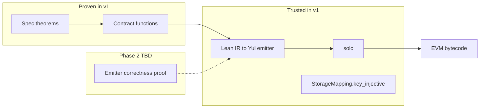
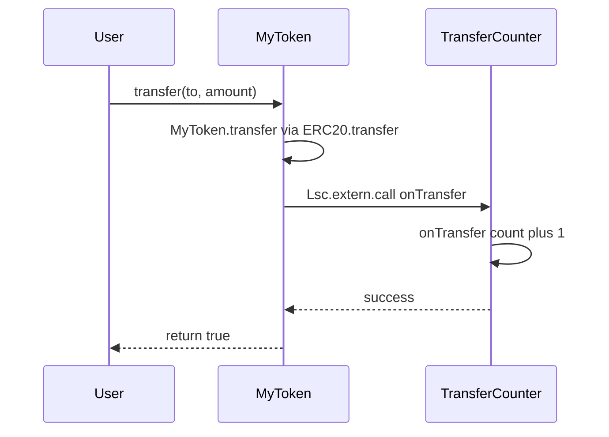

# LSC Toolchain — Reference Implementation

**Companion document:** [lsc-spec.md](lsc-spec.md) — normative LSC language definition  

This document describes **one conforming implementation** of [LSC](lsc-spec.md): a Foundry fork, `LeanCompiler`, Lake integration, and the `ForgeLean` Lean package (legacy name; normative API names are `Lsc.*` per the language spec).

---

## 1. Reference implementation overview

The primary implementation path compiles LSC contract modules (`.lean` under `src/`) to Foundry-compatible artifacts (`out/<Contract>.lean/<Contract>.json`) via:

1. `lake build` — Lean 4 elaboration  
2. LSC validator — dialect law ([lsc-spec.md §8](lsc-spec.md#8-well-formedness-and-diagnostics))  
3. Yul emitter — lowering-generated export wrappers  
4. `solc` — strict assembly to bytecode  

Distribution mirrors **native Foundry Vyper support** (`foundry-compilers` integration, not a standalone plugin on `PATH`).

### 1.1 Normative name bindings (v1)

| LSC ([lsc-spec.md](lsc-spec.md)) | This implementation (v1) |
| -------------------------------- | ------------------------ |
| `@[lsc.external]` | `@[evm_external]` (attribute name not yet migrated) |
| `Lsc.Std` / `Lsc.Prelude` | `ForgeLean` package (`ForgeLean.Prelude`, …) |
| `Lsc.extern` | `ForgeLean.extern` |
| `Lsc.Event.log` | `EVM.log` |
| `[lsc.contracts]` | `[lean.contracts]` in `foundry.toml` |
| `[lsc.compliance.*]` | `[lean.compliance.*]` |
| `[lsc]` profile keys | `[lean]` in `foundry.toml` |
| `lsc check-spec` | `forge-lean check-spec` (CLI alias TBD) |
| Diagnostic prefix `lsc:` | `forge-lean:` (emitter/validator messages) |

Future releases may align implementation identifiers with the language spec.

### 1.2 Repositories

| Repository | Role |
| ---------- | ---- |
| **forge-lean** (this repo) | [lsc-spec.md](lsc-spec.md), [lsc-toolchain.md](lsc-toolchain.md); eventually `ForgeLean` / `Lsc` library source |
| **foundry** fork | `LeanCompiler`, `forge build` / `forge test`, `testdata/src/Counter.lean` |
| **[forge-lean-erc20](https://github.com/forge-lean/forge-lean-erc20)** | ERC-20 demo: spec, proofs, fuzz |
| **[forge-lean-composition](https://github.com/forge-lean/forge-lean-composition)** | Composition demo: `Lsc.extern.call` hook |

---


## 2. Project layout and Lake

An LSC project (Foundry layout) follows this structure:

```
my-project/
├── foundry.toml
├── lean-toolchain              # pinned Lean toolchain, e.g. leanprover/lean4:v4.x.0
├── lakefile.lean               # Lake package: ForgeLean dep + module roots
├── lake-manifest.json
├── src/
│   └── Counter.lean            # Lean 4 contracts (default scaffold)
├── spec/
│   └── CounterSpec.lean        # Human-authored Prop definitions (def only)
├── test/
│   ├── CounterProof.lean       # LLM-generated proof terms (module CounterProof)
│   └── Counter.t.sol           # optional: deployCode fuzz (like Counter.vy)
├── cache/                      # incremental compile cache (Foundry-managed)
└── out/
    └── Counter.lean/
        ├── Counter.json        # PRIMARY artifact (Foundry-compatible; deployCode)
        ├── Counter.yul         # emitted Yul (when [lean] emit_yul = true)
        ├── Counter.bin         # raw bytecode (debug)
        └── Counter.abi         # ABI JSON (debug; also embedded in Counter.json)
```

For a full ERC-20 walkthrough (spec, proofs, fuzz), see the [forge-lean-erc20](https://github.com/forge-lean/forge-lean-erc20) demo repository (§9.1).

### Rules

- **`lib/*.lean`** defines shared storage/logic only; **no bytecode** is emitted from `lib/` ([lsc-spec.md Appendix B](lsc-appendices.md#appendix-b--composition-pattern)).
- Every `.lean` file under `spec/` is a specification: `def` propositions (`Prop`) plus optional `axiom` for extern assumptions. 
- Every `test/<Contract>Proof.lean` file contains proofs for the matching spec (e.g. `CounterProof.lean` for `CounterSpec.lean`). **Invalid:** `Counter.proof.lean` (dots break Lake module naming).
- The `lean-toolchain` file at the project root pins the exact Lean version. `forge init --lean` creates it. Compilation refuses to run if this file is missing.
- Lean imports use **Lake module paths** (e.g. `import Counter` for `src/Counter.lean`, `import CounterProof` for `test/CounterProof.lean`), not filesystem paths like `import src.Counter`.
- `spec/**` and `test/**/*Proof.lean` are excluded from contract compilation via `skip` in `foundry.toml`.

### `lakefile.lean` (minimal)

`forge init --lean` scaffolds:

```lean
import Lake
open Lake DSL

package «my-project» where
  -- project metadata

require forgelean from git
  "https://github.com/forge-lean/ForgeLean.git" @ "v1.0.0"

@[default_target]
lean_lib Counter where
  roots := #[`Counter]
```

The `ForgeLean` library is resolved by Lake; Foundry's `LeanCompiler` invokes `lake build` before reading compiled contract IR.

---

## 3. The Compiler Pipeline

### 3.1 Stages

```
src/Counter.lean
      │
      ▼  stage 1: lake build + Lean 4 elaboration
      ▼
  Lean IR (λRC)
      │
      ▼  stage 2: validator ([lsc-spec.md §8](lsc-spec.md#8-well-formedness-and-diagnostics))
      ▼
  Validated IR
      │
      ▼  stage 3: Yul emitter (compiler-generated export wrappers + auto load/store + dispatcher)
      ▼
  out/Counter.lean/Counter.yul
      │
      ▼  stage 4: solc via foundry-compilers (strict assembly)
      ▼
  out/Counter.lean/Counter.json   (primary)
```

### 3.2 Yul Emitter Mapping


| Lean IR construct                              | Yul output                                   |
| ---------------------------------------------- | -------------------------------------------- |
| `UInt256` literal `n`                          | `0xN`                                        |
| `if c then t else f`                           | `switch` / `if`                              |
| `match opt with | none => ... | some x => ...` | tag switch                                   |
| `StorageMapping.get/set`                       | `sload`/`sstore` via `storageKey`            |
| `Bytes` read/write                             | Solidity-compatible byte array ops           |
| Author `@[lsc.external]` return `none` / `some`   | `revert(0, 0)` / persist + `Lsc.Event.log` LOGs + ABI return |
| Generated export `none`                      | `revert(0, 0)` before any store              |
| Generated export `some (ret, logs)`            | persist state, `LOG` per entry, return `ret` |
| `Lsc.extern.staticcall` (v2b+)           | `staticcall` + ABI decode; no self `sstore`    |
| `Lsc.extern.call` (v2b+)                 | `call` + revert on failure; `invoke` threading |
| `Lsc.unsafe.call` (v3)                   | raw `call`; no spec guarantees                 |


Internal struct field access in export bodies is compiled against **local** copies loaded in step 2; persistence diffs whole struct fields. Extern sites suspend load/store around the opcode sequence per §4.14.4.

### 3.3 Yul Object Structure

Standard two-object Yul (`creation` + `runtime`) with ABI dispatcher, internal functions, and `storageKey` helper — as in v1.0 §7.3.

### 3.4 ABI JSON and Artifact Format

Primary output: `out/<Contract>.lean/<Contract>.json` compatible with Foundry's artifact schema:

```json
{
  "abi": [ ... ],
  "bytecode": { "object": "0x...", "sourceMap": "..." },
  "deployedBytecode": { "object": "0x..." },
  "metadata": {
    "compiler": { "version": "forge-lean/1.1.0" },
    "storageLayout": { ... }
  }
}
```


| Lean 4 type                            | ABI type             |
| -------------------------------------- | -------------------- |
| `UInt256`                              | `uint256`            |
| `Address`                              | `address`            |
| `Bool`                                 | `bool`               |
| `Bytes32`                              | `bytes32`            |
| `Bytes`                                | `string`             |
| `Option (Bool × List LogEntry)` return | `bool`               |
| View `UInt256` / `Bytes`               | respective view type |


---

## 4. Foundry Integration

### 4.1 Distribution (Mirror Vyper)


| Component               | Install                                                                             |
| ----------------------- | ----------------------------------------------------------------------------------- |
| Lean 4                  | [elan](https://github.com/leanprover/elan) + `lean-toolchain` (like pinning `solc`) |
| Foundry + Lean compiler | Forked Foundry via `foundryup` variant or pinned release from the forge-lean organization    |
| `Lsc` library     | `lake update` in project                                                            |


There is no separate `forge-vyper`-style plugin binary that Foundry auto-discovers. Vyper is native in Foundry; Lean follows the same model via forked `foundry-compilers`.

### 4.2 `foundry.toml`

```toml
[profile.default]
src = "src"
out = "out"
libs = ["lib"]
skip = ["spec/**", "test/**/*Proof.lean"]

[profile.default.lean]
path = "/optional/path/to/lean"   # default: `lean` on PATH
toolchain_file = "lean-toolchain"
emit_yul = true
max_bytes = 256

[profile.default.lean.contracts]
Counter = "0x0000000000000000000000000000000000000001"

# Optional: require named theorems in spec (demo repos, CI profiles)
# [lsc.compliance.erc20]
# spec = "spec/Token.spec.lean"
# required = ["transfer_preserves_total_supply", ...]
```

**Do not use** `[build] extra_output` or `[test] extra_output` for Lean — those keys select Solidity compiler output selections only.

### 4.3 `LeanCompiler` (Forked `foundry-compilers`)

- Registers `.lean` under `src/` as `MultiCompilerLanguage::Lean`
- Runs stages 1–4 (§8) per contract file
- Writes artifacts to `out/<Name>.lean/<Name>.json`
- Uses Foundry's incremental `cache/`
- Mixed `.sol` + `.lean` projects compile in one `forge build`

### 4.4 Commands


| Command                        | Role                                                                           |
| ------------------------------ | ------------------------------------------------------------------------------ |
| `forge build`                  | Compiles `.lean` and `.sol` (primary)                                          |
| `forge test`                   | Runs `.t.sol` EVM tests **and** Lean proof checking (separate report sections) |
| `forge init --lean`            | Scaffolds `lean-toolchain`, `lakefile.lean`, `spec/`, Counter contract (§9) |
| `forge init --lean --template erc20` | Scaffolds ERC-20 layout (points to demo patterns; [Appendix A](lsc-appendices.md#appendix-a--erc-20-pattern)) |
| `forge-lean check-spec <file>` | CI helper: spec shape + sorry-only proofs                                      |
| `forge-lean build`             | **Debug alias** for Lean-only compile (optional; not primary workflow)         |


### 4.5 EVM Testing (Mirror Vyper)

Solidity tests deploy Lean contracts via artifacts:

```solidity
import "forge-std/Test.sol";
contract CounterTest is Test {
    function test_increment() public {
        address counter = deployCode("src/Counter.lean");
        // assert ICounter(counter).number() == 1 after increment
    }
}
```

Formal proofs and EVM tests are complementary: proofs verify the Lean model; fuzz tests exercise deployed bytecode.

### 4.6 `forge test` — Lean Proof Section

After Solidity tests, Foundry runs the Lean proof runner:

- `lake build` for spec + proof modules
- Checks all spec `def` propositions have matching proof `theorem`s; optional `[lsc.compliance.*]` manifest ([lsc-spec.md §7](lsc-spec.md#7-verification))
- Rejects `sorry` in proof files
- Reports `PASS` / `FAIL` per theorem

Exit code: fails if **either** Solidity tests or Lean proofs fail (configurable in future; v1 default is combined failure).

### 4.7 solc Dependency

Uses `solc` from the user's Foundry installation via `foundry-compilers`. Error if Foundry not installed: `lsc: foundry not found; install Foundry for the LSC toolchain`.

---

## 5. Proof checking in CI

`forge build` performs **no** spec or proof checks — contracts only.

`forge test` runs, after Solidity tests:

- `lake build` for spec + proof modules  
- Checks all spec `def` propositions have matching proof `theorem`s; optional `[lsc.compliance.*]` / `[lean.compliance.*]` manifest  
- Rejects `sorry` in proof files  
- Reports `PASS` / `FAIL` per theorem  

**Utilities:**

| Command | Role |
| ------- | ---- |
| `forge-lean check-spec <file>` | CI helper: spec shape (`def … : Prop` only; target name: `lsc check-spec`) |
| `forge-lean build` | Debug alias for Lean-only compile (target name: `lsc build`) |

See [lsc-spec.md §7](lsc-spec.md#7-verification) for the verification model.

---


## 6. Error Message Reference

All messages are prefixed with `lsc:` and include file, line, and column.


| Condition                          | Message                                                                                        |
| ---------------------------------- | ---------------------------------------------------------------------------------------------- |
| Closure in contract                | `lsc: closures are not supported; use a top-level function`                             |
| Disallowed type `T`                | `lsc: type T is not allowed; use UInt256, Address, Bool, Bytes32, or Bytes`             |
| Stateful monadic contract code     | `lsc: stateful monads are not allowed; do-notation over Result E is permitted`        |
| `sorry` in proof file              | `lsc: proof file contains sorry; proofs must be complete`                               |
| `theorem` or `sorry` in spec file  | `lsc: spec modules use def … : Prop, not theorem; put proofs in *Proof.lean`            |
| Missing compliance proposition (on test) | `lsc: spec/TokenSpec.lean is missing required def transfer_preserves_total_supply` |
| Missing proof for spec def (on test) | `lsc: spec defines "f" but *Proof.lean has no theorem f`                                |
| Bare `Option State` on mutator | `lsc: mutator "f" must return Option (State × Unit) or Option (State × scalar); bare Option State is not allowed` |
| Invalid `@[lsc.external]` return shape | `lsc: @[lsc.external] "f" must return Option (State × Unit), Option (State × scalar), or Option α (view)` (v1: `@[evm_external]`) |
| Typed error / `CallResult` return | `lsc: use Option for revert; error kinds are not supported in v1` |
| Missing `lean-toolchain`           | `lsc: lean-toolchain file not found; run forge init --lean` |
| Foundry not found                  | `lsc: foundry not found; install Foundry for the LSC toolchain` |
| `Bytes` too long                   | `lsc: Bytes length exceeds max_bytes (N)`                                               |
| Author `sload` / `sstore`          | `lsc: storage IO is only performed by the emitter at @[lsc.external] boundaries` |
| Hand-written export wrapper        | `lsc: export wrappers are compiler-generated; use @[lsc.external] on contract functions` |
| `EvmContext` in author contract code | `lsc: use caller : Address; EvmContext is export-only`                     |
| `List` in author contract code     | `lsc: List is not allowed in contract code; use StorageMapping or Lsc.Event.log`        |
| Unknown event in `Lsc.Event.log`   | `lsc: unknown event type "X"; define Lsc.Event.EvmEvent instance or use string signature` |
| Raw `Fin` `+ - * /` on `UInt256` outside `do` and `unchecked do` | `lsc: arithmetic outside do blocks must use checkedAdd/Sub/Mul/Div explicitly, or unchecked do for wrapping` |
| `unchecked` in spec or proof | `lsc: unchecked is contract-only; use + on UInt256 in spec` |
| `wrapAdd` / direct `UInt256.add` in contract | `lsc: use unchecked do for wrapping arithmetic` |
| `←` in `do` without `HasArithErrors` | `lsc: arithmetic in do block requires HasArithErrors; add \| overflow to your @[lsc.error] inductive` |
| `do` on infallible function (`S` or `V`) | `lsc: do-notation requires Result return type` |
| Plain `+ - * /` outside `do` in contract | `lsc: arithmetic outside do blocks must use checkedAdd/Sub/Mul/Div explicitly` |
| Postfix `?` on `Result` | `lsc: ? operator is removed; use do-notation and ←` |
| `open Lsc.Arith` in spec or proof | `lsc: Lsc.Arith is for contract modules only; spec uses Fin +` |
| Malformed event signature          | `lsc: invalid event signature "..."; expected form "Name(type,type)"`                   |
| Event argument mismatch            | `lsc: event "Transfer(...)" expects N arguments of types ...; got ...`                  |
| Author constructs `LogEntry`       | `lsc: LogEntry is compiler-internal; use Lsc.Event.log`                                 |
| `@[lsc.event]` / log mismatch (lint) | `lsc: function declares event "Transfer(...)" but body has no matching Lsc.Event.log` |
| `World` in contract function       | `lsc: World is not allowed in contract functions; externs are compiler-generated only`          |
| Invalid contract filename stem     | `lsc: contract file "src/foo.lean" must be PascalCase (e.g. src/Foo.lean)`              |
| Unknown registered contract name     | `lsc: unknown contract name "X"; add [lsc.contracts] entry or deploy src/X.lean`       |
| Unresolved extern callee           | `lsc: unknown contract name "X"; add [lsc.contracts] or register src/X.lean`          |
| Extern in contract function        | `lsc: external calls are only allowed in compiler-generated exports`                    |
| `staticcall` to mutating export    | `lsc: staticcall target "sig" may persist storage`                                      |
| Reentrancy without `@[lsc.no_reentrant]` | `lsc: mutating extern.call may reenter; add @[lsc.no_reentrant] or prove via trace spec`  |


---

## 7. Verification and Trust Boundaries




| Layer                              | v1 status                                             |
| ---------------------------------- | ----------------------------------------------------- |
| Spec theorems → ``@[lsc.external]` functions` functions | **Proven** (Lean kernel)                           |
| Compiler-generated export → contract fn | **Trusted** (tested; `lift_no_extern` in v2c)       |
| Registered callee composition      | **Proven** when `simulate_call` + callee specs hold   |
| `@[lsc.extern_assume]` interface axioms  | **Trusted** (human-reviewed; not bytecode-checked)    |
| `Lsc.Semantics.invoke`       | **Trusted** in v2a–b; reference for emitter tests     |
| Lean model → Yul                   | **Trusted** (tested emitter)                          |
| Yul → bytecode                     | **Trusted** (`solc`)                                  |
| Bytecode → spec on chain           | **Tested** (Solidity fuzz/invariant via `deployCode`) |
| `StorageMapping.key_injective`     | **Axiom** (single storage axiom in contract proofs)   |
| `Lsc.unsafe.call`            | **No spec** (fuzz only)                               |


**Phase 2 (scope TBD):** May include a formal proof that the Yul emitter refines the Lean functional semantics. The approach (refinement types, deep embedding of Yul, etc.) will be chosen after v1 experience.

**Intent:** Full-stack verification — eventually the artifact on Ethereum is provably linked to the human-reviewed spec. v1 delivers the spec + proof workflow on the Lean model.

---

## 8. Implementation Checklist

### Phase v1 (foundry fork)

**Foundry fork**

- `LeanCompiler` in `foundry-compilers` (`MultiCompiler` + `.lean` extension)
- `[lean]` config parsing in `foundry-config`
- Foundry-compatible `out/<Contract>.lean/<Contract>.json` artifacts
- `forge init --lean` scaffolding (Counter default)
- `testdata/src/Counter.lean` + CI compile (parity with `Counter.vy`)
- `forge test` Lean proof runner; optional `[lsc.compliance.*]` (§5.3)
- `skip` patterns for `spec/` and `test/**/*Proof.lean`

`**forge-lean` utilities (Rust)**

- `forge-lean check-spec`
- `forge-lean build` (debug alias)
- Validator ([lsc-spec.md](lsc-spec.md).11 dialect law)
- Compiler-generated export wrappers from `@[lsc.external]` ([lsc-spec.md](lsc-spec.md).9–4.10)
- `@[lsc.public]` field getters synthesized as `@[lsc.external]` views before ABI pass ([lsc-spec.md §3.5](lsc-spec.md))
- `Lsc.Event.log` collection and LOG lowering ([lsc-spec.md](lsc-spec.md).5)
- Yul emitter with auto load/store ([lsc-spec.md](lsc-spec.md).8, §8.2)
- ABI JSON + selector computation
- All error messages (§11)

`**Lsc` library**

- `Lsc.Prelude`: `Address`, `Bytes32`, `Bytes`, `EvmContext`, `StorageMapping`, `HasArithErrors`, polymorphic `UInt256.checkedAdd` / `checkedSub` / `checkedMul` / `checkedDiv`; `Monad (Result · E)` for `do`-notation ([lsc-spec.md §2.5](lsc-spec.md))
- `Lsc.Arith` (in prelude): `unchecked do` macro for wrapping `+ - * /`; checked `+ - * /` sugar inside `do` in `@[lsc.export]` bodies; forward bridge lemmas `checkedAdd_ok`, `checkedAdd_overflow`, … ([lsc-spec.md §2.5](lsc-spec.md))
- `Lsc.Event`: `Lsc.Event.EvmEvent`, `Lsc.Event.log`, `LogEntry`
- `Lsc.ProofHelpers`: Layer 1 `compose`; Layers 2–4 `lift_*`, `simulate_call`, `export_cases` (§7)
- `Lsc.SpecTemplates` (Layer 1 + export/trace skeletons)
- `@[lsc.external]`, `@[lsc.error]` (elaboration-time generation via `AttributeImpl`: discriminators, `DecidableEq`, `HasArithErrors`), `@[lsc.public]` (elaboration-time `@[lsc.external]` view `def`s from State fields; [lsc-spec.md §3.5](lsc-spec.md)), `@[lsc.event]` (optional lint), `@[lsc.extern_hook]`, `@[lsc.no_reentrant]` attributes ([lsc-spec.md](lsc-spec.md).5, [lsc-spec.md](lsc-spec.md).9, [lsc-spec.md](lsc-spec.md).16)
- Filename-based contract registration ([lsc-spec.md](lsc-spec.md).13.1); `[lsc.contracts]` in `foundry.toml`

**`Lsc.Arith` (ForgeLean — normative surface)**

Implement in `ForgeLean` / `Lsc.Prelude` per [lsc-spec.md §2.5](lsc-spec.md):

1. Wrapping defs `UInt256.add` / `sub` / `mul` / `div` (prelude-internal; authors use `unchecked do`)
2. `unchecked` macro on `do` blocks — scoped rewriting of `+ - * /` to wrapping ops
3. `Monad (Result · E)` instance in `Lsc.Prelude` for standard `do`-notation
4. Validator macro: checked `+ - * /` → `checkedAdd` … only inside `do` blocks in `@[lsc.export]` function bodies
5. `@[simp]` forward bridge lemmas: `checkedAdd_ok`, `checkedAdd_overflow`, and sub/mul/div analogues
6. Validator: reject raw `HAdd` on `UInt256` outside `do` and `unchecked`; forbid `unchecked` / `open Lsc.Arith` in spec and proof; forbid `wrapAdd` in contracts; reject postfix `?` ([lsc-spec.md §13.1](lsc-spec.md))
7. Register `@[lsc.error]` via `Lean.registerBuiltinAttribute` / `AttributeImpl` — generates discriminators, `DecidableEq`, and `HasArithErrors` at elaboration time (not validator)
8. Register `@[lsc.public]` on State struct fields — after `State` is known, synthesize `@[lsc.external]` getter `def`s before ABI collection ([lsc-spec.md §3.5](lsc-spec.md))
9. Validator: reject bare `lsc_errors` keyword; surface `HasArithErrors` resolution failures from Lean elaborator; enforce `@[lsc.public]` rules ([lsc-spec.md §13.1](lsc-spec.md))

**Phase v2a (semantics only)**

- `Lsc.Semantics`: `World`, `Account`, `TypedAccount`, `CallFrame`, `CallKind`, `StepResult`, `invoke`
- Unit tests: `invoke` matches Foundry `deployCode` multi-contract scenarios

**Phase v2b (extern calls)**

- `Lsc.Interfaces` + `Lsc.extern.call` / `staticcall`
- Validator rules ([lsc-spec.md](lsc-spec.md).11, [lsc-spec.md](lsc-spec.md).15)
- Emitter `CALL` / `STATICCALL` lowering (§8.2)
- `@[lsc.extern_assume]` for assumed callees

**Phase v2c (reentrancy proofs)**

- `@[lsc.no_reentrant]` validator
- `Lsc.SpecTemplates` trace theorems
- Refinement lemmas (§7.5)

**Phase v3**

- `delegatecall` storage root in `invoke`
- `Lsc.unsafe.call`
- `CREATE` / `SELFDESTRUCT` in `World`

**Demo repository ([forge-lean-erc20](https://github.com/forge-lean/forge-lean-erc20))**

- `src/Token.lean` application code (§9.1)
- Full spec + proofs + `[lsc.compliance.erc20]`
- `Token.t.sol` fuzz via `deployCode`

**Demo repository ([forge-lean-composition](https://github.com/forge-lean/forge-lean-composition))**

- `lib/ERC20.lean` + `src/MyToken.lean` + `src/TransferCounter.lean` (§9.2)
- `[lsc.compliance.erc20]` on `ERC20Spec`; `[lsc.compliance.hook]` on `MyTokenSpec`
- `test/Composition.t.sol` multi-contract fuzz
- Optional `testdata/src/TransferCounter.lean` in Foundry fork (minimal compile smoke)

### Phase v2 (upstream + verification)

- Upstream PR: merge `LeanCompiler` into `foundry-rs/foundry`
- Emitter correctness proof (scope TBD)
- `forge verify-contract --language lean` (optional)

---

## 9. Minimal Counter (Foundry testdata)

The Foundry fork ships a Lean counter beside [`testdata/src/Counter.vy`](https://github.com/foundry-rs/foundry/blob/master/testdata/src/Counter.vy) to smoke-test `LeanCompiler` on every CI run. `forge init --lean` scaffolds the same shape for new projects.

**Path (fork):** `foundry/testdata/src/Counter.lean`

**Dialect note:** Contract name comes from the filename (`Counter.lean` → `Counter`). Authors write `@[lsc.external]` functions with inferred ABI; the compiler generates export wrappers and Yul. `forge build` produces deployable `out/Counter.lean/Counter.json` for `deployCode` in Solidity tests.

### `src/Counter.lean`

```lean
import Lsc.Prelude

open Lsc Lsc.Arith

@[lsc.error]
inductive CounterError where
  | overflow   -- checkedAdd only

structure CounterState where
  @[lsc.public]
  number : UInt256

@[lsc.external]
def increment (s : CounterState) : Result CounterState CounterError := do
  let n ← s.number + 1
  return .ok { s with number := n }

@[lsc.external]
def setNumber (s : CounterState) (n : UInt256) : CounterState :=
  { s with number := n }

-- `number` view generated from @[lsc.public] (§3.5)
```

### `spec/CounterSpec.lean` (minimal)

```lean
import Counter

def increment_increases_number
    (s s' : CounterState) (ret : Unit)
    (h : increment s = some (s', ret)) : Prop :=
  s'.number = s.number + 1
```

### `test/CounterProof.lean` (minimal)

```lean
import CounterSpec

theorem increment_increases_number
    (s s' : CounterState) (ret : Unit)
    (h : increment s = some (s', ret)) :
    CounterSpec.increment_increases_number s s' ret h := by
  simp [CounterSpec.increment_increases_number, increment] at h
  exact h
```

No `EvmContext`, `LogEntry`, or `Lsc.ProofHelpers` import required — Layer 1 proofs only ([lsc-spec.md §1.6.2](lsc-spec.md#162-proof-layers-default-path-vs-advanced)).

### `test/Counter.t.sol` (sketch)

```solidity
import "forge-std/Test.sol";

contract CounterTest is Test {
    function test_increment() public {
        address c = deployCode("src/Counter.lean");
        // ICounter(c).increment(); assert ICounter(c).number() == 1;
    }
}
```

### LLM prompt sketch (Counter)

> Given `src/Counter.lean` and `spec/CounterSpec.lean` (def … : Prop), complete `test/CounterProof.lean` with a theorem per spec def. Use `simp` on contract and spec definitions. No `sorry`.

### 9.1 ERC-20 showcase (external demo)

The [forge-lean-erc20](https://github.com/forge-lean/forge-lean-erc20) repository demonstrates the full workflow at application scale:

1. **Write** — `src/Token.lean` with `ERC20State`, `@[lsc.external]` functions and `Lsc.Event.log` for events (§9.1). Compiler infers ABI from names and `Option` return shapes.
2. **Spec** — `spec/TokenSpec.lean` with human-reviewed `def … : Prop` over `@[lsc.external]` functions; `[lsc.compliance.erc20]` enforces the proposition list on `forge test`.
3. **Prove** — `test/TokenProof.lean` (LLM-assisted, kernel-checked).
4. **Fuzz** — `test/Token.t.sol` deploys bytecode via `deployCode` and runs Foundry fuzz/invariant tests.

That repo is the canonical place for ERC-20-only documentation — not the core Foundry toolchain.

### 9.2 Composition demo (ERC-20 + TransferCounter hook)

The [forge-lean-composition](https://github.com/forge-lean/forge-lean-composition) repository demonstrates **mutating external calls**: **MyToken** extends ERC-20 and **CALL**s **TransferCounter** on every successful `transfer` / `transferFrom`. Full layout, theorems, and CEI rules are in **[Appendix B](lsc-appendices.md#appendix-b--composition-pattern)**.

**Why a separate repo:** Keeps [forge-lean-erc20](https://github.com/forge-lean/forge-lean-erc20) minimal (closed-world ERC-20 only) while this demo drives v2a `invoke` + v2b `Lsc.extern.call` requirements.

---


---


### 9.1 ERC-20 demo ERC-20 reference application (demo repo)

This appendix documents the **[forge-lean-erc20](https://github.com/forge-lean/forge-lean-erc20)** showcase. It is **not** part of the core `Lsc` package or default `forge test` behavior. The demo enables `[lsc.compliance.erc20]` to require the theorem list below.

### C.1 Application scope

- Full ERC-20 interface (constructor-only mint; no post-deploy mint/burn in the reference token)
- `Bytes` for `name` / `symbol`; mutators return `bool` on the ABI (compiler-generated)
- `Lsc.Event.log` for `Transfer` and `Approval` events (classic emit)

### C.2 State and prelude (demo `lib/` or `src/ERC20.lean`)

```lean
structure TransferEvent where
  from to : Address
  value : UInt256
  deriving Lsc.Event.EvmEvent

structure ERC20State where
  name        : Bytes
  symbol      : Bytes
  decimals    : UInt256
  totalSupply : UInt256
  balances    : StorageMapping Address UInt256
  allowances  : StorageMapping Address (StorageMapping Address UInt256)

@[lsc.external]
def transfer (caller : Address) (s : ERC20State) (to : Address) (amount : UInt256)
    : Option (ERC20State × Bool) :=
  if s.balances.get caller < amount then
    none
  else
    let s' := { s with
      balances := s.balances.set caller (s.balances.get caller - amount)
                    |>.set to (s.balances.get to + amount) }
    Lsc.Event.log (TransferEvent.mk caller to amount)
    some (s', true)
```

Example revert theorem (no error-kind branching; §2.8):

```lean
def transfer_no_overdraft
    (caller to : Address) (amount : UInt256) (s : ERC20State)
    (h : transfer caller s to amount = none) : Prop :=
  s.balances.get caller < amount
```

The demo defines `@[lsc.external]` functions with **`Lsc.Event.log`** on success paths (no hand-written export wrappers; no `Lsc.ERC20` in core).

### C.3 Required theorems (`[lsc.compliance.erc20]`)

Enforced only when the demo repo (or a project) sets `[lsc.compliance.erc20]` in `foundry.toml`.


| Group        | Theorem                               | Statement (summary)                           |
| ------------ | ------------------------------------- | --------------------------------------------- |
| Transfer     | `transfer_preserves_total_supply`     | `totalSupply` unchanged on success            |
| Transfer     | `transfer_no_overdraft`               | insufficient balance → `none`                 |
| Transfer     | `transfer_no_creation`                | tokens conserved between distinct parties     |
| Transfer     | `transfer_self_noop`                  | `from = to` → state unchanged on success path |
| Approve      | `approve_sets_allowance`              | allowance equals requested amount             |
| Approve      | `increaseAllowance_additive`          | allowance increases by delta                  |
| Approve      | `decreaseAllowance_subtractive`       | allowance decreases by delta (saturating)     |
| Approve      | `decreaseAllowance_saturates_at_zero` | decrease below zero → allowance 0             |
| TransferFrom | `transferFrom_respects_allowance`     | insufficient allowance → `none`               |
| TransferFrom | `transferFrom_decrements_allowance`   | allowance reduced by transfer amount          |
| TransferFrom | `transferFrom_respects_balance`       | insufficient balance → `none`                 |
| Constructor  | `constructor_mints_initial_supply`    | deployer balance equals `initialSupply`       |
| Constructor  | `constructor_sets_metadata`           | `name`, `symbol`, `decimals` stored correctly |


### C.4 Demo layout

```
forge-lean-erc20/
├── src/Token.lean
├── spec/TokenSpec.lean
├── test/TokenProof.lean
├── test/Token.t.sol
└── foundry.toml    # [lsc.compliance.erc20]
```

### C.5 LLM prompt sketch (Token)

> Given `src/Token.lean` and `spec/TokenSpec.lean` (`def … : Prop`), complete `test/TokenProof.lean` with one `theorem` per spec def. Use `simp`, `omega`, `StorageMapping.get_set_same`. No `sorry`.

Full source listings are maintained in the demo repository, not duplicated here.

---


---


### 9.2 Composition demo Composition demo (MyToken + TransferCounter)

This appendix documents **[forge-lean-composition](https://github.com/forge-lean/forge-lean-composition)** — a reference application for **mutating `Lsc.extern.call`**, reentrancy-aware `World` / `invoke` (§4.14), and **`structure … extends`** for storage (§4.6). It is not part of the core toolchain; it is the primary driver for v2a–v2b extern support.

### D.1 Goal

- **MyToken** — one deployed ERC-20-compatible contract whose storage **extends** `ERC20State` with a `counter : Address` hook target.
- **TransferCounter** — `{ count : UInt256 }`; exposes `onTransfer()`.
- On every successful **`transfer`** and **`transferFrom`**, MyToken runs token logic then **CALL**s the counter (checks-effects-interactions).



### D.2 Repository layout

| Path | Deployed? | Purpose |
| ---- | --------- | ------- |
| `lib/ERC20.lean` | No | `ERC20State`, `ERC20.transfer` and related library helpers; **no** `@[lsc.external]` |
| `src/MyToken.lean` | Yes | `MyTokenState extends ERC20State`; full ERC-20 ABI + hook on transfer paths |
| `src/TransferCounter.lean` | Yes | Counter contract |
| `interfaces/ITransferCounter.lean` | No | Interface for `Lsc.extern.call` validator |
| `spec/ERC20Spec.lean` | — | Appendix C theorems over `ERC20.transfer` on `ERC20State` |
| `spec/MyTokenSpec.lean` | — | Hook / composition theorems only |
| `spec/TransferCounterSpec.lean` | — | `onTransfer` increments `count` |
| `test/ERC20Proof.lean`, `test/MyTokenProof.lean`, `test/TransferCounterProof.lean` | — | Proofs |
| `test/Composition.t.sol` | — | Deploy both; fuzz `transfer` vs `count` |


### D.3 MyToken extends ERC20 (Lean model)

```lean
-- lib/ERC20.lean
structure ERC20State where
  name : Bytes
  symbol : Bytes
  decimals : UInt256
  totalSupply : UInt256
  balances : StorageMapping Address UInt256
  allowances : StorageMapping Address (StorageMapping Address UInt256)

def ERC20.transfer (s : ERC20State) (from to : Address) (amount : UInt256)
    : Option ERC20State := ...

-- src/MyToken.lean
import ERC20

structure MyTokenState extends ERC20State where
  counter : Address   -- 0 = hook disabled in tests

def MyToken.transfer (s : MyTokenState) (from to : Address) (amount : UInt256)
    : Option MyTokenState :=
  match ERC20.transfer s.toERC20 from to amount with
  | none => none
  | some erc' => some { s with toERC20 := erc' }
```

- **Field access:** `s.balances` works on `MyTokenState` (flat inheritance).
- **Appendix C proofs** target `ERC20.transfer` on `ERC20State` in `spec/ERC20Spec.lean`.
- **MyToken exports** with hooks: author annotates `transfer` / `transferFrom` with `@[lsc.external]` and `@[lsc.extern_hook]` (or equivalent metadata); **compiler-generated** export threads `World` and inserts `Lsc.extern.call` after contract-function success (§4.15.2).

### D.4 TransferCounter

```lean
structure TransferCounterState where
  count : UInt256

@[lsc.external]
def onTransfer (s : TransferCounterState) : Option TransferCounterState :=
  some { s with count := s.count + 1 }
```

- No `Lsc.extern.*` in the counter (closed-world Layer 1 proofs).
- Optional: store allowed `token : Address` and reject callers other than MyToken.

### D.5 Hooked exports (CEI)

**Checks-effects-interactions** on `transfer` / `transferFrom`. Author writes token logic in contract functions; the **compiler-generated export** (not author code):

1. Calls `MyToken.transfer` / `transferFrom` (delegates to `ERC20.transfer` on `s.toERC20`).
2. If `s.counter ≠ 0` and transfer is not a self-noop, `Lsc.extern.call` to `ITransferCounter.onTransfer`.
3. On callee revert → export returns `none`; emitter / `invoke` must not persist token storage (§4.14).

**Reference generated export shape (illustrative — not written in `src/`):**

```lean
-- Compiler-generated only
def transfer (ctx : EvmContext) (w : World) (s : MyTokenState) (to : Address) (amount : UInt256)
    : Option (World × Bool × List LogEntry) :=
  match MyToken.transfer s ctx.sender to amount with
  | none => none
  | some s' =>
      if s'.counter == Address.zero then
        some (w, true, [...])   -- LOGs from Lsc.Event.log sites on success path
      else
        match Lsc.extern.call w s'.counter ctx inferInstance s'.counter with
        | none => none
        | some (w', ()) => some (w', true, [...])
```

**Self-transfer (`from == to`):** When `ERC20.transfer` is a noop, **do not** call the counter (`transfer_self_noop`).

**Constructor:** `(name, symbol, decimals, initialSupply, counterAddress)`.

**Non-hook exports:** `approve`, `balanceOf`, etc. use standard wrappers over `ERC20` library helpers without `World` (or pass `w` through unchanged).

### D.6 `foundry.toml` (composition project)

```toml
[lsc.contracts]
MyToken = "0x0000000000000000000000000000000000000001"
TransferCounter = "0x0000000000000000000000000000000000000002"

[lsc.compliance.erc20]
spec = "spec/ERC20Spec.lean"
required = [
  "transfer_preserves_total_supply",
  "transfer_no_overdraft",
  # ... full list in Appendix C.3
]

[lsc.compliance.hook]
spec = "spec/MyTokenSpec.lean"
required = [
  "transfer_increments_counter_when_hooked",
  "transfer_skips_counter_when_zero",
  "transfer_self_noop_skips_counter",
  "hook_revert_implies_transfer_none",
  "transferFrom_increments_counter_when_hooked"
]
```

### D.7 Required theorems

**ERC-20 (`[lsc.compliance.erc20]`):** Same table as Appendix C.3, stated over `ERC20.transfer` in `spec/ERC20Spec.lean`.

**Hook (`[lsc.compliance.hook]`):** In `spec/MyTokenSpec.lean` only.


| Theorem | Statement (summary) |
| ------- | ------------------- |
| `transfer_increments_counter_when_hooked` | `counter ≠ 0`, successful hooked export ⇒ counter `count` increases by 1 |
| `transfer_skips_counter_when_zero` | `counter = 0` ⇒ behavior matches export without extern |
| `transfer_self_noop_skips_counter` | `from = to` ⇒ counter unchanged |
| `hook_revert_implies_transfer_none` | counter call reverts ⇒ MyToken export `none` |
| `transferFrom_increments_counter_when_hooked` | same as `transfer` for `transferFrom` |


**TransferCounter (`spec/TransferCounterSpec.lean`):**


| Theorem | Statement (summary) |
| ------- | ------------------- |
| `onTransfer_increments_count` | `onTransfer` increments `count` by 1 |


### D.8 Proof strategy

| Layer | What | Where |
| ----- | ---- | ----- |
| 1 | ERC-20 contract fns | `ERC20Spec` / `ERC20Proof` — no `World` |
| 2 | Counter contract fns | `TransferCounterSpec` / `TransferCounterProof` |
| 3 | Hook / composition | `MyTokenSpec` / `MyTokenProof` — `lift_no_extern`, `simulate_call`, or `@[lsc.no_reentrant]` (§4.16, §7.5) |
| 4 | EVM | `Composition.t.sol` — `deployCode` both contracts; assert `count` after transfers |

### D.9 Platform dependencies

| Phase | Needed for demo |
| ----- | ---------------- |
| v2a | `Lsc.Semantics`: `World`, `invoke`, revert, reentrancy |
| v2b | `Lsc.extern.call`, emitter `CALL`, `[lsc.contracts]` |
| v2c (partial) | `@[lsc.no_reentrant]` or trace specs for reentrancy-sensitive hook proofs |

### D.10 Out of scope (first slice)

- `delegatecall` proxies
- Counter re-entering MyToken
- Payable hook / `msg.value` on CALL
- Hooking `approve` / `increaseAllowance`

### D.11 LLM prompt sketches

**ERC-20:** Given `lib/ERC20.lean` and `spec/ERC20Spec.lean`, complete `test/ERC20Proof.lean`. Use `simp`, `omega`, `StorageMapping.get_set_*`. No `sorry`.

**Composition:** Given `src/MyToken.lean`, `spec/MyTokenSpec.lean`, and `Lsc.ProofHelpers`, complete `test/MyTokenProof.lean` for hook theorems. No `sorry`.

## Appendix A. Migration from forge-lean-spec v1.6

| Old section (`forge-lean-spec.md`) | New location |
| ---------------------------------- | ------------ |
| §1 Overview, §2 Design principles | [lsc-spec.md §1](lsc-spec.md#1-introduction) |
| §4 Contract model | [lsc-spec.md §3–6](lsc-spec.md#3-defining-a-contract) |
| §5–7 Spec / proof / helpers | [lsc-spec.md §7](lsc-spec.md#7-verification) |
| §8 Compiler | [lsc-toolchain.md §3](lsc-toolchain.md#3-compiler-pipeline) |
| §9 Foundry | [lsc-toolchain.md §4](lsc-toolchain.md#4-foundry-integration) |
| §10 ForgeLean package | [lsc-spec.md §9](lsc-spec.md#9-standard-library-lscstd) + toolchain §1.1 |
| §11 Errors | [lsc-spec.md §8](lsc-spec.md#8-well-formedness-and-diagnostics) + toolchain §6 |
| §12 Counter | [lsc-spec.md §1.1](lsc-spec.md#11-end-to-end-example-counter) + toolchain §9 |
| §13 Trust | [lsc-toolchain.md §7](lsc-toolchain.md#7-trust-boundaries) |
| §14 Checklist | [lsc-toolchain.md §8](lsc-toolchain.md#8-implementation-checklist) |
| Appendices C–D demos | [lsc-spec.md](lsc-spec.md) Appendices A–B (patterns) + toolchain §9 (full walkthrough) |

---

## Appendix B. Toolchain changelog

| Version | Changes |
| ------- | ------- |
| 1.0 | Split from forge-lean-spec v1.6 into lsc-spec + lsc-toolchain; LSC naming |

